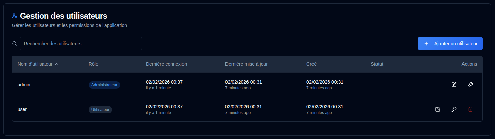

# Utilisateurs {#users}

Gérez les comptes utilisateur, les autorisations et le contrôle d'accès pour **duplistatus**. Cette section permet aux administrateurs de créer, modifier et supprimer les comptes utilisateur.

>[!TIP] 
>Le compte `admin` par défaut peut être supprimé. Pour ce faire, créez d'abord un nouvel utilisateur administrateur, connectez-vous avec ce compte, 
> puis supprimez le compte `admin`.
>
> Le mot de passe par défaut du compte `admin` est `Duplistatus09`. Vous serez tenu de le modifier lors de votre première connexion.

## Accès à la Gestion des utilisateurs {#accessing-user-management}

Vous pouvez accéder à la section Gestion des utilisateurs de deux façons :

1. **À partir du Menu Utilisateur** : Cliquez sur le <IconButton icon="lucide:user" label="Nom d'utilisateur" />   dans la [Barre d'outils de l'Application](../overview.md#application-toolbar) et sélectionnez « Admin Utilisateurs ».

2. **À partir des Paramètres** : Cliquez sur <IconButton icon="lucide:settings"/> et `Users` dans la barre latérale des paramètres

## Création d'un nouvel utilisateur {#creating-a-new-user}

1. Cliquez sur le bouton <IconButton icon="lucide:plus" label="Ajouter un utilisateur"/>
2. Entrez les détails de l'utilisateur :
   - **Nom d'utilisateur** : Doit contenir 3 à 50 caractères, être unique et insensible à la casse
   - **Admin** : Cochez cette case pour accorder les privilèges d'administrateur
   - **Exiger le changement de mot de passe** : Cochez cette case pour forcer le changement de mot de passe à la première connexion
   - **Mot de passe** : 
     - Option 1 : Cochez « Générer automatiquement le mot de passe » pour créer un mot de passe temporaire sécurisé
     - Option 2 : Décochez et entrez un mot de passe personnalisé
3. Cliquez sur <IconButton icon="lucide:user-plus" label="Créer l'utilisateur" />.

## Modification d'un Utilisateur {#editing-a-user}

1. Cliquez sur l'icône <IconButton icon="lucide:edit" /> de modification à côté de l'utilisateur
2. Modifiez l'un des éléments suivants :
   - **Nom d'utilisateur** : Modifiez le nom d'utilisateur (doit être unique)
   - **Admin** : Basculez les privilèges d'administrateur
   - **Exiger un changement de mot de passe** : Basculez l'exigence de changement de mot de passe
3. Cliquez sur <IconButton icon="lucide:check" label="Enregistrer les modifications" />.

## Réinitialisation du mot de passe d'un utilisateur {#resetting-a-user-password}

1. Cliquez sur l'icône <IconButton icon="lucide:key-round" /> clé à côté de l'utilisateur
2. Confirmez la réinitialisation du mot de passe
3. Un nouveau mot de passe temporaire sera généré et affiché
4. Copiez le mot de passe et transmettez-le à l'utilisateur de manière sécurisée

## Suppression d'un utilisateur {#deleting-a-user}

1. Cliquez sur l'icône <IconButton icon="lucide:trash-2" /> de suppression à côté de l'utilisateur
2. Confirmez la suppression dans la boîte de dialogue. **La suppression de l'utilisateur est permanente et ne peut pas être annulée.**

## Verrouillage de compte {#account-lockout}

Les comptes sont automatiquement verrouillés après plusieurs tentatives de connexion échouées :
- **Seuil de verrouillage** : 5 tentatives échouées
- **Durée du verrouillage** : 15 minutes
- Les comptes verrouillés ne peuvent pas se connecter jusqu'à l'expiration de la période de verrouillage

## Récupération de l'accès Admin {#recovering-admin-access}

Si vous avez perdu votre Mot de passe Admin ou avez été verrouillé de votre compte, vous pouvez récupérer l'accès en utilisant le script de récupération Admin. Consultez le guide [Récupération de Compte Admin](../admin-recovery.md) pour des instructions détaillées sur la récupération de l'accès administrateur dans les environnements Docker.
