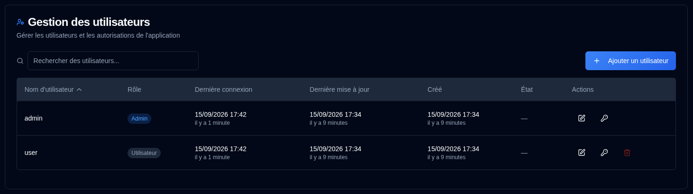

# Utilisateurs {/* #users */}

Gérer les comptes utilisateur, les autorisations et le contrôle d'accès pour **duplistatus**. Cette section permet aux administrateurs de créer, modifier et supprimer des comptes utilisateur.

>[!TIP] 
>Le compte `admin` par défaut peut être supprimé. Pour ce faire, créez d'abord un nouvel utilisateur administrateur, connectez-vous avec ce compte, 
> puis supprimez le compte `admin`.
>
> Le mot de passe par défaut pour le compte `admin` est `Duplistatus09`. Vous devrez le modifier lors de votre première connexion.

## Accéder à la gestion des utilisateurs {/* #accessing-user-management */}

Vous pouvez accéder à la section Gestion des utilisateurs de deux manières :

1. **À partir du menu Utilisateur** : Cliquez sur le <IconButton icon="lucide:user" label="nom d'utilisateur" /> dans la [barre d'outils de l'application](../overview.md#application-toolbar) et sélectionnez "Utilisateurs admin".

2. **À partir des paramètres** : Cliquez sur <IconButton icon="lucide:settings"/> et **Utilisateurs** dans la barre latérale des paramètres

## Créer un nouvel utilisateur {/* #creating-a-new-user */}

1. Cliquez sur le bouton <IconButton icon="lucide:plus" label="Ajouter un utilisateur"/>
2. Saisissez les détails de l'utilisateur :
   - **Nom d'utilisateur** : Doit comporter 3 à 50 caractères, être unique et insensible à la casse
   - **Admin** : Cochez pour accorder des privilèges d'administrateur
   - **Exiger le changement de mot de passe** : Cochez pour forcer le changement de mot de passe lors de la première connexion
   - **Mot de passe** : 
     - Option 1 : Cochez "Générer automatiquement le mot de passe" pour créer un mot de passe temporaire sécurisé
     - Option 2 : Décochez et saisissez un mot de passe personnalisé
3. Cliquez sur <IconButton icon="lucide:user-plus" label="Créer un utilisateur" />.

## Modifier un utilisateur {/* #editing-a-user */}

1. Cliquez sur l'icône d'édition <IconButton icon="lucide:edit" /> à côté de l'utilisateur
2. Modifiez l'un des éléments suivants :
   - **Nom d'utilisateur** : Modifiez le nom d'utilisateur (doit être unique)
   - **Admin** : Activez ou désactivez les privilèges d'administrateur
   - **Exiger le changement de mot de passe** : Activez ou désactivez l'exigence de changement de mot de passe
3. Cliquez sur <IconButton icon="lucide:check" label="Enregistrer les modifications" />.

## Réinitialiser le mot de passe d'un utilisateur {/* #resetting-a-user-password */}

1. Cliquez sur l'icône de clé <IconButton icon="lucide:key-round" /> à côté de l'utilisateur
2. Confirmez la réinitialisation du mot de passe
3. Un nouveau mot de passe temporaire sera généré et affiché
4. Copiez le mot de passe et fournissez-le à l'utilisateur de manière sécurisée

## Supprimer un utilisateur {/* #deleting-a-user */}

1. Cliquez sur l'icône de suppression <IconButton icon="lucide:trash-2" /> à côté de l'utilisateur
2. Confirmez la suppression dans la boîte de dialogue. **La suppression d'un utilisateur est définitive et ne peut pas être annulée.**

## Verrouillage de compte {/* #account-lockout */}

Les comptes sont automatiquement verrouillés après plusieurs tentatives de connexion échouées :
- **Seuil de verrouillage** : 5 tentatives échouées
- **Durée du verrouillage** : 15 minutes
- Les comptes verrouillés ne peuvent pas se connecter jusqu'à l'expiration de la période de verrouillage

## Récupération de l'accès administrateur {/* #recovering-admin-access */}

Si vous avez perdu votre mot de passe administrateur ou été verrouillé hors de votre compte, vous pouvez récupérer l'accès en utilisant le script de récupération d'administration. Voir le guide [Récupération du compte administrateur](../admin-recovery.md) pour des instructions détaillées sur la récupération de l'accès administrateur dans des environnements Docker.

Si le navigateur affiche **Accès refusé** (HTTP 403) avant le formulaire de connexion, récupérez plutôt avec [Verrouillé par la liste d'adresses IP autorisées](../troubleshooting.md#locked-out-by-ip-allowlist) à la place.
