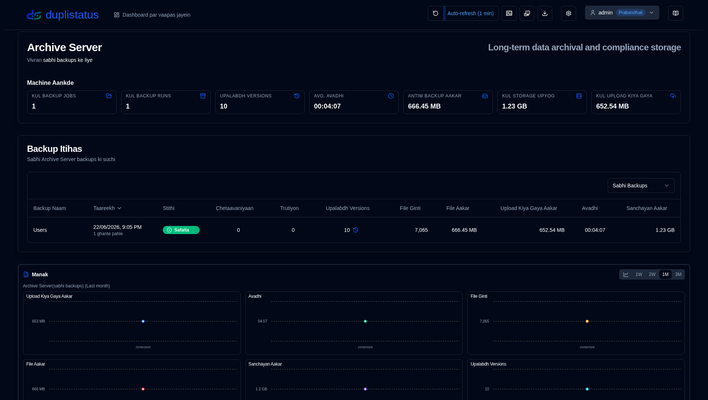
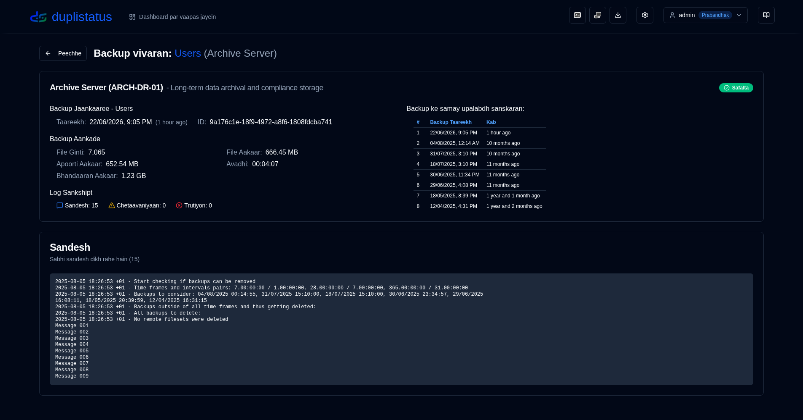
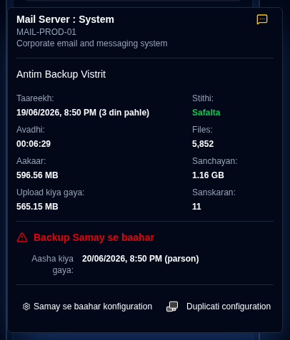

# Duplistatus mein swagat hai {#welcome-to-duplistatus}

**Duplistatus** - Ekal Dashboard se Multiple [Duplicati's](https://github.com/duplicati/duplicati) Server Monitor Karen

## Visheshtayein {#features}

- **Turant Setup**: Saral containerised deployment, Docker Hub aur GitHub par uplabdh images ke saath.
- **Ekikrit Dashboard**: Sabhi serveron ke liye backup sthiti, itihas, aur vivaran ek hi sthan par dekhen.
- **Backup Monitoring**: Overdue scheduled backups ke liye swachalit jaanch aur alert.
- **Data Visualisation & Logs**: Duplicati serveron se interactive charts aur swachalit log collection.
- **Suchnaayein & Alerts**: Backup alerts ke liye NTFY aur SMTP email support sammilit, jismein overdue backup suchnaayein shamil hain.
- **Upyogkarta Access Control & Suraksha**: Role-based access control (Admin/User roles) ke saath surakshit authentication pranali, configure kiye ja sakne wale password policy, account lockout protection, aur comprehensive upyogkarta prabandhan.
- **Audit Logging**: Advanced filtering, export capabilities, aur configurable retention periods ke saath sabhi pranali parivartanon aur upyogkarta kriyaon ka poora audit trail.
- **Application Logs Viewer**: Web interface se seedhe application logs ko dekhne, khojne, aur export karne ke liye Admin-only interface, real-time monitoring capabilities ke saath.
- **Multi-Bhaasha Support**: Interface aur documentation English, French, German, Spanish, Brazilian Portuguese, Hindi (Roman) aur Simplified Chinese mein upalabdh hain.

## Sthapana {#installation}

Application ko Docker, Portainer Stacks, ya Podman ka upyog karke deploy kiya ja sakta hai. 
[Sthapana Guide](installation/installation.md) mein vivaran dekhen.

- Yadi aap kisi purane sanskaran se upgrade kar rahe hain, to aapka database upgrade prakriya ke dauran swachalit roop se
  naye schema mein [migrate](migration/version_upgrade.md) ho jayega.

- Podman ka upyog karte samay (ya to standalone container ke roop mein ya pod ke andar), aur yadi aapko custom DNS settings ki avashyakta hai 
(jaise ki Tailscale MagicDNS, corporate networks, ya anya custom DNS configurations ke liye), to aap manually 
dns server aur search domains nirdharit kar sakte hain. Adhik vivaran ke liye sthapana guide dekhen.

## Duplicati Server Configuration (Anivarya) {#duplicati-servers-configuration-required}

Ek baar jab aapka **duplistatus** server chal raha ho, to aapko apne **Duplicati** serveron ko configure karne ki avashyakta hogi 
taki backup logs **duplistatus** ko bheje ja saken, jaisa ki Sthapana Guide ke [Duplicati Configuration](installation/duplicati-server-configuration.md) 
section mein bataya gaya hai. Is configuration ke bina, dashboard ko aapke Duplicati serveron se backup data prapt nahi hoga.

## Upyogkarta Guide {#user-guide}

Prarambhik setup, visheshta configuration, aur troubleshooting sahit **duplistatus** ko configure aur upyog karne ke baare mein vishad nirdeshon ke liye [Upyogkarta Guide](user-guide/overview.md) dekhen.

## Screenshots {#screenshots}

### Dashboard {#dashboard}

### Backup Itihas {#backup-history}

### Backup Vivaran {#backup-details}

### Overdue Backups {#overdue-backups}

### Aapke phone par overdue suchnaayein {#overdue-notifications-on-your-phone}

## API Sandarbh {#api-reference}

Uplabdh endpoints, request/response formats, aur udaharanon ke baare mein vivaran ke liye [API Endpoints Documentation](api-reference/overview.md) dekhen.

## Vikas {#development}

Code download karne, badalne, ya chalane ke liye instructions ke vaaste, [Vikas Setup](development/setup.md) dekhen.

Yah project mukhya roop se AI ki madad se banaya gaya tha. Kaise, yah jaanane ke liye [AI tools ka upyog karke yah application kaise banaya](development/how-i-build-with-ai) dekhen.

## Shrey {#credits}

- Sarvapratham, Duplicati banane ke liye Kenneth Skovhede ka dhanyavaad—yah adbhut backup tool. Sabhi yogdaanakartaon ka bhi dhanyavaad.

💙 Yadi aap [Duplicati](https://www.duplicati.com) ko upyogi paate hain, to kripya developer ka samarthan karne par vichar karen. Unke website ya GitHub page par adhik vivaran uplabdh hain.

- Duplicati SVG icon https://dashboardicons.com/icons/duplicati se
- ntfy SVG icon https://dashboardicons.com/icons/ntfy se
- GitHub SVG icon https://github.com/logos se

:::note
 Sabhi product naam, logos aur trademarks unke respective owners ki sampatti hain. Icons aur naam keval pehchaan ke uddeshya se istemaal kiye jaate hain aur samarthan ka sanket nahin dete hain.
:::

## License {#license}

Project [Apache License 2.0](LICENSE.md) ke tahat license prapt hai.   

**Copyright © 2026 Waldemar Scudeller Jr.**
