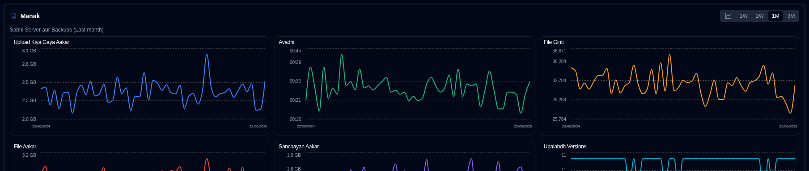

# Backup Metrics {#backup-metrics}

Dashboard (table view) aur server details page donon par samay ke saath backup metrics ka ek chart dikhaya gaya hai.

- **Dashboard**: chart mein **duplistatus** database mein record kiye gaye backups ki kul sankhya dikhai jaati hai. Yadi aap Cards layout ka upyog karte hain, to aap uske consolidated metrics dekhne ke liye ek server chun sakte hain (jab side panel metrics dikha raha ho).
- **Server Details** page: chart chune hue server (uske sabhi backups ke liye) ya ek akela, vishisht backup ke liye metrics dikhata hai.

## Inline Chart Controls {#inline-chart-controls}

Display Settings mein navigate kiye bina aasan configuration ke liye chart panel headers par turant access controls uplabdh hain:

### Time Range Selector {#time-range-selector}

Turant samay seema chunav ke liye chart header mein pill buttons dikhte hain: **1W | 2W | 1M | 3M**

- **1W**: Pichhle 7 din (rolling window)
- **2W**: Pichhle 14 din (rolling window)
- **1M**: Pichhle 30 din (rolling window, default)
- **3M**: Pichhle 90 din (rolling window)

Yahan kiye gaye badlav aapke Display Settings ke saath sync hote hain, isliye aapki pasand page refresh hone par yaad rakhi jaati hai.

### Chart Style Toggle {#chart-style-toggle}

Chart header mein ek toggle button aapko iske beech switch karne ki anumati deta hai:

- **Smooth Lines**: Data points ko smooth curves se jode hue dikhayein
- **Bar Chart**: Har samay avadhi ke liye data ko discrete bars ke roop mein dikhayein

Donon modes optimal display ke liye time-bucket aggregation ka upyog karte hain. Bar mode mein khali avadhiyon mein koi bar render nahin hota hai. Aapki pasand page refresh hone par bani rehti hai aur Display Settings ke saath sync hoti hai.

## Chart Data Consolidation {#chart-data-consolidation}

Jab ek hi din mein kai backups hote hain, to **duplistatus** unhe charts par dikhane se pehle data ko consolidate karta hai:

- **SUM**: Cumulative metrics (Duration, File Count, File Size, Uploaded Size) ke liye upyog kiya jaata hai
- **LAST**: Storage Size ke liye upyog kiya jaata hai (din ka sabse naya maan)
- **MAX**: Available Versions ke liye upyog kiya jaata hai (din ki sabse oonchi sankhya)

Yah consolidation samay bucketing lagoo hone se pehle hota hai, jo sahi aggregated metrics sunishchit karta hai. Udaharan ke liye, 5/12/26 ko do backups chart par ek consolidated data point utpann karenge.

## Metric Definitions {#metric-definitions}

- **Uploaded Size**: Duplicati server se destination (local storage, FTP, cloud provider, ...) prati din backup ke dauran upload/transmit data ki kul matra.
- **Duration**: Prati din milne wale sabhi backups ki kul avadhi HH:MM mein.
- **File Count**: Prati din milne wale sabhi backups ke liye report kiye gaye file count counter ka yog.
- **File Size**: Prati din milne wale sabhi backups ke liye Duplicati server dwara report ki gayi file size ka yog.
- **Storage Size**: Prati din Duplicati server dwara report ki gayi backup destination par upyog ki gayi storage size ka yog.
- **Available Versions**: Prati din sabhi backups ke liye uplabdh sabhi versions ka yog.

:::noteAap chart ke liye samay seema configure karne hetu [Display Settings](settings/display-settings.md) control ka upyog kar sakte hain.
:::
