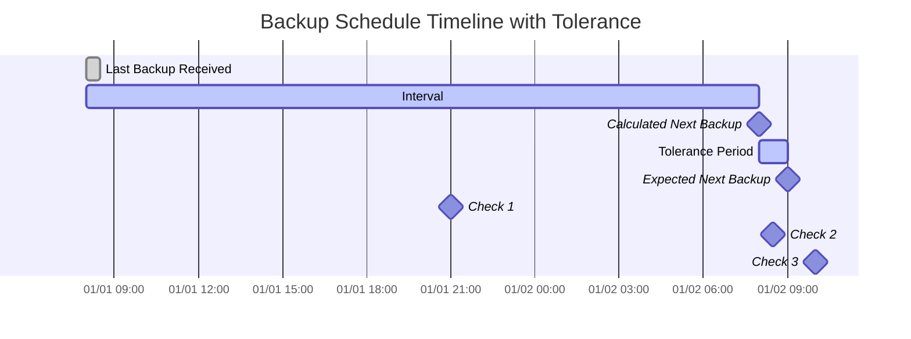

import { ZoomMermaid } from '@site/src/components/ZoomMermaid';

# Backup Monitoring {#backup-monitoring}

Backup monitoring ki suvidha aapko overdue backups ko track aur alert karne ki anumati deti hai. Suchnaayein NTFY ya Email ke dwara ho sakti hain.

User interface mein, overdue backups ko ek warning icon ke saath dikhaya jaata hai. Icon par hover karne se overdue backup ke vivaran dikhte hain, jismein antim backup samay, apekshit backup samay, tolerance period aur apekshit agla backup samay shaamil hain.

## Overdue Check Process {#overdue-check-process}

**Yah kaise kaam karta hai:**

| **Step** | **Value**                  | **Description**                                   | **Example**        |
|:--------:|:---------------------------|:--------------------------------------------------|:-------------------|
|    1     | **Last Backup**            | Antim safal backup ka timestamp.      | `2024-01-01 08:00` |
|    2     | **Expected Interval**      | Configure kiya gaya backup frequency.                  | `1 day`            |
|    3     | **Calculated Next Backup** | `Last Backup` + `Expected Interval`               | `2024-01-02 08:00` |
|    4     | **Tolerance**              | Configure kiya gaya grace period (extra samay ki anumati). | `1 hour`           |
|    5     | **Expected Next Backup**   | `Calculated Next Backup` + `Tolerance`            | `2024-01-02 09:00` |

Ek backup ko **overdue** maana jaata hai agar vartaman samay `Expected Next Backup` samay se baad ka hai.

<ZoomMermaid>

</ZoomMermaid>

**Upar di gayi timeline par aadharit udaharan:**

- `2024-01-01 21:00` par (🔹Check 1), backup **samay par** hai.
- `2024-01-02 08:30` par (🔹Check 2), backup **samay par** hai, kyunki yah abhi bhi tolerance period ke andar hai.
- `2024-01-02 10:00` par (🔹Check 3), backup **overdue** hai, kyunki yah `Expected Next Backup` samay ke baad hai.

## Periodic Checks {#periodic-checks}

**duplistatus** configure kiye ja sakte intervals par overdue backups ke liye periodic checks karta hai. Default interval 20 minute hai, lekin aap ise [Settings → Backup Monitoring](settings/backup-monitoring-settings.md) mein configure kar sakte hain.

## Automatic Configuration {#automatic-configuration}

Jab aap Duplicati server se backup logs collect karte hain, to **duplistatus** svatah hi:

- Duplicati configuration se backup schedule extract karta hai
- Backup monitoring intervals ko theek se match karne ke liye update karta hai
- Anumati prapt saptaah ke din aur scheduled samay ko synchronize karta hai
- Aapki notification preferences ko preserve karta hai

:::tip
Sabse achhe parinaamon ke liye, Duplicati server mein backup job interval badalne ke baad backup logs ikattha karein. Yah sunishchit karta hai ki **duplistatus** aapke vartaman configuration ke saath samayojit rahe.
:::

Vistrit configuration vikalpon ke liye [Backup Monitoring Sammaan](settings/backup-monitoring-settings.md) section ki samiksha karein.
