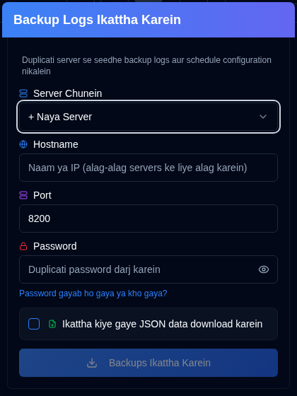
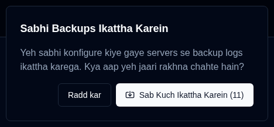

# Backup Logs Sankalan {#collect-backup-logs}

**duplistatus** Duplicati serveron se backup logs seedhe prapt kar sakta hai database ko bharne ya mishing log data ko restore karne ke liye. Application automatically duplicate logs ko skip kar deti hai jo pehle se database mein maujood hain.

## Backup Logs Sankalan ke Liye Kadam {#steps-to-collect-backup-logs}

### Manual Sankalan {#manual-collection}

1.  Application Toolbar mein <IconButton icon="lucide:download" /> **Backup Logs Sankalan** icon par click karein [Application Toolbar](overview.md#application-toolbar).

2.  Server Chunein

Yadi aapke paas [Sammaan → Server Sammaan](settings/server-settings.md) mein server addresses configure hain, to turant sankalan ke liye dropdown list se ek chunein. Yadi aapke paas koi server configure nahin hai, to aap Duplicati server ka vivaran manually enter kar sakte hain.

3.  Duplicati server ka vivaran enter karein:
    - **Hostname**: Duplicati server ka hostname ya IP pata. Aap multiple hostnames ko comma se alag karke enter kar sakte hain, jaise `192.168.1.23,someserver.local,192.168.1.89`
    - **Port**: Duplicati server dwara istemaal kiya jaane wala port number (default: `8200`).
    - **Password**: Yadi zaroori ho to authentication password enter karein.
    - **Ikattha kiye gaye JSON data download karein**: duplistatus dwara sankalit data download karne ke liye is option ko enable karein.
4.  **Backups Ikattha Karein** par click karein.

***Notes:***
- Yadi aap multiple hostnames enter karte hain, to sabhi serveron ke liye same port aur password ka istemaal karke sankalan kiya jayega.
- **duplistatus** automatically sabse accha connection protocol (HTTPS ya HTTP) detect karega. Yeh pehle HTTPS (proper SSL validation ke saath) try karta hai, phir self-signed certificates ke saath HTTPS, aur aakhir mein fallback ke roop mein HTTP.

:::tip
[Sammaan → Backup Monitoring](settings/backup-monitoring-settings.md) aur [Sammaan → Server Sammaan](settings/server-settings.md) mein single-server sankalan ke liye <IconButton icon="lucide:download" /> buttons uplabdh hain.
:::

 

### Bulk Sankalan {#bulk-collection}

Sabhi configured serveron se sankalan karne ke liye application toolbar mein <IconButton icon="lucide:download" /> **Backup Logs Sankalan** button par _right-click_ karein.

:::tip
Aap sabhi configured serveron se sankalan karne ke liye [Sammaan → Backup Monitoring](settings/backup-monitoring-settings.md) aur [Sammaan → Server Sammaan](settings/server-settings.md) pages mein <IconButton icon="lucide:import" label="Sabhi Sankalan"/> button ka bhi istemaal kar sakte hain.
:::

## Sankalan Prakriya Kaise Kaam Karti Hai {#how-the-collection-process-works}

- **duplistatus** automatically sabse accha connection protocol detect karta hai aur diye gaye Duplicati server se connect hota hai.
- Yeh backup itihas, log ki jaankari, aur backup settings (backup monitoring ke liye) retrieve karta hai.
- **duplistatus** database mein pehle se maujood koi bhi logs skip kar diye jaate hain.
- Naya data process karke local database mein store kiya jata hai.
- Istemal kiya gaya URL (detect kiye gaye protocol ke saath) local database mein store ya update kiya jayega.
- Yadi download option chuna gaya hai, to yeh sankalit JSON data download karega. File ka naam is format mein hoga: `[serverName]_collected_[Timestamp].json`. Timestamp ISO 8601 date format (YYYY-MM-DDTHH:MM:SS) ka istemaal karta hai.
- Dashboard naye information ko reflect karne ke liye update ho jata hai.

:::note Collect karne ke baad duplicate servers dikh rahe hain?
Agar backup logs collect karne ke baad (ya Duplicati reinstall/upgrade ke baad) vahi server ek se zyada baar dikhta hai, to iska karan aksar badal gaya `machine_id` ya ek Duplicati API bug hota hai jo `identity` id aur `machine_id` ko mix karta hai. Iska hal Duplicati server par ids ko align karna hai (`identity.txt`/`machineid.txt` edit karein ya **Duplicati → Sammaan → Advanced Options → Machine-id** set karein), Duplicati restart karein, aur phir **duplistatus** mein entries ko [Sammaan → Database Maintenance → Duplicate servers merge karein](settings/database-maintenance.md#merge-duplicate-servers) ke zariye merge karein. Poori steps ke liye [Dashboard par Duplicate servers](troubleshooting.md#duplicate-servers-on-the-dashboard) dekhein.
:::

## Sankalan Issues Ka Troubleshooting {#troubleshooting-collection-issues}

Backup log sankalan ke liye Duplicati server ka **duplistatus** installation se accessible hona zaroori hai. Yadi aapko issues aate hain, to kripya nimnalikhit ki jaanch karein:

- Pura karein ki hostname (ya IP pata) aur port number sahi hain. Aap iska test apne browser mein Duplicati server UI ko access karke kar sakte hain (jaise, `http://hostname:port`).
- Check karein ki **duplistatus** Duplicati server se connect ho sakta hai. Ek aam samasya DNS naam resolution hai (system hostname dwara server ko dhoondh nahin paata hai). [troubleshooting section](troubleshooting.md#collect-backup-logs-not-working) mein aur dekhein.
- Pura karein ki aapne jo password provide kiya hai woh sahi hai.
