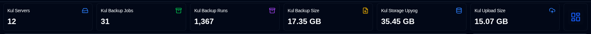
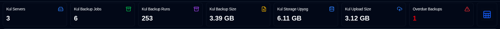
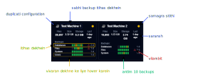
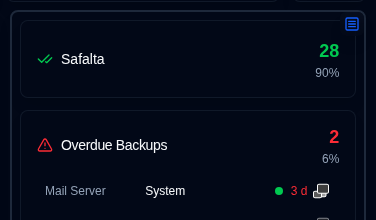
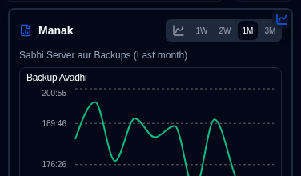
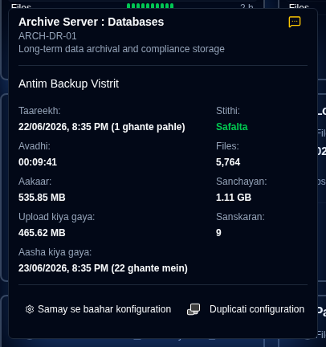
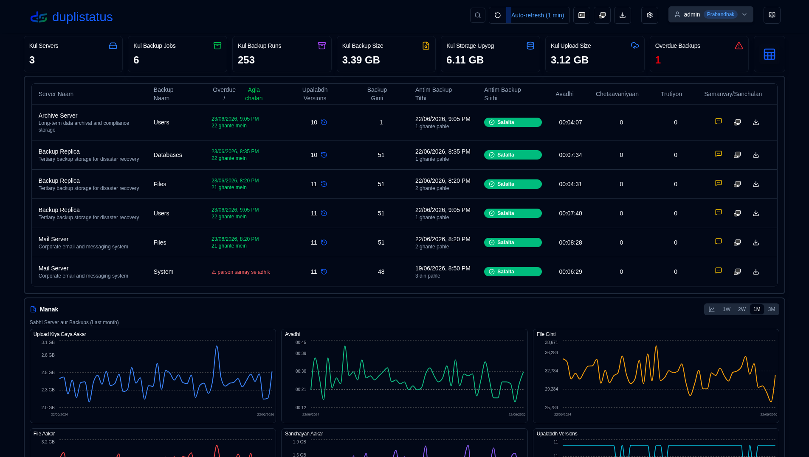
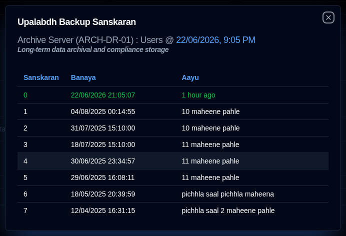

# Dashboard {#dashboard}

## Dashboard Summary {#dashboard-summary}

Is section mein sabhi backups ke liye ekathrit aankde dikhaate hain.

- **Kul Server**: Nigrani ke adheen aane wale serveron ki sankhya.                                                                                                             
- **Kul Backup Jobs**: Sabhi serveron ke liye konfigure kiye gaye backup jobs (prakaar) ki kul sankhya.                                                                                
- **Kul Backup Runs**: Sabhi serveron ke liye prapt ya ekathrit kiye gaye backup logs ki kul sankhya.                                                                   
- **Kul Backup Size**: Sabse adhik backup logs prapt hone par aadharit, sabhi strot data ka sahayogik aakar.                                                                    
- **Kul Storage Upyog**: Backup gantavya (jaise ki cloud storage, FTP server, local drive) par backup dwaara upyog kiya gaya kul storage sthaan, sabse adhik backup logs prapt hone par aadharit.                
- **Kul Upload Size**: Duplicati server se gantavya (jaise ki local storage, FTP, cloud provider) tak upload ki gayi data ki kul matra.                                       
- **Vilambit Backups** (table): Vilambit backups ki sankhya. [Backup Suchnaayein Sammaan](settings/backup-notifications-settings.md) dekhain                          
- **Layout Toggle**: Cards layout (default) aur Table layout ke beech badalne ke liye.

:::tip Duplicate server dekh rahe hain?
Yadi ek hi server dashboard par ek se adhik baar dikhai deti hai, to use [Sammaan → Database Maintenance → Duplicate Servers Merge Karein](settings/database-maintenance.md#merge-duplicate-servers) ka upyog karke unhein ekatrit karein. Duplicate tabhi hoti hain jab aap Duplicati ko punah sthaapit karte hain ya upgrade karte hain, kyunki server ka `machine_id` badal sakta hai aur **duplistatus** use ek naya server maanta hai.
:::

## Server Filtering {#server-filtering}

Aap dashboard par pradarshit serveron aur backups ko application toolbar mein search field ka upyog karke filter kar sakte hain. Search field ko prakat karne ke liye filter icon <IconButton icon="lucide:search" /> par click karein.

**Filter Matches:**
- Server ID
- Server URL
- Backup job names

**Scope:**
- Dashboard par card aur table views dono ko filter karta hai
- Session state ko Dashboard Server Filter Provider ke madhyam se banaye rakhta hai
- Refresh ya dashboard chhodne par clear ho jaata hai

Isse aapko kai nigrani kiye ja rahe systemon mein vishisht serveron ya backups ko jaldi se khojne mein aasani hoti hai.

## Cards Layout {#cards-layout}

Cards layout pratyek backup ke liye prapt hone wale sabse adhik backup log ki stithi dikhaata hai.

- **Server Naam**: Duplicati server ka naam (ya upnaam)
  - **Server Naam** par hover karne se server naam aur note dikhai dega
- **Overall Status**: Server ki stithi. Vilambit backups ko **Warning** stithi ke roop mein dikhaaya jaayega
- **Summary information**: Is server ke sabhi backups ke liye fileon ki sankhya, aakar aur storage upyog ki sankalit jaankari. Saath hi saath sabse adhik backup log prapt hone ka samay bhi dikhaata hai (hover karne par timestamp dikhai dega)
- **Backups list**: Is server ke liye konfigure kiye gaye sabhi backups ki ek table, 3 columns ke saath:
  - **Backup Naam**: Duplicati server mein backup ka naam
  - **Status history**: Antim 10 backups ke status.
  - **Antim backup prapt**: Antim log prapt hone ke samay se beeti samay. Yadi backup vilambit hai, to ek warning icon dikhai dega.
    - Samay ko sankshipt prakaar mein dikhaaya jaata hai: `m` minute ke liye, `h` ghante ke liye, `d` dinon ke liye, `w` saptaah ke liye, `mo` mahino ke liye, `y` varshon ke liye.

Card sort order aur anya konfigurasyon ko [Display Settings](settings/display-settings.md) mein set kiya ja sakta hai.

Panel view mein do suchnaatmak pradarshaniyaan uplabdh hain, jo side panel ke upar dibe baaye button par click karke prapt ki ja sakti hain:

- Status: Pratyek stithi ke backup jobs ki aankde, vilambit backups ki suchi ke saath, aur warning/errors stithi wale backup jobs ke saath.

- Metrics: Samay ke saath duration, file size aur storage size ke chart, ekathrit ya chuni gayi server ke liye.

### Backup Vivaran {#backup-details}

List mein backup par hover karne se antim backup log prapt ki antim backup log prapt ki vivaran aur koi bhi vilambit jaankari dikhai deti hai.

- **Server Naam : Backup**: Duplicati server aur backup ka naam ya upnaam, server naam aur note bhi dikhayega.
  - Upnaam aur note ko [Sammaan → Server Sammaan](settings/server-settings.md) par configure kiya ja sakta hai.
- **Suchna**: Naye backup logs ke liye [configure ki gayi suchna](#notifications-icons) setting dikhane wala ek icon.
- **Taareekh**: Backup ka timestamp aur antim screen refresh ke baad beeta hua samay.
- **Stithi**: Prapt antim backup ki stithi (Safalta, Warning, Truti, Gambhir).
- **Avadhi, File Ginti, File Aakar, Sanchayan Aakar, Upload Kiya Gaya Aakar**: Duplicati server dwara report kiye gaye maan.
- **Upalabdh Versions**: Backup ke samay backup destination par store ki gayi backup versions ki sankhya.

Yadi yeh backup vilambit hai, to tooltip yeh bhi dikhata hai:

- **Apekshit Backup**: Backup ka samay jab backup apekshit tha, jismein configure kiya gaya grace period (vilambit chinhit karne se pehle anumati prapt samay) shamil hai.

Aap monitoring settings configure karne ke liye ya Duplicati server ke web interface ko kholne ke liye neeche diye gaye buttons par click kar sakte hain [Sammaan → Backup Suchnaayein](settings/backup-notifications-settings.md).

## Table Layout {#table-layout}

Table layout sabhi servers aur backups ke liye prapt sabse naye backup logs ko list karta hai.

- **Server Naam**: Duplicati server (ya upnaam) ka naam
  - Naam ke neeche server note hai
- **Backup Naam**: Duplicati server mein backup ka naam.
- **Upalabdh Versions**: Backup destination par store ki gayi backup versions ki sankhya. Yadi icon greyed out hai, to log mein vivaran prapt nahi hua tha. Vivaran ke liye [Duplicati Configuration nirdeshon](../installation/duplicati-server-configuration.md) ko dekhein.
- **Backup Ginti**: Duplicati server dwara report ki gayi backups ki sankhya.
- **Antim Backup Tithi**: Prapt antim backup log ka timestamp aur antim screen refresh ke baad beeta hua samay.
- **Antim Backup Stithi**: Prapt antim backup ki stithi (Safalta, Warning, Truti, Gambhir).
- **Avadhi**: HH:MM:SS mein backup ki avadhi.
- **Chetaavaniyaan/Trutiyon**: Backup log mein report ki gayi chetaavaniyon/trutiyon ki sankhya.
- **Sammaan**:
  - **Suchna**: Naye backup logs ke liye configure ki gayi suchna setting dikhane wala ek icon.
  - **Duplicati configuration**: Duplicati server ke web interface ko kholne ke liye ek button

Aap table size aur anya configurations ko configure karne ke liye [Display settings](settings/display-settings.md) ka upyog kar sakte hain.

### Suchna Icons {#notifications-icons}

| Icon                                                                                                                               | Suchna Vikalp | Vivaran                                                                                         |
|------------------------------------------------------------------------------------------------------------------------------------|---------------------|-----------------------------------------------------------------------------------------------------|
| <IconButton icon="lucide:message-square-off" style={{border: 'none', padding: 0, color: '#9ca3af', background: 'transparent'}} />  | Band                 | Naya backup log prapt hone par koi suchna nahi bheji jayegi                                     |
| <IconButton icon="lucide:message-square-more" style={{border: 'none', padding: 0, color: '#60a5fa', background: 'transparent'}} /> | Sabhi                 | Naye backup log ke liye suchna bheji jayegi, iski stithi ke bawajood.                      |
| <IconButton icon="lucide:message-square-more" style={{border: 'none', padding: 0, color: '#fbbf24', background: 'transparent'}} /> | Chetaavaniyaan            | Suchna kewal Warning, Anjaan, Truti, ya Gambhir stithi wale backup logs ke liye bheji jayegi. |
| <IconButton icon="lucide:message-square-more" style={{border: 'none', padding: 0, color: '#f87171', background: 'transparent'}} /> | Trutiyon              | Suchna kewal Truti ya Gambhir stithi wale backup logs ke liye bheji jayegi.                    |

:::note
Yeh suchna setting kewal tabhi lagu hoti hai jab **duplistatus** Duplicati server se naya backup log prapt karta hai. Vilambit suchnaayein alag se configure ki jaati hain aur is setting ke bawajood bheji jayengi.
:::

### Vilambit Vivaran {#overdue-details}

Vilambit warning icon par hover karne se vilambit backup ke baare mein vivaran dikhai deta hai.

- **Janch kiya gaya**: Kab antim vilambit janch ki gayi thi. Frequency ko [Backup suchnaayein Sammaan](settings/backup-notifications-settings.md) mein configure karein.
- **Antim Backup**: Kab antim backup log praapt hua tha.
- **Apekshit Backup**: Backup ka samay jab backup apekshit tha, samay seema (vilambit ke roop mein chinhit karne se pehle anumati diya gaya extra samay) sahit.
- **Antim Suchna**: Kab antim vilambit suchna bheji gayi thi.

### Upalabdh Backup Sanskaran {#available-backup-versions}

Neela ghadi icon click karne par backup ke samay upalabdh backup sanskaranon ki ek soochi khulti hai, jaisa ki Duplicati server dwara report kiya gaya hai.

- **Backup Vivaran**: Server naam aur upnaam, server note, backup naam, aur backup kab execute kiya gaya tha, dikhata hai.
- **Sanskaran Vivaran**: Sanskaran sankhya, nirman taareekh, aur aayu dikhata hai.

:::note
Yadi icon greyed out hai, to iska matlab hai ki sandesh logs mein koi vistrit jaankari praapt nahi hui.
Vivaran ke liye [Duplicati Configuration nirdesh](../installation/duplicati-server-configuration.md) dekhein.
:::
