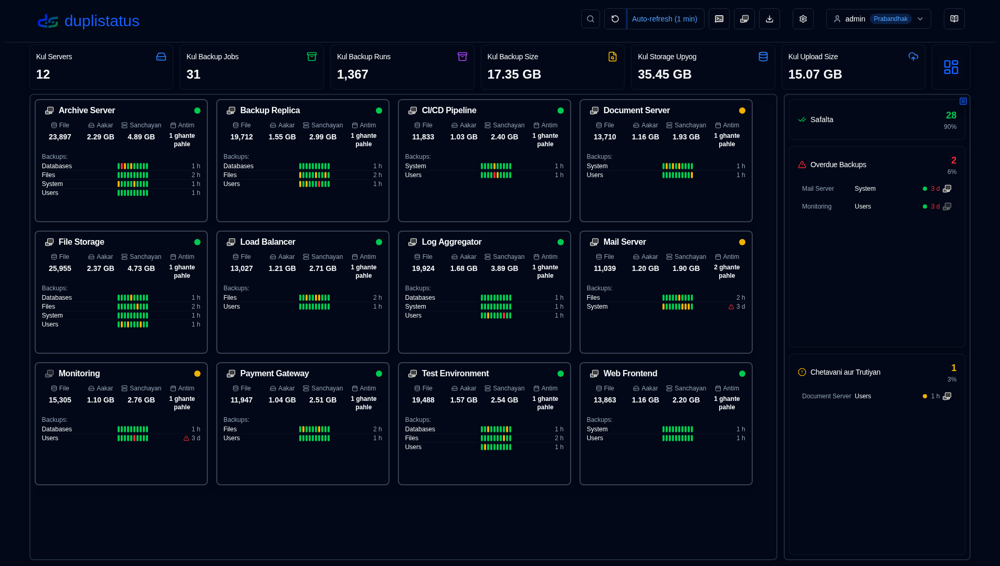
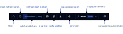
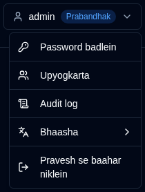
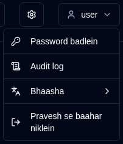

# Overview {#overview}

duplistatus user guide mein aapka swagat hai. Yah vistrit document, kai servers par Duplicati backup operations ko monitor aur manage karne ke liye duplistatus ka upyog karne ke liye vishad nirdesh pradan karta hai.

## duplistatus kya hai? {#what-is-duplistatus}

duplistatus ek shaktishali monitoring dashboard hai jo khaas taur par Duplicati backup systems ke liye design kiya gaya hai. Yah pradan karta hai:

- Ekal interface se kai Duplicati servers ki kendrit monitoring
- Sabhi backup operations ki real-time stithi tracking
- Configure kiye ja sakne wale alerts ke saath swachalit overdue backup detection
- Backup performance ke vistrit metrics aur visualisation
- Lachhila suchana pranali NTFY aur Email ke zariye
- Anek-bhaasha samarthan (English, French, German, Spanish, Brazilian Portuguese, Hindi (Roman) aur Simplified Chinese).

## Sthapana {#installation}

Prarambhik avashyaktaon aur vishad installation nirdeshon ke liye, kripya [Installation Guide](../installation/installation.md) dekhein.

## Dashboard Access Karna {#accessing-the-dashboard}

Safal installation ke baad, nimnalikhit steps ka anupalan karke duplistatus web interface access karein:

1. Apne pasandida web browser ko kholein
2. `http://your-server-ip:9666` par navigate karein
   - `your-server-ip` ko apne duplistatus server ke vastavik IP address ya hostname se badlein
   - Default port `9666` hai
3. Aapko ek login page dikhaya jayega.

Pehle upyog ke liye (ya pre-0.9.x versions se upgrade ke baad) in credentials ka upyog karein:
    - username: `admin`
    - password: `Duplistatus09`

Upar dahine kone mein <IconButton icon="lucide:languages" label="Bhaasha" />, ya login ke baad <IconButton icon="lucide:user" label="Username" /> mein user interface bhasha chunein (neeche dekhein).

4. Login ke baad, mukhya dashboard swatah dikhai dega (pehli baar upyog karne par data ke bina)

## User Interface Overview {#user-interface-overview}

duplistatus aapke poore infrastructure mein Duplicati backup operations ki monitoring ke liye ek sahaj dashboard pradan karta hai.

User interface ko ek spasht aur vistrit monitoring anubhav pradan karne ke liye kai mukhya sections mein sangathit kiya gaya hai:

1. [Application Toolbar](#application-toolbar): Zaroori functions aur configurations tak turant pahunch
2. [Dashboard Summary](dashboard.md#dashboard-summary): Sabhi monitored servers ke liye overview statistics
3. Servers Overview: Sabhi backups ki latest stithi dikhane wala [Cards layout](dashboard.md#cards-layout) ya [table layout](dashboard.md#table-layout)
4. [Overdue Details](dashboard.md#overdue-details): Vistrit jankari ke saath overdue backups ke liye visual warnings
5. [Available Backup Versions](dashboard.md#available-backup-versions): Destination par uplabdh backup versions dekhne ke liye neele icon par click karein
6. [Backup Metrics](backup-metrics.md): Samay ke saath backup performance dikhane wale interactive charts
7. [Server Details](server-details.md): Vistrit statistics sahit, specific servers ke liye record kiye gaye backups ki vistrit list
8. [Backup Details](server-details.md#backup-details): Execution logs, warnings, aur errors sahit, individual backups ke liye gehri jankari

## Application Toolbar {#application-toolbar}

Application toolbar mein mukhya functions aur settings tak pahunchne ke liye suvidhajanak access milta hai, jo kushal workflow ke liye sanrachit hain.

| Button                                                                                                                                           | Description                                                                                                                                                                                |
|--------------------------------------------------------------------------------------------------------------------------------------------------|--------------------------------------------------------------------------------------------------------------------------------------------------------------------------------------------|
| <IconButton icon="lucide:search" /> &nbsp; Filter                                                                                            | ID, URL, ya backup job naam dwara server ko khojein aur filter karein.                                                      |
| <IconButton icon="lucide:rotate-ccw" /> &nbsp; Refresh screen                                                                                    | Sabhi data ka turant manual screen refresh karein                                                                                                                                     |
| <IconButton label="Auto-refresh" />                                                                                                              | Sva-sanchalit refresh functionality ko saksham ya asamarth karen. [Display settings](settings/display-settings.md) mein Configure karein   Display Settings prushth kholne ke liye _Right-click_ karen                         |
| <SvgButton svgFilename="ntfy.svg" /> &nbsp; NTFY kholein                                                                                            | Apne sanrachit notification topic ke liye ntfy.sh website access karein.   _Right-click_ karein duplistatus se suchnaayein prapt karne ke liye apne device ko sanrachit karne hetu QR code dikhane ke liye.               |
| <SvgButton svgFilename="duplicati_logo.svg" href="duplicati-configuration" /> &nbsp; [Duplicati configuration](duplicati-configuration.md)       | Duplicati server ke web interface ko kholein   Duplicati legacy UI (`/ngax`) ko naye tab mein kholne ke liye _right-click_ karein                                                              |
| <IconButton icon="lucide:download" href="collect-backup-logs" /> &nbsp; [Sankalan karein logs](collect-backup-logs.md)                                   | Duplicati server se connect karein aur backup logs prapt karein   _Right-click_ karein sabhi configured server ke liye logs sankalan karne ke liye                                                                       |
| <IconButton icon="lucide:settings" href="settings/backup-notifications-settings" /> &nbsp; [Settings](settings/backup-notifications-settings.md) | Notifications, monitoring, SMTP server, aur notification templates ko configure karein                                                                                                               |
| <IconButton icon="lucide:user" label="username" />                                                                                               | Jude hue user, user type (`Admin`, `User`), user menu ke liye click karein (bhasha chayan shamil hai). [User Management](settings/user-management-settings.md) mein aur dekhein               |
| <IconButton icon="lucide:book-open-text" href="overview" /> &nbsp; User Guide                                                                    | Aapke dwara vartaman mein dekhe ja rahe page se sambandhit section mein [User Guide](overview.md) kholein. Tooltip "Help for [Page Name]" dikhata hai yeh batane ke liye ki kaun sa documentation khulega. |

### User Menu {#user-menu}

Upyogkarta button par click karne se ek dropdown menu khulta hai jismein upyogkarta-vishisht vikalop hote hain. Menu ke vikalop is par nirbhar karte hain ki aap prabandhak ke roop mein login hain ya ek sadharan upyogkarta. Dono bhoomikayen **Bhaasha** submenu ke zariye antar-mukh bhaasha badal sakti hain. Samarthit bhaashayen: English, French, German, Spanish, Brazilian Portuguese, Hindi (Roman) aur Simplified Chinese.

<table>
  <tr>
    <th>Administrator</th>
    <th>Regular User</th>
  </tr>
  <tr>
    <td style={{verticalAlign: 'top'}}></td>
    <td style={{verticalAlign: 'top'}}></td>
  </tr>
</table>

## Aavashyak Configuration {#essential-configuration}

1. Apne [Duplicati servers](../installation/duplicati-server-configuration.md) ko backup log sandesh duplistatus ko bhejane ke liye configure karein (anivarya).
2. Prarambhik backup logs ikattha karein – apne sabhi Duplicati servers se aitihasik backup data ke saath database ko bharne ke liye [Backup Logs Ikattha Karein](collect-backup-logs.md) suvidha ka upyog karein. Yah pratyek server ke configuration ke aadhar par backup monitoring intervals ko svatah update karta hai.
3. Server settings configure karein – apne dashboard ko adhik suchak banane ke liye [Settings → Server](settings/server-settings.md) mein server aliases aur notes set karein.
4. NTFY settings configure karein – [Settings → NTFY](settings/ntfy-settings.md) mein NTFY ke madhyam se suchnaayein set karein.
5. Email settings configure karein – [Settings → Email](settings/email-settings.md) mein email suchnaayein set karein.
6. Backup Suchna Configure Karen – [Settings → Backup Notifications](settings/backup-notifications-settings.md) mein prati-backup ya prati-server suchnaayein set karein.

 

:::info[IMPORTANT]
Yad rakhein ki Duplicati servers ko backup logs duplistatus ko bhejane ke liye configure karein, jaisa ki [Duplicati configuration](../installation/duplicati-server-configuration.md) section mein rooprekha di gayi hai.
:::

 

:::note
Sabhi product names, logos aur trademarks unke respective owners ki property hain. Icons aur names sirf identification purposes ke liye use kiye gaye hain aur endorsement imply nahi karte hain.
:::
