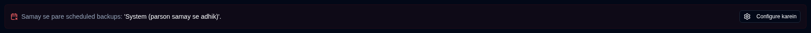
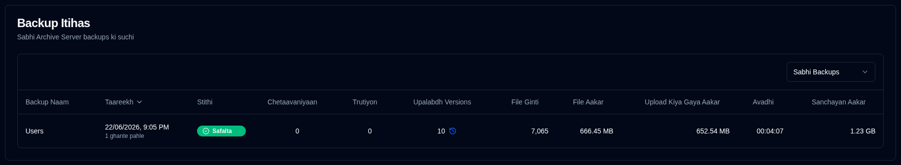

# Server Vivaran {#server-details}

Dashboard se server par click karne par ek page khulta hai jisme us server ke backups ki list hoti hai. Aap sabhi backups dekh sakte hain ya agar server mein kai backups configure hain to ek vishesh backup select kar sakte hain.

## Server/Backup Aankade {#serverbackup-statistics}

Yah section server par sabhi backups ya ek chune hue backup ke liye aankade dikhata hai.

- **KUL BACKUP JOBS**: Is server par configure kiye gaye backup jobs ki kul sankhya.
- **KUL BACKUP RUNS**: Chalaye gaye backup runs ki kul sankhya (Duplicati server dwara report ki gayi).
- **UPALABDH VERSIONS**: Upalabdh versions ki sankhya (Duplicati server dwara report ki gayi).
- **AUSAT AVDHI**: **duplistatus** database mein record kiye gaye backups ki ausat (mean) avadhi.
- **ANTIM BACKUP AAKAR**: Antim backup log se source files ka aakar jo prapt hua.
- **KUL STORAGE UPYOG**: Backup destination par upyog kiya gaya storage, antim backup log mein report ke anusar.
- **KUL UPLOAD KIYA GAYA**: **duplistatus** database mein record kiye gaye sabhi upload kiye gaye data ka yog.

Agar yah backup ya server par kisi bhi backup (jab **Sabhi Backups** select kiya gaya ho) mein vilamb ho raha hai, to summary ke neeche ek sandesh dikhai deta hai.

<IconButton icon="lucide:settings" href="settings/backup-monitoring-settings" label="Configure karein"/> par click karein [Sammaan → Backup Monitoring](settings/backup-monitoring-settings.md) par jaane ke liye. Ya toolbar par <SvgButton SvgButton svgFilename="duplicati_logo.svg" href="duplicati-configuration" /> par click karke Duplicati server ke web interface ko kholein aur logs ki jaanch karein.

 

## Backup Itihas {#backup-history}

Yah table chune hue server ke liye backup logs ki list karti hai.

- **Backup Naam**: Duplicati server mein backup ka naam.
- **Taareekh**: Backup ka samay chinh aur antim screen refresh ke baad beeta hua samay.
- **Stithi**: Backup ki stithi (Safalta, Warning, Truti, Gambhir).
- **Chetaavaniyaan/Trutiyon**: Backup log mein report ki gayi chetaavaniyon/trutiyon ki sankhya.
- **Upalabdh Versions**: Backup destination par upalabdh backup versions ki sankhya. Agar icon greyed out hai, to vivaran prapt nahin hua.
- **File Ginti, File Aakar, Upload Kiya Gaya Aakar, Avadhi, Sanchayan Aakar**: Duplicati server dwara report kiye gaye maan.

:::tip Tips
• Is server ke liye **Sabhi Backups** ya ek vishesh backup select karne ke liye **Backup Itihas** section mein dropdown menu ka upyog karein.

• Aap kisi bhi column ko uske header par click karke sort kar sakte hain, sort order ulta karne ke liye dobara click karein.
 
• [Backup Vivaran](#backup-details) dekhne ke liye kisi bhi row par kahin bhi click karein.

:::

:::note
Jab **Sabhi Backups** select kiya jata hai, to list default roop se sabse naye se sabse purane tak sabhi backups dikhati hai.
:::

 

## Backup Vivaran {#backup-details}

Dashboard (table view) mein status badge par ya backup itihas table mein kisi bhi row par click karne se vistrit backup jaankaaree dikhai deti hai.

- **Server vivaran**: server naam, upnaam aur note.
- **Backup Jaankaaree**: Backup ka samay chinh aur uska ID.
- **Backup Aankade**: Report kiye gaye counters, aakar, aur avadhi ka sankshipt vivaran.
- **Log Sankshipt**: Report kiye gaye sandeshon ki sankhya.
- **Upalabdh Versions**: Upalabdh versions ki ek list (sirf tab dikhai deti hai agar jaankaaree logs mein prapt hui ho).
- **Sandesh/Chetaavaniyaan/Trutiyon**: Poore execution logs. Upasheershak batata hai ki kya log Duplicati server dwara truncate kiya gaya tha.

 

:::note
Duplicati server ko poore execution logs bhejne aur truncation se bachne ke liye configure karne ka tareeka janne ke liye [Duplicati Configuration nirdeshon](../installation/duplicati-server-configuration.md) ka sandarbh lein.
:::
