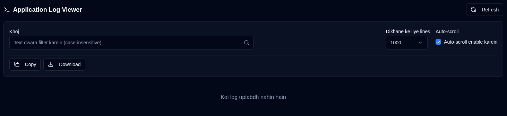

# Application Logs {#application-logs}

Application Logs viewer prashasakon ko filtering, export, aur web interface se seedhe real-time updates ke saath, ek hi jagah par sabhi application logs ki nigrani karne deta hai.

 

## Upalabdh Kriyaen {#available-actions}

| Button                                                              | Vivaran                                                                                         |
|:--------------------------------------------------------------------|:----------------------------------------------------------------------------------------------------|
| <IconButton icon="lucide:refresh-cw" label="Refresh" />            | Chune hue file se logs ko manually reload kare. Naye line ki pehchan ke liye tracking ko reset karta hai aur refresh hote samay loading spinner dikhata hai. |
| <IconButton icon="lucide:copy" label="Copy to clipboard" />         | Filter kiye gaye sabhi log lines ko apne clipboard mein copy kare. Vartaman khoj filter ka samman karta hai. Jaldi sharing ya anya tools mein paste karne ke liye upyogi. |
| <IconButton icon="lucide:download" label="Export" />               | Logs ko text file ke roop mein download kare. Vartaman mein chune hue file version se export karta hai aur vartaman khoj filter (yadi koi ho) lagoo karta hai. Filename format: `duplistatus-logs-YYYY-MM-DD.txt` (ISO format mein taareekh). |
| <IconButton icon="lucide:arrow-down-from-line" />                   | Pradarshit logs ki shuruaat mein jaldi se jump kare. Jab auto-scroll nishkriya ho ya lambe log files mein navigate karte samay upyogi. |
| <IconButton icon="lucide:arrow-down-to-line" />                    | Pradarshit logs ke ant mein jaldi se jump kare. Jab auto-scroll nishkriya ho ya lambe log files mein navigate karte samay upyogi. |

 

## Niyantran aur Filters {#controls-and-filters}

| Niyantran | Vivaran |
|:--------|:-----------|
| **File Version** | Kaunsa log file dekhna hai chune: **Vartaman** (sakriya file) ya rotated files (`.1`, `.2`, aadi, jahan uchch sankhyaen purani hain). |
| **Dikhane ke liye lines** | Chuni hui file se sabse naye **100**, **500**, **1000** (default), **5000**, ya **10000** lines pradarshit kare. |
| **Auto-scroll** | Jab saksham ho (vartaman file ke liye default), naye log entries par swatah scroll karta hai aur har 2 second mein refresh karta hai. Keval **Vartaman** file version ke liye kaam karta hai. |
| **Khoj** | Text dwara log lines ko filter kare (case-insensitive). Filters vartaman mein pradarshit lines par lagoo hote hain. |

 

Log display header filtered line count, total lines, file size, aur antim modified timestamp dikhata hai.

 
