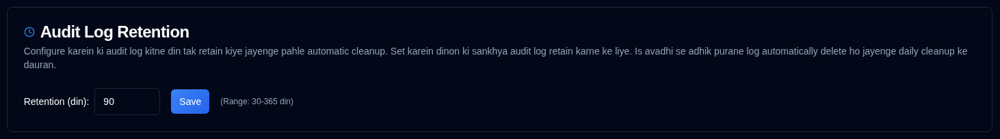

# Audit Log Retention {#audit-log-retention}

Configure karein ki audit logs ko automatic cleanup se pehle kitne samay tak rakha jaata hai.

| Setting | Description | Default Value |
|:-------|:-----------|:-------------|
| **Retention (days)** | Audit logs ko automatic deletion se pehle kitne dinon tak rakha jaayega, iski sankhya | **90 days** |

## Retention Settings {#retention-settings}

- **Range**: 30 se 365 din
- **Automatic Cleanup**: Rozana 02:00 UTC par chalta hai (configure nahi kiya ja sakta)
- **Manual Cleanup**: Administrators ke liye API ke dwara uplabdh hai (dekhein [Cleanup Audit Logs](../../api-reference/administration-apis.md#cleanup-audit-logs---apiaudit-logcleanup))
