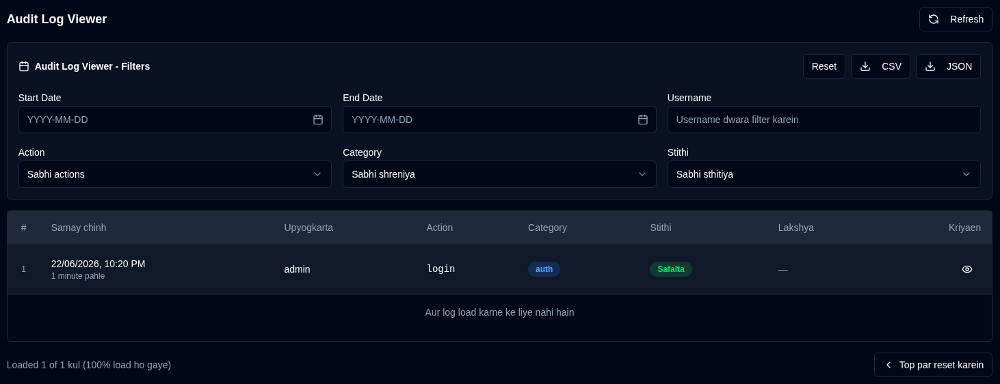

# Audit Logs {#audit-logs}

Audit log sabhi pranali badlavon aur upyogkarta kriyaon ka ek vistrit record pradan karta hai **duplistatus** mein. Yah suraksha aur samasya nivaran uddeshyon ke liye configuration badlavon, upyogkarta gatividhiyon, aur pranali parichalanon ko track karne mein madad karta hai.

## Audit Log Viewer {#audit-log-viewer}

Audit log viewer nimnalikhit jaankari ke saath sabhi logged ghatnaon ki ek kalakramik soochi pradarshit karta hai:

- **Samay chinh**: Kab ghatna hui
- **Upyogkarta**: Kriya karne wale upyogkarta ka username (ya svachalit kriyaon ke liye "Pranali")
- **Kriya**: Ki gayi vishisht kriya
- **Category**: Kriya ki category (Pramanikaran, Upyogkarta Prabandhan, Configuration, Backup Operations, Server Management, Pranali Operations)
- **Stithi**: Kya kriya safal hui ya asafal
- **Lakshya**: Prabhavit vastu (yadi lagu ho)
- **Vivaran**: Kriya ke baare mein atirikt jaankari

### Log Vivaran Dekhna {#viewing-log-details}

Vistrit jaankari dekhne ke liye kisi bhi log entry ke bagal mein <IconButton icon="lucide:eye" /> aankh icon par click karein, jisme shamil hain:
- Pura samay chinh
- Upyogkarta jaankari
- Sampoorn kriya vivaran (udaharan ke liye: badle gaye kshetr, aankde, ityadi)
- IP pata aur upyogkarta agent
- Truti sandesh (yadi kriya asafal rahi)

### Audit Logs Export Karna {#exporting-audit-logs}

Aap do roopon mein filtered audit logs export kar sakte hain:

| Button | Description |
|:------|:-----------|
| <IconButton icon="lucide:download" label="CSV"/> | Spreadsheet vishleshan ke liye CSV file ke roop mein logs export karein |
| <IconButton icon="lucide:download" label="JSON"/> | Programmatic vishleshan ke liye JSON file ke roop mein logs export karein |

:::note
Niryaat mein keval ve log shamil hain jo aapke sakriya filters ke aadhar par vartaman mein drishya hain. Sabhi logs export karne ke liye, pehle sabhi filters saaf karein.
:::
