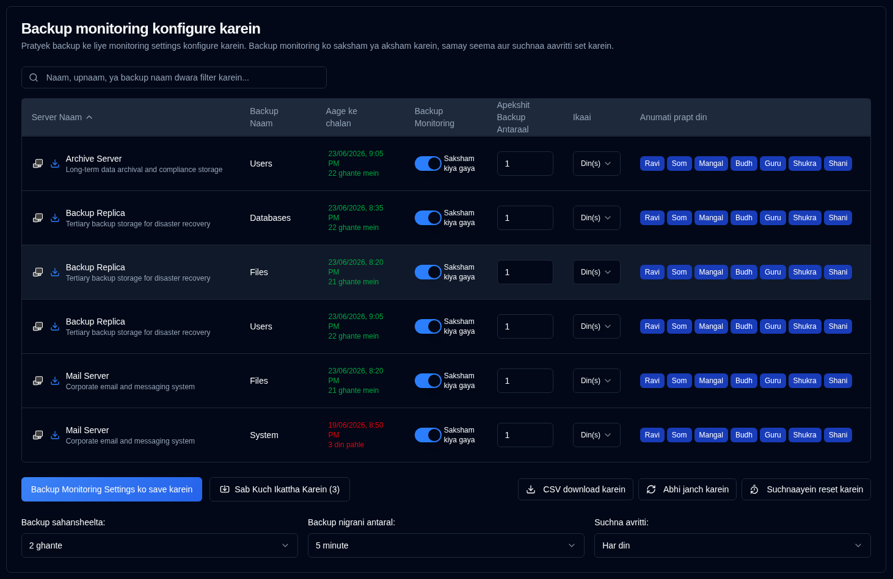

# Backup Monitoring {#backup-monitoring}

## Server Filtering {#server-filtering}

Is server list is page par filter field ka istemaal karke filter kiya ja sakta hai.

**Filter Matches:**
- Server ID
- Server URL
- Backup job names

Yah bahut saare systems ko manage karte samay monitoring settings mein vishesh servers ya backups ko jaldi se locate karna aasaan banata hai.

## Per-Backup Monitoring Settings Configure Karein {#configure-per-backup-monitoring-settings}

-  **Server Naam**: Overdue backups ke liye monitor karne hetu server ka naam. 
   - Duplicati server ke web interface ko kholne ke liye <SvgIcon svgFilename="duplicati_logo.svg" height="18"/> par click karein
   - Is server se backup logs collect karne ke liye <IIcon2 icon="lucide:download" height="18"/> par click karein.
- **Backup Naam**: Overdue backups ke liye monitor karne hetu backup ka naam.
- **Aage ke chalan**: Aage schedule kiya gaya backup samay, jo future mein schedule hone par hare rang mein, ya overdue hone par laal rang mein dikhaya jaata hai. "Aage ke chalan" value par hover karne se database se antim backup samay chinh dikhane wala tooltip khulta hai, jo poore din/samay aur saapeksh samay ke saath format kiya jaata hai.
- **Backup Monitoring**: Is backup ke liye backup monitoring enable ya disable karein.
- **Apekshit Backup Antaraal**: Apekshit backup antaraal.
- **Ikaai**: Apekshit antaraal ki ikaai.
- **Anumati prapt din**: Backup ke liye anumati prapt saptaah ke din.

Yadi server naam ke bagal mein icons greyed out hain, to server [Sammaan → Server Sammaan](/user-guide/settings/server-settings) mein configure nahin kiya gaya hai.

:::note
Jab aap Duplicati server se backup logs collect karte hain, to **duplistatus** backup monitoring intervals aur configurations ko svachaalit roop se update karta hai.
:::

:::tip
Behtar parinaamon ke liye, apne Duplicati server mein backup job intervals configuration ko badalne ke baad backup logs collect karein. Yah sunishchit karta hai ki **duplicati** aapki vartaman configuration ke saath synchronized rahe.
:::

## Global Configurations {#global-configurations}

Ye settings sabhi backups par lagu hote hain:

| Setting                         | Description                                                                                                                                                                                                                                                                                                                             |
|:--------------------------------|:----------------------------------------------------------------------------------------------------------------------------------------------------------------------------------------------------------------------------------------------------------------------------------------------------------------------------------------|
| **Backup Tolerance**            | Overdue ke roop mein mark karne se pehle apekshit backup samay mein joda gaya grace period (anumati prapt atirikt samay). Default **1 ghanta** hai.                                                                                                                                                                                                             |
| **Backup Monitoring Interval** | System kitni baar overdue backups ke liye jaanch karta hai. Default **5 minute** hai.                                                                                                                                                                                                                                                            |
| **Notification Frequency**      | Kitni baar overdue suchnaayein bheji jaani hain:   **Ek baar`: Send **just one** notification when the backup becomes overdue.   `Har din`: Send **daily** notifications while overdue (default).   `Har saptaah`: Send **weekly** notifications while overdue.   `Har mahine**: Overdue hone par **masik** suchnaayein bhejein. |

## Upalabdh Kriyaen {#available-actions}

| Button                                                              | Description                                                                                                                           |
|:--------------------------------------------------------------------|:--------------------------------------------------------------------------------------------------------------------------------------|
| <IconButton label="Backup Monitoring Settings Save Karein" />              | Settings ko save karta hai, nishkriya backups ke liye timers clear karta hai, aur ek overdue check chalaata hai.                                                |
| <IconButton icon="lucide:import" label="Sab Kuch Ikattha Karein (#)"/>          | Sabhi configure kiye gaye server se backup logs collect karein, brackets mein un server ki sankhya jinse collect karna hai.                                   |
| <IconButton icon="lucide:download" label="Download CSV"/>           | Database se sabhi backup monitoring settings aur "Antim Backup Samay Chinh (DB)" wali CSV file download karta hai.               |
| <IconButton icon="lucide:refresh-cw" label="Janch karein abhi"/>            | Vilambit backup check turant run karta hai. Ye configuration badalne ke baad upyogi hai. Ye "Aage ke chalan" ka punarganana bhi trigger karta hai. |
| <IconButton icon="lucide:timer-reset" label="Reset notifications"/> | Sabhi backups ke liye bheji gayi antim vilambit notification ko reset karta hai.                                                                            |
