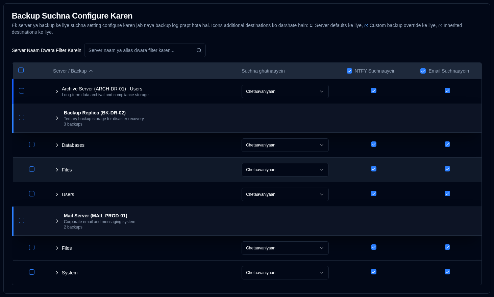
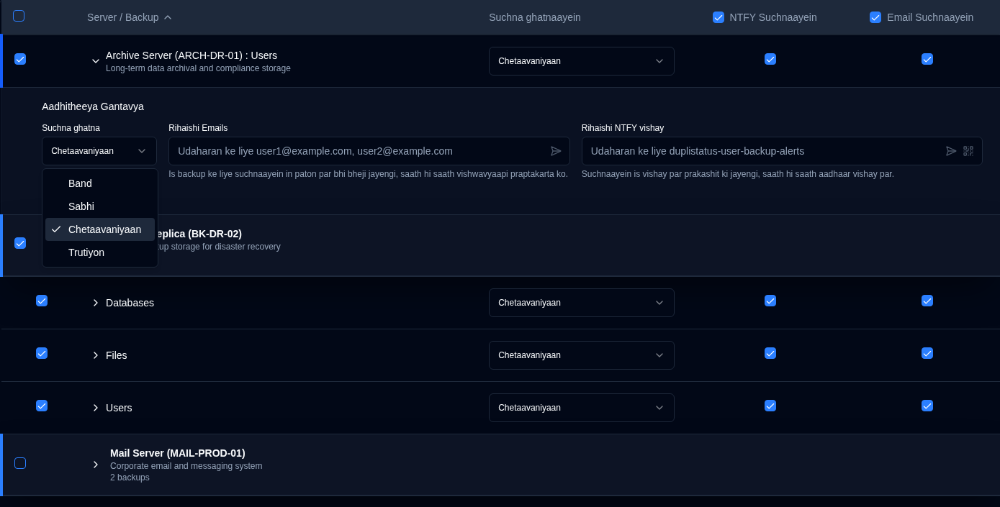

# Backup Suchnaayein {#backup-notifications}

In is sammelan ka upyog karke suchnaayein bhejein jab [naya backup log prapt hota hai](../../installation/duplicati-server-configuration.md).

Backup suchnaayein table server dwara sangathit hai. Pradarshan format is baat par nirbhar karta hai ki server ke paas kitne backup hain:
- **Anek backup**: Ek server header row dikhata hai jiske neeche vyaktigat backup rows hote hain. Backup list ko expand ya collapse karne ke liye server header par click karein.
- **Ek backup**: Ek **merged row** dikhata hai jisme neela left border hota hai, jo dikhata hai:
  -  **Server Naam : Backup Naam** yadi koi server upnaam configure nahin kiya gaya hai, ya
  - **Server Upnaam (Server Naam) : Backup Naam** yadi yeh configure kiya gaya hai.

Is page mein auto-save suvidha hai. Aap jo bhi badlav karenge woh svatah save ho jayenge.

 

## Filter {#filter}

Server naam ya upnaam dwara vishesh backup ko jaldi se dhoondhane ke liye page ke upar **Server Naam Dwara Filter Karein** field ka upyog karein. Table svatah filter hokar kewal milte jule entries dikhayega.

 

## Prati-Backup Suchna Settings Configure Karein {#configure-per-backup-notification-settings}

| Setting                       | Vivaran                                               | Default Value |
| :---------------------------- | :-------------------------------------------------------- | :------------ |
| **Suchna ghatnaayein**       | Naye backup logs ke liye kab suchnaayein bhejni hain, configure karein. | **Chetaavaniyaan**    |
| **NTFY**                      | Is backup ke liye NTFY suchnaayein saksham ya asamksham karein.     | **Saksham kiya gaya**     |
| **Email**                     | Is backup ke liye email suchnaayein saksham ya asamksham karein.    | **Saksham kiya gaya**    |

**Suchna ghatnaayein vikalp:**

- **Sabhi**: Sabhi backup ghatnaon ke liye suchnaayein bhejein.
- **Chetaavaniyaan**: Kewal chetaavaniyon aur trutiyon ke liye suchnaayein bhejein (default).
- **Trutiyon**: Kewal trutiyon ke liye suchnaayein bhejein.
- **Band**: Is backup ke liye naye backup logs ki suchnaayein asamksham karein.

 

## Aadhitheeya Gantavya {#additional-destinations}

Aadhitheeya suchna gantavya aapko vaishvik settings se pare vishesh email addresses ya NTFY topics par suchnaayein bhejane ki anumati dete hain. Pranali ek hierarchical inheritance model ka upyog karti hai jahan backup apne server se default settings inherit kar sakte hain, ya unhein backup-vishesh maan dwara override kar sakte hain.

Aadhitheeya gantavya configuration server aur backup naamon ke bagal mein contextual icons dwara sanketit ki jaati hai:

- **Server icon** <IconButton icon="lucide:settings-2" style={{border: 'none', padding: 0, color: 'inherit', background: 'transparent'}} />: Server naamon ke bagal mein dikhai deta hai jab server star par default aadhitheeya gantavya configure kiye jaate hain.

- **Backup icon** <IconButton icon="lucide:external-link" style={{border: 'none', padding: 0, color: '#60a5fa', background: 'transparent'}} /> (neela): Backup naamon ke bagal mein dikhai deta hai jab anukoolit aadhitheeya gantavya configure kiye jaate hain (server defaults ko override karte hue).

- **Backup icon** <IconButton icon="lucide:external-link" style={{border: 'none', padding: 0, color: '#64748b', background: 'transparent'}} /> (graey): Backup naamon ke bagal mein dikhai deta hai jab backup server defaults se aadhitheeya gantavya inherit kar raha hota hai.

Yadi koi icon nahin dikhai deta hai, to server ya backup mein aadhitheeya gantavya configure nahin kiye gaye hain.

### Server-Level Defaults {#server-level-defaults}

Aap server-level par aadhaar rihaishi gantavya sanrachit kar sakte hain jinhein us server ke sabhi backups svachaalit roop se viraasat mein prapt karenge.

1. [Sammaan → Backup suchnaayein](backup-notifications-settings.md) par navigate karein.
2. Table server dwara group kiya gaya hai, jismein server naam, upnaam, aur backup ginti dikhane wali alag server header rows hain.
   - **Note**: Keval ek backup wale server ke liye, ek alag server header ke bajaye ek merged row dikhai jaati hai. Merged rows se seedhe server-level defaults ko configure nahi kiya ja sakta hai. Agar aapko single-backup server ke liye server defaults ko configure karne ki zaroorat hai, to aap us server mein temporarily ek aur backup jodkar aisa kar sakte hain, ya backup ke Aadhitheeya Gantavya swatah kisi bhi maujooda server defaults se inherit ho jayenge.
3. Server row mein kahin bhi click karke **Is Server ke liye Aadhaar Rihaishi Gantavya** section ko expand karein.
4. Nimnalikhit aadhaar sthal settings sanrachit karein:
   - **Suchna ghatna**: Chunnein ki kaun si ghatnayein aadhitheeya gantavyaon ko suchnaayein trigger karengi (**sabhi**, **chetaavaniyaan**, **trutiyon**, ya **band**).
   - **Rihaishi Emails**: Ek ya ek se adhik email address (comma-separated) enter karein jo is server ke sabhi backups ke liye suchnaayein prapt karenge. Field mein addresson par ek parikshan email bhejane ke liye <IconButton icon="lucide:send-horizontal" style={{border: 'none', padding: 0, color: 'inherit', background: 'transparent'}} /> icon button par click karein.
   - **Rihaishi NTFY vishay**: Ek anukoolit NTFY vishay naam enter karein jahan is server ke sabhi backups ke liye suchnaayein prakashit ki jaayengi. Vishay par ek parikshan suchna bhejane ke liye <IconButton icon="lucide:send-horizontal" style={{border: 'none', padding: 0, color: 'inherit', background: 'transparent'}} /> icon button par click karein, ya vishay ke liye ek QR code dikhane ke liye <IconButton icon="lucide:qr-code" style={{border: 'none', padding: 0, color: 'inherit', background: 'transparent'}} /> icon button par click karein taaki aapka device suchnaayein prapt karne ke liye sanrachit ho sake.

**Server Default Prabandhan:**

- **Sabhi ke saath sankalit karein**: Sabhi backup overrides ko saaf karta hai, jisse sabhi backups server defaults se viraasat mein prapt hote hain.
- **Sabhi saaf karein**: Server defaults aur sabhi backups donon se sabhi aadhitheeya gantavyaon ko saaf karta hai jabki viraasat sanrachna bani rehti hai.

### Prati-Backup Configuration {#per-backup-configuration}

Vyaktigat backups svachaalit roop se server defaults se viraasat mein prapt karte hain, lekin aap unhein vishesh backup jobs ke liye override kar sakte hain.

1. Uske **Additional Destinations** section ko vistarit karne ke liye kisi backup row mein kahin bhi click karein.
2. Nimnalikhit settings sanrachit karein:
   - **Suchna ghatna**: Chunnein ki kaun si ghatnayein aadhitheeya gantavyaon ko suchnaayein trigger karengi (**sabhi**, **chetaavaniyaan**, **trutiyon**, ya **band**).
   - **Rihaishi Emails**: Ek ya ek se adhik email address (comma-separated) enter karein jo mukhya praaptkarta ke alawa suchnaayein prapt karenge. Field mein addresson par ek parikshan email bhejane ke liye <IconButton icon="lucide:send-horizontal" style={{border: 'none', padding: 0, color: 'inherit', background: 'transparent'}} /> icon button par click karein.
   - **Rihaishi NTFY vishay**: Ek anukoolit NTFY vishay naam enter karein jahan default vishay ke alawa suchnaayein prakashit ki jaayengi. Vishay par ek parikshan suchna bhejane ke liye <IconButton icon="lucide:send-horizontal" style={{border: 'none', padding: 0, color: 'inherit', background: 'transparent'}} /> icon button par click karein, ya vishay ke liye ek QR code dikhane ke liye <IconButton icon="lucide:qr-code" style={{border: 'none', padding: 0, color: 'inherit', background: 'transparent'}} /> icon button par click karein taaki aapka device suchnaayein prapt karne ke liye sanrachit ho sake.

**Viraasat Sanketak:**

- Neela **Link icon** <IconButton icon="lucide:link" style={{border: 'none', padding: 0, color: '#3b82f6', background: 'transparent'}} />: Sanket deta hai ki maan server defaults se viraasat mein mila hai. Field par click karne se sampadan ke liye ek override banega.
- Neela **Broken link icon** <IconButton icon="lucide:link-2-off" style={{border: 'none', padding: 0, color: '#3b82f6', background: 'transparent'}} />: Sanket deta hai ki maan override kiya gaya hai. Viraasat mein lautane ke liye icon par click karein.

**Aadhitheeya Gantavya Vyavhaar:**

- Suchnayein mukhya settings aur aadhitheeya gantavyaon donon ko bheji jaati hain jab sanrachit kiya jaata hai.
- Aadhitheeya gantavyaon ke liye suchna ghatna setting mukhya suchna ghatna setting se svatantra hai.
- Yadi aadhitheeya gantavya **band** par set hain, to un gantavyaon ko koi suchnayein nahin bheji jaayengi, lekin mukhya suchnayein prathmik settings ke anusaar kaam karti rahengi.
- Jab koi backup server defaults se viraasat mein prapt karta hai, to server defaults mein koi bhi badlav svachaalit roop se us backup par lagu honge (jab tak ki use override na kiya gaya ho).

 

## Bulk Sampadan {#bulk-edit}

Aap bulk sampadan suvidha ka upyog karke ek saath kai backups ke liye aadhitheeya gantavya settings ko sampadit kar sakte hain. Yah vishesh roop se upyogi hai jab aapko kai backup jobs mein saman aadhitheeya gantavya lagu karne ki avashyakta hoti hai.

1. [Sammaan → Backup suchnaayein](backup-notifications-settings.md) par navigate karein.
2. Edit karne ke liye backups ya servers ko select karne ke liye pehle column mein checkboxes ka upyog karein.
   - Sabhi dikhne wale backups ko select ya deselect karne ke liye header row mein checkbox ka upyog karein.
   - Select karne se pehle list ko narrow down karne ke liye aap filter ka upyog kar sakte hain.
3. Ek baar backups select ho jaane ke baad, ek bulk action bar dikhega jo selected backups ki sankhya dikhayega.
4. Edit dialog kholne ke liye **Bulk Sampadan** par click karein.
5. Rihaishi destination settings ko configure karein:
   - **Suchna ghatna**: Sabhi selected backups ke liye suchna ghatna set karein.
   - **Rihaishi Emails**: Sabhi selected backups par apply karne ke liye email addresses (comma-separated) enter karein.
   - **Rihaishi NTFY vishay**: Sabhi selected backups par apply karne ke liye NTFY topic ka naam enter karein.
   - Email addresses aur NTFY topics ko kai backups par apply karne se pehle verify karne ke liye bulk edit dialog mein Test buttons uplabdh hain.
6. Sabhi selected backups par settings apply karne ke liye **Save** par click karein.

**Bulk Saaf karein:**

Selected backups se sabhi rihaishi destination settings ko hatane ke liye:

1. Un backups ko select karein jinhe aap saaf karna chahte hain.
2. Bulk action bar mein **Bulk Saaf karein** par click karein.
3. Dialogue box mein action ki pushti karein.

Yah selected backups ke liye sabhi rihaishi email addresses, NTFY topics, aur notification event ko hata dega. Saaf karne ke baad, backups server ke aadhaar sthalon se virasat mein milne par laut aayenge (agar koi configure kiya gaya hai).

 
