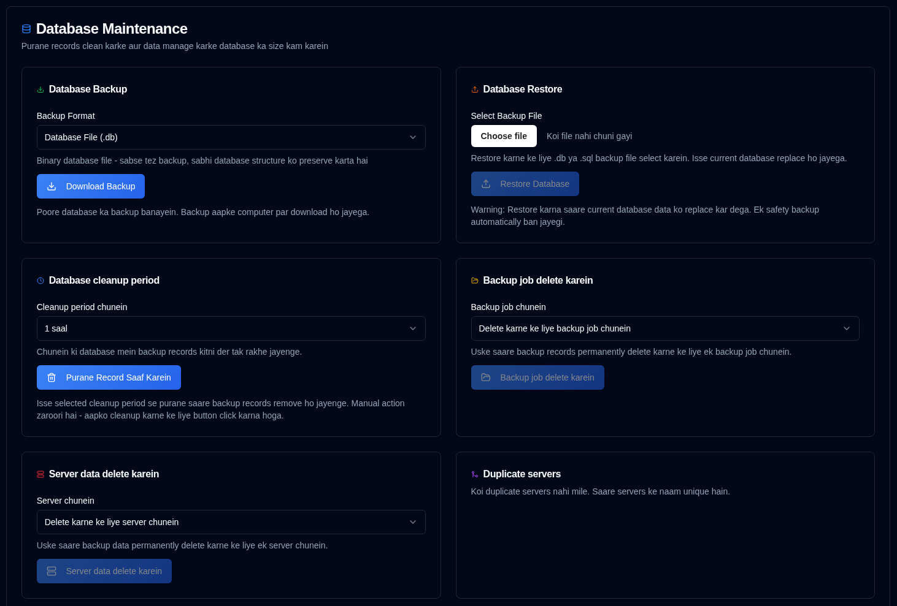

# Database Maintenance {#database-maintenance}

Apne backup data ka prabandhan karein aur database maintenance operations ke dwara performance ko behtar banayein.

 

## Database Backup {#database-backup}

Surakshit rakhne ya migration ke uddeshya se apne poore database ka backup banayein.

1.  [Sammaan → Database Maintenance](database-maintenance.md) par jaayein.
2.  **Database Backup** section mein, ek backup format chunein:
    - **Database File (.db)**: Binary format - sabse tez backup, sabhi database structure ko bilkul sahi rakhta hai
    - **SQL Dump (.sql)**: Text format - manav-pathneeya SQL statements, restore se pehle edit kiye ja sakte hain
3.  <IconButton icon="lucide:download" label="Download Backup" /> par click karein.
4.  Backup file aapke computer par timestamped filename ke saath download ho jayegi.

**Backup Formats:**

- **.db format**: Niyamit backups ke liye sujhaaya gaya hai. Database ke istemaal mein hone par bhi consistency sunishchit karte hue, SQLite ke backup API ka upyog karke database file ki ek bilkul sahi copy banata hai.
- **.sql format**: Migration, inspection, ya jab aap restore karne se pehle data ko edit karna chahte hain, tab upyogi hai. Ismein database ko phir se banane ke liye zaroori sabhi SQL statements shamil hain.

**Best Practices:**

- Bade operations (cleanup, merge, ityadi) se pehle niyamit backups banayein
- Backups ko application se alag ek surakshit sthan par store karein
- Backups ke vaidh hone ko sunishchit karne ke liye samay-samay par restore procedures ka parikshan karein

 

## Database Restore {#database-restore}

Pehle banaye gaye backup file se apne database ko restore karein.

1.  [Sammaan → Database Maintenance](database-maintenance.md) par jaayein.
2.  **Database Restore** section mein, file input par click karein aur ek backup file chunein:
    - Supported formats: `.db`, `.sql`, `.sqlite`, `.sqlite3`
    - Maximum file size: 100MB
3.  <IconButton icon="lucide:upload" label="Restore Database" /> par click karein.
4.  Dialogue box mein action ki pushti karein.

**Restore Process:**

- Restore se pehle vartaman database ka ek suraksha backup svayanchalit roop se banaya jata hai
- Vartaman database ko backup file se badal diya jata hai
- Suraksha ke liye sabhi sessions clear kar diye jate hain (upyogkartaon ko phir se pravesh karna hoga)
- Restore ke baad database ki integrity ki jaanch ki jati hai
- Taaza data sunishchit karne ke liye sabhi caches clear kar diye jate hain

**Restore Formats:**

- **.db files**: Database file seedhe badal di jati hai. Sabse tez restore vidhi.
- **.sql files**: Database ko phir se banane ke liye SQL statements execute kiye jate hain. Yadi zaroorat ho to chayanatmak restoration ki anumati deta hai.

:::warning
Database ko restore karne se **vartaman sabhi data badal jayega**. Yah action ananya nahi kiya ja sakta hai.  
Ek suraksha backup svayanchalit roop se banaya jata hai, lekin restore karne se pehle apna backup banana sujhaaya gaya hai.
 
**Mahatvapurna:** Restore ke baad, suraksha ke liye sabhi upyogkarta sessions clear kar diye jate hain. Aapko phir se pravesh karne ki zaroorat hogi.
:::

**Troubleshooting:**

- Yadi restore vifal hota hai, to mool database svayanchalit roop se suraksha backup se restore ho jata hai
- Sunishchit karein ki backup file corrupted na ho aur apekshit format se mel khati ho
- Bade databases ke liye, restore process mein kai minute lag sakte hain

 

---

 

:::note
Yeh sabhi neeche di gayi maintenance functions par lagu hota hai: dashboard, detail pages, aur charts par sabhi aankde **duplistatus** database ke data ka upyog karke calculate kiye jaate hain. Purani jaankari ko delete karne se in calculations par asar padega.
 
Yadi aap galti se data delete kar dete hain, to aap [Backup Logs Ikattha Karein](../collect-backup-logs.md) feature ka upyog karke ise restore kar sakte hain.
:::

 

## Data Safai Ka Samay {#data-cleanup-period}

Storage space khali karne aur system performance behtar karne ke liye purane backup records hatayein.

1.  [Sammaan → Database Maintenance](database-maintenance.md) par jaayein.
2.  Ek retention period chunein:
    - **6 mahine**: Pichhle 6 mahine ke records rakhein.
    - **1 saal**: Pichhle 1 saal ke records rakhein.
    - **2 saal**: Pichhle 2 saal ke records rakhein (Default).
    - **Saara data delete karein**: Sabhi backup records aur servers delete karein. 
3.  <IconButton icon="lucide:trash-2" label="Purane Records Saaf Karein" /> par click karein.
4.  Dialogue box mein action ki pushti karein.

**Safai Ke Asar:**

- Chuni gayi period se purane backup records delete karta hai
- Sabhi sambandhit aankde aur manak update karta hai

:::warning

"Saara data delete karein" option chunne se **system se sabhi backup records aur configuration settings hamesha ke liye delete ho jayengi**.

Is action ko aage badhane se pehle database backup banana atyadhik sujhaya gaya hai.

:::

 

## Backup Job Data Delete Karein {#delete-backup-job-data}

Ek vishisht Backup Job (prakar) ka data hatayein.

1.  [Sammaan → Database Maintenance](database-maintenance.md) par jaayein.
2.  Dropdown list se ek Backup Job chunein.
    - Backups server upnaam ya naam ke anusar, phir backup naam ke anusar order kiye jayenge.
3.  <IconButton icon="lucide:folder-open" label="Backup Job Delete Karein" /> par click karein.
4.  Dialogue box mein action ki pushti karein.

**Deletion Ke Asar:**

- Is Backup Job / Server se sambandhit sabhi data hamesha ke liye delete karta hai.
- Sambandhit configuration settings saaf karta hai.
- Dashboard aankdon ko uske anusar update karta hai.

 

## Server Data Delete Karein {#delete-server-data}

Ek vishisht server aur uske sabhi sambandhit backup data ko hatayein.

1.  [Sammaan → Database Maintenance](database-maintenance.md) par jaayein.
2.  Dropdown list se ek server chunein.
3.  <IconButton icon="lucide:server" label="Server Data Delete Karein" /> par click karein.
4.  Dialogue box mein action ki pushti karein.

**Deletion Ke Asar:**

- Chune gaye server aur uske sabhi backup records hamesha ke liye delete karta hai
- Sambandhit configuration settings saaf karta hai
- Dashboard aankdon ko uske anusar update karta hai

 

## Duplicate Servers Merge Karein {#merge-duplicate-servers}

Ek hi naam wale lekin alag IDs wale duplicate servers ka pata lagayein aur unhe merge karein. Is feature ka upyog unhe ek hi server entry mein consolidate karne ke liye karein.

Yeh Duplicati ke `machine-id` upgrade ya reinstall ke baad badalne par ho sakta hai. Duplicate servers tabhi dikhaye jate hain jab woh maujood hon. Yadi koi duplicate nahi milte hain, to section ek sandesh dikhayega ki sabhi servers ke naam unique hain.

1.  [Settings → Database Maintenance](database-maintenance.md) par jaayen.
2.  Agar duplicate servers milte hain, to ek **Merge Duplicate Servers** section dikhega.
3.  Duplicate server groups ki list dekhen:
    - Har group mein alag IDs wale par same naam ke servers dikhaye jaate hain
    - **Target Server** (creation date ke hisaab se sabse naya) highlight kiya jaata hai
    - **Old Server IDs** jinhe merge kiya jaayega, woh alag se list kiye jaate hain
4.  Un server groups ko select karein jinhe aap merge karna chahte hain, har group ke bagal mein checkbox ko tick karke.
5.  <IconButton icon="lucide:git-merge" label="Merge Selected Servers" /> par click karein.
6.  Dialogue box mein action ko confirm karein.

**Merge Process:**

- Sabhi purane server IDs target server mein merge ho jaate hain (creation date ke hisaab se sabse naya)
- Sabhi backup records aur configurations target server mein transfer ho jaate hain
- Same backup naam ke liye duplicate `backup_id` values ko ek single ID mein consolidate kiya jaata hai (sabse haal hi ka backup row jeetta hai)
- Purane server entries delete kar di jaati hain
- Dashboard statistics automatically update ho jaate hain

:::info[IMPORTANT]
Yeh action undo nahi kiya ja sakta. Confirm karne se pehle database backup recommend kiya jaata hai.  
:::

 
