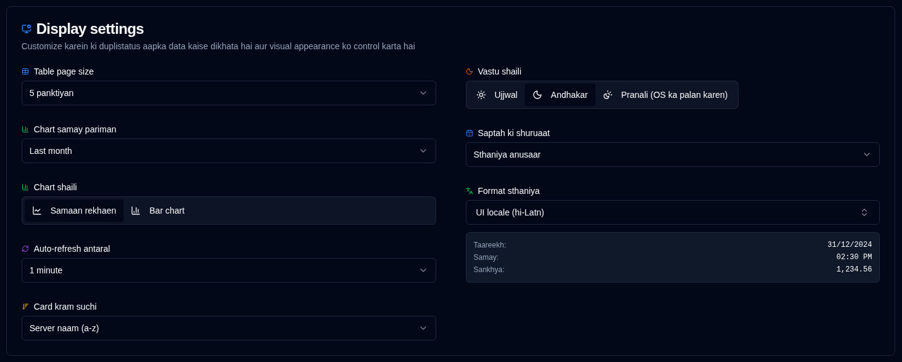

# Display {#display}

Upyogkarta interface aur pradarshan pasandeedgi configure karein.

 

| Setting                   | Description                                         | Default Value      |
|:--------------------------|:----------------------------------------------------|:-------------------|
| **Table Size**            | Server vivaran prushth par prati prushth rows ki sankhya. | 5 rows             |
| **Theme**                 | Ujjwal, andhakar, ya aapke operating system ki dikhavat se mel khata hua chunein (ujjwal/andhakar mode ko prathmikta deta hai). | Sthaniya anusaar jab anset ho |
| **Chart Time Range**      | Charts mein dikhaya gaya samay antaral. Uplabdh vikalp: **1W** (antim 7 din), **2W** (antim 14 din), **1M** (antim 30 din), **3M** (antim 90 din). Aap chart headers se seedhe samay pariman ko bhi toggle kar sakte hain. | 1 month            |
| **Chart Style**           | Samaan line charts ya bar chart visualization ke beech chunein. Dono modes optimal pradarshan ke liye samay-bucket aggregation ka upyog karte hain. Aap chart headers se seedhe bhi toggle kar sakte hain. | Samaan rekhaen       |
| **Format Locale**         | Apni UI bhaasha se svatantr formatting locale chunein (416 locales supported). Yah prabhavit karta hai ki taareekh, samay, aur sankhya kaise pradarshit hote hain. Aapki chayan ke saath ek live preview dikhaya gaya hai. Udaharan: UI bhaasha = German, Format locale = English (UK) → UK date formats ke saath German UI. | Sthaniya UI anusaar |
| **Auto-refresh Interval** | Kitni baar prushth svachaalit roop se refresh hote hain.              | 1 minute           |
| **Cards Sort Order**      | Dashboard par cards kaise sort kiye jaate hain.              | Server naam (a-z)  |
| **Start of Week**         | Configure karein ki saptah kab shuru hota hai.                     | Sthaniya anusaar    |

 

:::tip
**Quick Access**: Aap application toolbar mein auto-refresh button par right-click karke is page ko turant access kar sakte hain.
:::
