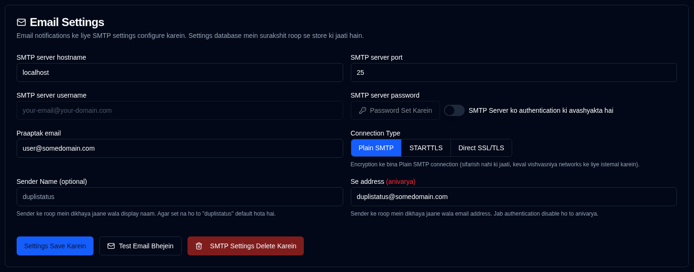

# Email {#email}

**duplistatus** SMTP ke madhyam se email suchnaayein bhejane ka samarthan karta hai, jo NTFY suchnaaon ke vikalp ya purak ke roop mein kaam karta hai. Email configuration ab web interface ke madhyam se prabandhit kiya jaata hai, jismein suraksha badhane ke liye database mein encrypted storage hota hai.

| Setting                 | Description                                                      |
|:------------------------|:-----------------------------------------------------------------|
| **SMTP Server Host**    | Aapke email provider ka SMTP server (udaharan: `smtp.gmail.com`).      |
| **SMTP Server Port**    | Port number (aam taur par Plain SMTP ke liye `25`, STARTTLS ke liye `587`, ya Direct SSL/TLS ke liye `465`). |
| **Connection Type**     | Plain SMTP, STARTTLS, ya Direct SSL/TLS ke beech chunein. Nayi configurations ke liye default Direct SSL/TLS hai. |
| **SMTP Authentication** | SMTP authentication ko saksham ya nishkriya karne ke liye toggle karein. Jab nishkriya kiya jaata hai, to username aur password fields avashyak nahin hote hain. |
| **SMTP Username**       | Aapka email address ya username (jab authentication saksham ho to avashyak). |
| **SMTP Password**       | Aapka email password ya app-vishesh password (jab authentication saksham ho to avashyak). |
| **Sender Name**         | Vah display naam jo email suchnaaon mein bhejane wale ke roop mein dikhta hai (vaikalpik, default "duplistatus" hai). |
| **From Address**        | Vah email address jo bhejane wale ke roop mein dikhta hai. Plain SMTP connections ke liye ya jab authentication nishkriya ho to avashyak. Jab authentication saksham ho to SMTP username ke roop mein default hota hai. Dhyan dein ki kuch email providers `From Address` ko `SMTP Server Username` se override kar denge. |
| **Recipient Email**     | Vah email address jise suchnaayein prapt hongi. Ek vaidh email address format hona chahiye. |

Sidebar mein **Email** ke bagal mein ek <IIcon2 icon="lucide:mail" color="green"/> hari icon ka matlab hai ki aapki settings vaidh hain. Agar icon <IIcon2 icon="lucide:mail" color="yellow"/> peela hai, to aapki settings vaidh nahin hain ya configure nahin ki gayi hain.

Jab sabhi avashyak fields set hote hain: SMTP Server Host, SMTP Server Port, Recipient Email, aur ya to (SMTP Username + Password jab authentication avashyak ho) ya (From Address jab authentication avashyak na ho), to icon hara dikhta hai.

Jab configuration poori tarah se configure nahin hoti hai, to ek peela alert box dikhaya jaata hai jo aapko suchit karta hai ki jab tak email settings sahi dhang se bhari nahin jaati hain, tab tak koi email nahin bheja jayega. [Backup Notifications](backup-notifications-settings.md) tab mein Email checkboxes bhi greyed out honge aur "(disabled)" labels dikhayenge.

 

## Upalabdh Kriyaen {#available-actions}

| Button                                                           | Description                                              |
|:-----------------------------------------------------------------|:---------------------------------------------------------|
| <IconButton label="Save Settings" />                             | NTFY settings mein kiye gaye badlavon ko save karein.              |
| <IconButton icon="lucide:mail" label="Send Test Email"/>         | SMTP configuration ka upyog karke ek test email sandesh bhejta hai. Test email SMTP server hostname, port, connection type, authentication status, username (yadi lagu ho), recipient email, from address, sender name, aur test timestamp dikhata hai. |
| <IconButton icon="lucide:trash-2" label="Delete SMTP Settings"/> | SMTP configuration ko delete / clear karein.                   |

 

:::info[IMPORTANT]
  Aapko yeh sunishchit karne ke liye <IconButton icon="lucide:mail" label="Send Test Email"/> button ka upyog karna chahiye ki aapki email setup is par nirbhar karne se pehle kaam karti hai.

 Bhale hi aapko ek hara <IIcon2 icon="lucide:mail" color="green"/> icon dikhe aur sab kuch configure lage, email shayad na bheje jaayen.
 
 **duplistatus** sirf yeh jaanchta hai ki aapki SMTP settings bhari gayi hain ya nahin, balki yeh nahin ki email vastav mein deliver ho sakte hain ya nahin.
:::

 

## Aam SMTP Providers {#common-smtp-providers}

**Gmail:**

- Host: `smtp.gmail.com`
- Port: `587` (STARTTLS) ya `465` (Direct SSL/TLS)
- Connection Type: STARTTLS port 587 ke liye, Direct SSL/TLS port 465 ke liye
- Username: Aapka Gmail address
- Password: App Password ka istemaal karein (aapka regular password nahi). Ek yahan generate karein https://myaccount.google.com/apppasswords
- Authentication: Zaroori hai

**Outlook/Hotmail:**

- Host: `smtp-mail.outlook.com`
- Port: `587`
- Connection Type: STARTTLS
- Username: Aapka Outlook email address
- Password: Aapke account ka password
- Authentication: Zaroori hai

**Yahoo Mail:**

- Host: `smtp.mail.yahoo.com`
- Port: `587`
- Connection Type: STARTTLS
- Username: Aapka Yahoo email address
- Password: App Password ka istemaal karein
- Authentication: Zaroori hai

### Security Best Practices {#security-best-practices}

- Suchnaayein ke liye ek alag email account istemaal karne par vichar karein
 - "Test Email Bhejein" button ka istemaal karke apne configuration ka parikshan karein
 - Sammaan ko encrypt karke database mein surakshit roop se store kiya jaata hai
 - **Encrypted connections ka istemaal karein** - STARTTLS aur Direct SSL/TLS production use ke liye recommended hain
 - Plain SMTP connections (port 25) trusted local networks ke liye uplabdh hain lekin untrusted networks par production use ke liye recommended nahi hain
