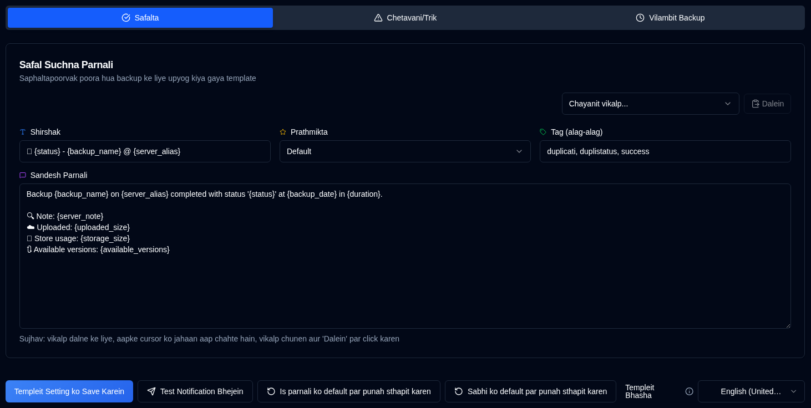

# Templeit {#templates}

**duplistatus** teen templeit ka upyog karata hai suchna sandeshon ke liye. Ye templeit NTFY aur Email suchnaayein dono ke liye upyog kiye jaate hain.

Prushth mein ek **Templeit Bhasha** chayanak shamil hai jo default templeton ke liye sthaaniya nirdharit karta hai. Bhaasha badalne se naveen defaults ke liye sthaaniya badal jaati hai, lekin vah **moujud** templeton ke text ko nahin badalti. Apne templeton mein nayi bhaasha lagu karne ke liye, unhen haath se sampadit karen ya **Is parnali ko default par punah sthapit karen** (vartaman tab ke liye) ya **Sabhi ko default par punah sthapit karen** (teenon templeton ke liye) ka upyog karen.

| Templeit           | Varnan                                         |
| :----------------- | :-------------------------------------------------- |
| **Safalta**        | Jab backup safaltapurvak poora hota hai.            |
| **Chetavani/Trik**  | Jab backup chetavaniyon ya trutiyon ke saath poora hota hai. |
| **Vilambit Backup** | Jab backup vilambit hote hain.                      |

 

## Templeit Bhasha {#template-language}

Prushth ke upar **Templeit Bhasha** selector aapko default templates ke liye bhasha chunane deta hai (English, German, French, Spanish, Portuguese, Hindi (Roman), aur Simplified Chinese). Bhasha badalne se default ke liye locale update ho jata hai, lekin maujooda customized templates apna vartaman text tab tak rakhte hain jab tak aap unhe update nahi karte ya koi bhi reset button use nahi karte.

 

## Upalabdh Kriyaen {#available-actions}

| Button                                                              | Varnan                                                                                         |
|:--------------------------------------------------------------------|:----------------------------------------------------------------------------------------------------|
| <IconButton label="Templeit Sammaan Bachaayein" />                      | Templeit badalne par sammaan bachaata hai. Button pradarshit templeit (Safalta, Chetavani/Trik ya Vilambit Backup) ko bachaata hai. |
| <IconButton icon="lucide:send" label="Parikshan Suchna Bhejein"/>     | Templeit ko update karne ke baad jaanchta hai. Vahan vaareeble ko unke naam se badal diya jaayega. Email suchnaayein ke liye, templeit shirshak email vishay rekha ban jaata hai. |
| <IconButton icon="lucide:rotate-ccw" label="Is template ko default par reset karein"/> | Default template ko **chuni hui template** (vartaman tab) ke liye punarsthapit karta hai. Reset karne ke baad save karna na bhulein. |
| <IconButton icon="lucide:rotate-ccw" label="Sabhi ko default par punah sthapit karen"/> | Teenon templeit (Safalta, Chetavani/Trik, Vilambit Backup) ko chuni gayi Templeit Bhasha ke defaults par punah sthapit karta hai. Yaad rakhen ki reset karne ke baad bachaayein. |

 

## Vaareeble {#variables}

Sabhi templeit mein vaareeble ka samarthan hai jo vaastavik maanon se badal jaayenge. Neeche di gayi table upalabdh vaareeble dikhata hai:

| Vaareeble               | Varnan                                     | Upalabdh Mein     |
|:-----------------------|:------------------------------------------------|:-----------------|
| `{server_name}`        | Server ka naam.                             | Sabhi templeit    |
| `{server_alias}`       | Server ka upnaam.                            | Sabhi templeit    |
| `{server_note}`        | Server ke liye note.                            | Sabhi templeit    |
| `{server_url}`         | Duplicati Server web konfigyoorshan ka URL   | Sabhi templeit    |
| `{backup_name}`        | Backup ka naam.                             | Sabhi templeit    |
| `{status}`             | Backup stithi (Safalta, Chetavani, Truti, Gambhir). | Safalta, Chetavani |
| `{backup_date}`        | Backup ki taareekh aur samay.                    | Safalta, Warning |
| `{duration}`           | Backup ki avadhi.                         | Safalta, Warning |
| `{uploaded_size}`      | Upload kiya gaya data ki maatra.                        | Safalta, Warning |
| `{storage_size}`       | Sanchayan upayog ki jaankari.                      | Safalta, Warning |
| `{available_versions}` | Upalabdh backup sanskaranon ki sankhya.            | Safalta, Warning |
| `{file_count}`         | Prabandhit fileon ki sankhya.                      | Safalta, Warning |
| `{file_size}`          | Backup kiye gaye fileon ka kul aakar.                  | Safalta, Warning |
| `{messages_count}`     | Sandeshon ki sankhya.                             | Safalta, Warning |
| `{warnings_count}`     | Chetavaniyon ki sankhya.                             | Safalta, Warning |
| `{errors_count}`       | Trutiyon ki sankhya.                               | Safalta, Warning |
| `{log_text}`           | Log sandesh (chetaavaniyaan aur trutiyan)              | Safalta, Warning |
| `{last_backup_date}`   | Antim backup ki taareekh.                        | Vilambit          |
| `{last_elapsed}`       | Antim backup ke baad beeta samay.             | Vilambit          |
| `{expected_date}`      | Apekshit backup taareekh.                           | Vilambit          |
| `{expected_elapsed}`   | Apekshit taareekh ke baad beeta samay.           | Vilambit          |
| `{backup_interval}`    | Avadhi string (udaaharan: "1D", "2W", "1M").       | Vilambit          |
| `{overdue_tolerance}`  | Vilambit sahanseelta setting.                      | Vilambit          |
