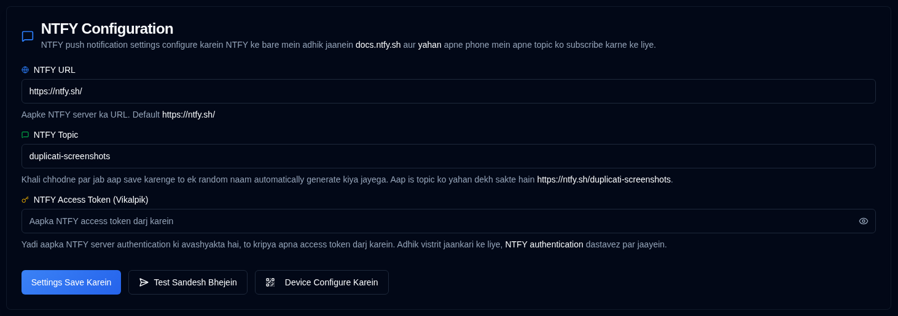

# NTFY {#ntfy}

[NTFY](https://github.com/binwiederhier/ntfy) ek saral suchna seva hai jo aapke phone ya desktop par push suchnaayein bhej sakti hai. Yah section aapko apne suchna server connection aur authentication ko sthapit karne ki anumati deta hai.

| Setting               | Description                                                                                                                                   |
|:----------------------|:----------------------------------------------------------------------------------------------------------------------------------------------|
| **NTFY URL**          | Aapke NTFY server ka URL (default roop se sarvajanik `https://ntfy.sh/` hai).                                                                      |
| **NTFY Topic**        | Aapki suchnaon ke liye ek anokha identifier. Yadi khali chhoda gaya hai to pranali svayanchalit roop se ek yadrcchik topic utpann karegi, ya aap apna khud ka nirdharit kar sakte hain. |
| **NTFY Access Token** | Pramanikrit NTFY servers ke liye ek vaikalpik access token. Yadi aapke server ko authentication ki avashyakta nahin hai to is field ko khali chhodein.               |

 

Sidebar mein **NTFY** ke bagal mein ek <IIcon2 icon="lucide:message-square" color="green"/> hari icon ka matlab hai ki aapki settings vaidh hain. Yadi icon <IIcon2 icon="lucide:message-square" color="yellow"/> peela hai, to aapki settings vaidh nahin hain.
Jab configuration vaidh nahin hota hai, to [`Backup Notifications`](backup-notifications-settings.md) tab mein NTFY checkboxes bhi greyed out ho jayenge.

## Upalabdh Kriyaen {#available-actions}

| Button                                                                | Description                                                                                                  |
|:----------------------------------------------------------------------|:-------------------------------------------------------------------------------------------------------------|
| <IconButton label="Save Sammaan" />                                  | Save any changes made to the NTFY Sammaan.                                                                  |
| <IconButton icon="lucide:send-horizontal" label="Send Test Message"/> | Apne configuration ki jaanch karne ke liye apne NTFY server par ek test sandesh bhejein.                                         |
| <IconButton icon="lucide:qr-code" label="Configure Device"/>          | Ek QR code pradarshit kare jo aapko NTFY suchnaon ke liye apne mobile device ya desktop ko jaldi se sanrachit karne ki anumati deta hai. |

## Device Configuration {#device-configuration}

Aapko ise sanrachit karne se pahle apne device par NTFY application install karna chahiye ([yahan dekhein](https://ntfy.sh/)). <IconButton icon="lucide:qr-code" label="Configure Device"/> button par click karne se, ya application toolbar mein <SvgButton svgFilename="ntfy.svg" /> icon par right-click karne se, ek QR code pradarshit hoga. Is QR code ko scan karne se aapka device suchnaon ke liye sahi NTFY topic ke saath svayanchalit roop se sanrachit ho jayega.

 

 

:::caution
Yadi aap bina access token ke sarvajanik **ntfy.sh** server ka upyog karte hain, to aapke topic naam wala koi bhi vyakti aapki
suchnaon ko dekh sakta hai. 
 
Nijiata ki ek degree pradan karne ke liye, ek yadrcchik 12-akshariya topic utpann kiya jata hai, jo
3 sextillion (3,000,000,000,000,000,000,000) se adhik sambhav sanyojan pradan karta hai, jise anuman lagana kathin banata hai.

Behtar suraksha ke liye, apne topics ko surakshit karne ke liye [access token authentication](https://docs.ntfy.sh/config/#access-tokens) aur [access control lists](https://docs.ntfy.sh/config/#access-control-list-acl) ka upyog karne par vichar karen, ya sampurn niyantran ke liye [NTFY ko self-host karen](https://docs.ntfy.sh/install/#docker).

⚠️ **Aap apne NTFY topics ko surakshit karne ke liye jimmedar hain. Kripya is seva ka upyog apni vivekbudhhi se karen.**
:::

 
 

:::note
Sabhi product names, logos aur trademarks unke respective owners ki property hain. Icons aur names sirf identification purposes ke liye use kiye gaye hain aur endorsement imply nahi karte hain.
:::
