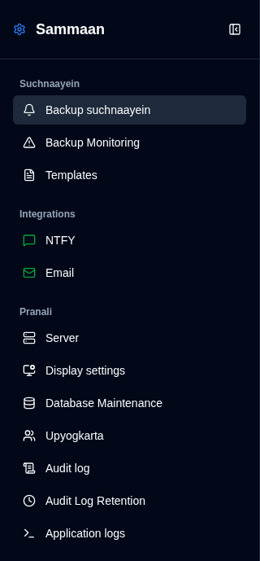
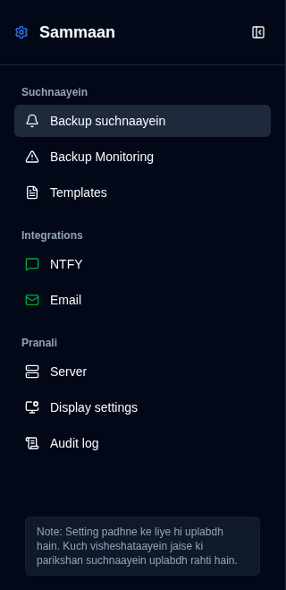

# Overview {#overview}

The Settings page offers a unified interface for configuring all aspects of **duplistatus**. You can access it by clicking the <IconButton icon="lucide:settings" /> **Settings** button in the [Application Toolbar](../overview.md#application-toolbar). Note that regular users will see a simplified menu with fewer options compared to administrators.

## Administrator View {#administrator-view}

Administrators see all available settings.

<table>
  <tr>
    <td>
      
    </td>
    <td>
      <ul>
        <li>
          <strong>Suchnaayein</strong>
          <ul>
            <li><a href="backup-notifications-settings.md">Backup Suchnaayein</a>: Configure per-backup notification settings</li>
            <li><a href="backup-monitoring-settings.md">Backup Monitoring</a>: Configure vilambit backup detection aur alerts</li>
            <li><a href="notification-templates.md">Templates</a>: Customise notification message templates</li>
          </ul>
        </li> 
        <li>
          <strong>Integrations</strong>
          <ul>
            <li><a href="ntfy-settings.md">NTFY</a>: Configure NTFY push notification service</li>
            <li><a href="email-settings.md">Email</a>: Configure SMTP email notifications</li>
          </ul>
        </li> 
        <li>
          <strong id="system">Pranali</strong>
          <ul>
            <li><a href="server-settings.md">Server</a>: Manage Duplicati server configurations</li>
            <li><a href="display-settings.md">Display settings</a>: Configure vastu shaili, chart samay pariman, chart shaili, format sthaniya, auto-refresh antaral, card sort order, aur saptah shuruaat</li>
            <li><a href="database-maintenance.md">Database Maintenance</a>: Perform database cleanup (admin only)</li>
            <li><a href="user-management-settings.md">Upyogkarta</a>: Manage user accounts (admin only)</li>
            <li><a href="audit-logs-viewer.md">Audit log</a>: View pranali audit logs</li>
            <li><a href="audit-logs-retention.md">Audit Log Retention</a>: Configure audit log retention (admin only)</li>
            <li><a href="application-logs-settings.md">Application logs</a>: View aur export application logs (admin only)</li>
          </ul>
        </li>
      </ul>
    </td>
  </tr>
</table>

## Non-Administrator View {#non-administrator-view}

Regular users see a limited set of settings.

<table>
  <tr>
    <td>
      
    </td>
    <td>
      <ul>
        <li>
          <strong>Suchnaayein</strong>
          <ul>
            <li><a href="backup-notifications-settings.md">Backup Suchnaayein</a>: View per-backup notification settings (read-only)</li>
            <li><a href="backup-monitoring-settings.md">Backup monitoring</a>: View vilambit backup settings (read-only)</li>
            <li><a href="notification-templates.md">Templates</a>: View notification templates (read-only)</li>
          </ul>
        </li> 
        <li>
          <strong>Integrations</strong>
          <ul>
            <li><a href="ntfy-settings.md">NTFY</a>: View NTFY settings (read-only)</li>
            <li><a href="email-settings.md">Email</a>: View email settings (read-only)</li>
          </ul>
        </li> 
        <li>
          <strong id="system">Pranali</strong>
          <ul>
            <li><a href="server-settings.md">Server</a>: View server configurations (read-only)</li>
            <li><a href="display-settings.md">Display</a>: Configure vastu shaili, chart samay pariman, chart shaili, format sthaniya, auto-refresh antaral, card sort order, aur saptah shuruaat</li>
            <li><a href="audit-logs-viewer.md">Audit log</a>: View pranali audit logs (read-only)</li>
          </ul>
        </li>
      </ul>
    </td>
  </tr>
</table>

## Status Icons {#status-icons}

Sidebar mein **NTFY** aur **Email** integration settings ke bagal mein status icons dikhaye jaate hain:
- <IIcon2 icon="lucide:message-square" color="green"/> <IIcon2 icon="lucide:mail" color="green"/> **Hara icon**: Aapki settings vaidh hain aur sahi dhang se configure ki gayi hain
- <IIcon2 icon="lucide:message-square" color="yellow"/> <IIcon2 icon="lucide:mail" color="yellow"/> **Peela icon**: Aapki settings vaidh nahin hain ya configure nahin ki gayi hain

Jab configuration avaidh hota hai, to [Backup Notifications](backup-notifications-settings.md) tab mein sambandhit checkboxes greyed out aur disabled ho jayenge. Adhik vivaran ke liye, [NTFY Settings](ntfy-settings.md) aur [Email Settings](email-settings.md) pages dekhein.

 

:::important
Hara icon avashyak roop se yeh nahin batata ki notifications sahi dhang se kaam kar rahi hain. Un par nirbhar hone se pehle apni notifications ke kaam karne ki pushti karne ke liye hamesha uplabdh test features ka upyog karein.
:::

 
