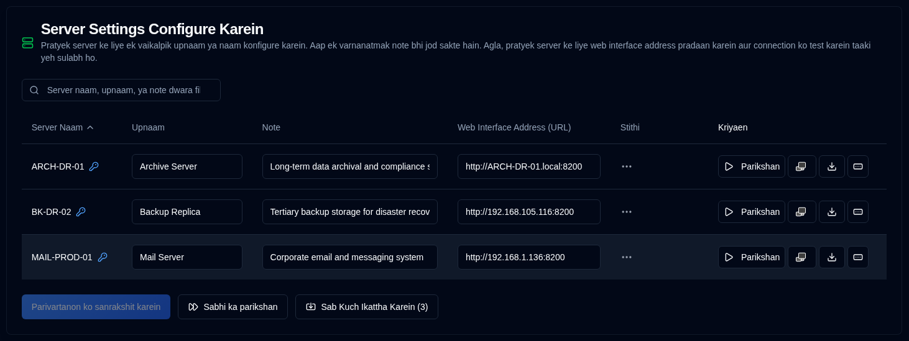

# Server {#server}

Aap apne server ke liye ek vikalp naam (upnaam) configure kar sakte hain, iske karya ka varnan karne ke liye ek note aur aapke Duplicati server ke web paton ke pate yahan.

| Setting                         | Description                                                                                                                                                                                  |
|:--------------------------------|:---------------------------------------------------------------------------------------------------------------------------------------------------------------------------------------------|
| **Server Naam**                 | Duplicati server mein configure kiya gaya server naam. Yadi server ke liye password set kiya gaya hai to ek <IIcon2 icon="lucide:key-round" color="#42A5F5"/> pradarshit hoga.                                         |
| **Upnaam**                       | Aapke server ka ek upnaam ya manav-dwaraa naam. Jab aap upnaam par hover karte hain to yeh uska naam dikhayega; kuch maamalon mein spashtata ke liye yeh upnaam aur naam brackets ke beech mein pradarshit karega. |
| **Note**                        | Server ki karyashamta, sthaapna sthaan, ya kisi anya jaankari ka varnan karne ke liye muft text. Yadi yeh configure kiya gaya hai, to yeh server ke naam ya upnaam ke saath pradarshit hoga.                 |
| **Web Interface Address (URL)** | Duplicati Server ke UI tak pahunchne ke liye URL configure karein. Dono `HTTP` aur `HTTPS` URLs samarthit hain.                                                                                           |
| **Stithi**                      | Parikshan ya sankalan backup logs ke parinaam pradarshit karein                                                                                                                                              |
| **Kriyaen**                     | Aap parikshan, Duplicati interface kholein, logs ikattha karein aur password set karein, adhik vivaran ke liye niche dekhein.                                                                                         |

 

:::note
Yadi Web Interface Address (URL) configure nahin kiya gaya hai, to <SvgIcon svgFilename="duplicati_logo.svg" /> button 
Sabhi pannon mein nishkriya hoga aur server [Duplicati Configuration](../duplicati-configuration.md) <SvgButton svgFilename="duplicati_logo.svg" href="../duplicati-configuration"/>  suchi mein pradarshit nahin hoga.
:::

 

## Pratyek server ke liye uplabdh kriyaen {#available-actions-for-each-server}

| Button                                                                                                      | Description                                                             |
|:------------------------------------------------------------------------------------------------------------|:------------------------------------------------------------------------|
| <IconButton icon="lucide:play" label="Parikshan"/>                                                               | Duplicati server ke saath connection ka parikshan karein.                            |
| <SvgButton svgFilename="duplicati_logo.svg" />                                                              | Duplicati server ka web interface naye browser tab mein kholein.         |
| <IconButton icon="lucide:download" />                                                                       | Duplicati server se backup logs ikattha karein.                          |
| <IconButton icon="lucide:rectangle-ellipsis" /> &nbsp; ya <IIcon2 icon="lucide:key-round" color="#42A5F5"/> | Duplicati server ke liye password badlein ya set karein jo backup ikattha karein. |

 

:::info[IMPORTANT]

Aapki suraksha ka raksha karne ke liye, aap keval nimnalikhit kriyaen kar sakte hain:
- Server ke liye password set karein
- Password ko poora tarah se hata dein (delete karein)
 
Password database mein sankriya roop mein sangrahit hota hai aur kabhi bhi user interface mein pradarshit nahin hota.
:::

 

## Sabhi server ke liye uplabdh kriyaen {#available-actions-for-all-servers}

| Button                                                     | Description                                     |
|:-----------------------------------------------------------|:------------------------------------------------|
| <IconButton label="Parivartanon ko Save karein" />                        | Server sammaanon mein kiye gaye parivartanon ko save karein.   |
| <IconButton icon="lucide:fast-forward" label="Sabhi ka Parikshan"/>  | Sabhi Duplicati server ke saath connection ka parikshan karein.   |
| <IconButton icon="lucide:import" label="Sab Kuch Ikattha Karein (#)"/> | Sabhi Duplicati server se backup logs ikattha karein. |

 
