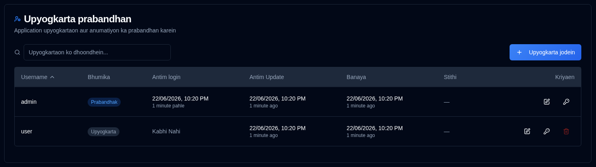

# Upyogkarta {#users}

**duplistatus** ke liye upyogkarta khata, anumati, aur access niyantran ka prabandhan karein. Yah section prabandhakon ko upyogkarta khata banane, sanshodhit karne, aur delete karne ki anumati deta hai.

>[!TIP] 
>Default `admin` khata delete kiya ja sakta hai. Aisa karne ke liye, pehle ek naya admin upyogkarta banayein, us khate se pravesh karein, 
> aur phir `admin` khata delete karein.
>
> `admin` khate ke liye default password `Duplistatus09` hai. Pahle pravesh par ise badalne ki avashyakta hogi.

## Upyogkarta Prabandhan Tak Pahunchna {#accessing-user-management}

Aap do tarikon se Upyogkarta Prabandhan section tak pahunch sakte hain:

1. **Upyogkarta Menu Se**: <IconButton icon="lucide:user" label="username" /> par click karein [Application Toolbar](../overview.md#application-toolbar) mein aur "Admin Users" chunein.

2. **Settings Se**: <IconButton icon="lucide:settings"/> par click karein aur settings sidebar mein **Users** par click karein

## Naya Upyogkarta Banana {#creating-a-new-user}

1. <IconButton icon="lucide:plus" label="Add User"/> button par click karein
2. Upyogkarta ka vivaran enter karein:
   - **Username**: 3-50 akshar hona chahiye, advitiya, case-insensitive
   - **Admin**: prabandhakiya visheshadhikar dene ke liye check karein
   - **Password Badlav Ki Avashyakta**: pahle pravesh par password badlav ko majaboor karne ke liye check karein
   - **Password**: 
     - Vikalp 1: ek surakshit aarthik password banane ke liye "Auto-generate password" check karein
     - Vikalp 2: uncheck karein aur ek anukoolit password enter karein
3. <IconButton icon="lucide:user-plus" label="Create User" /> par click karein.

## Upyogkarta Ko Sanshodhit Karna {#editing-a-user}

1. upyogkarta ke bagal mein <IconButton icon="lucide:edit" /> edit icon par click karein
2. Nimnalikhit mein se kisi ko bhi modify karein:
   - **Username**: username badlein (advitiya hona chahiye)
   - **Admin**: prabandhakiya visheshadhikar toggle karein
   - **Password Badlav Ki Avashyakta**: password badlav avashyakta toggle karein
3. <IconButton icon="lucide:check" label="Save Changes" /> par click karein.

## Upyogkarta Password Reset Karna {#resetting-a-user-password}

1. upyogkarta ke bagal mein <IconButton icon="lucide:key-round" /> key icon par click karein
2. password reset ki pushti karein
3. ek naya aarthik password banaya jayega aur dikhaya jayega
4. password copy karein aur upyogkarta ko surakshit roop se pradan karein

## Upyogkarta Ko Delete Karna {#deleting-a-user}

1. upyogkarta ke bagal mein <IconButton icon="lucide:trash-2" /> delete icon par click karein
2. dialog box mein deletion ki pushti karein. **Upyogkarta deletion sthayi hai aur ise vapas nahi kiya ja sakta hai.**

## Khata Lockout {#account-lockout}

Bahut adhik asafal pravesh prayason ke baad khate swatah lock ho jate hain:
- **Lockout Threshold**: 5 asafal prayas
- **Lockout Duration**: 15 minute
- Lock kiye gaye khate lockout avadhi samapt hone tak pravesh nahi kar sakte hain

## Admin Access Ko Punah Prapt Karna {#recovering-admin-access}

Yadi aapka prabandhak password kho gaya hai ya aap apne account se lock ho gaye hain, to aap prabandhak recovery script ka upyog karke access prapt kar sakte hain. Docker environments mein prabandhak access ko recover karne ke liye vistrit instructions ke liye [Prabandhak Khata Punarprapti](../admin-recovery.md) guide dekhen.
