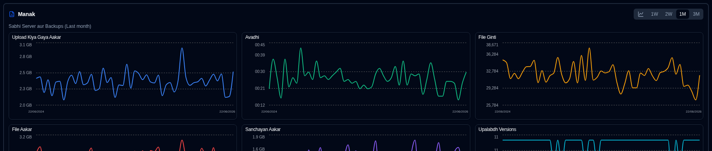

# Backup Manak {#backup-metrics}

Dashboard (table view) aur server details page par samay ke sath backup manak ka ek chart dikhaya jata hai.

- **Dashboard**, chart par **duplistatus** database mein record ki gayi sabhi backups ki sankhya dikhati hai. Agar aap Cards layout ka istemal kar rahe hain, to aap ek server select karke uske consolidated manak dekh sakte hain (jab side panel manak dikhata hai).
- **Server Details** page, chart par selected server ke liye manak dikhaye jate hain (uske sabhi backups ke liye) ya ek specific backup ke liye.

## Inline Chart Controls {#inline-chart-controls}

Quick access controls are available directly on chart panel headers for easy configuration without navigating to Display Settings:

### Time Range Selector {#time-range-selector}

Chart header mein pill buttons dikhaye jate hain quick time range selection ke liye: **1W | 2W | 1M | 3M**

- **1W**: Antim 7 din (rolling window)
- **2W**: Antim 14 din (rolling window)
- **1M**: Antim 30 din (rolling window, default)
- **3M**: Antim 90 din (rolling window)

Yahan par kiya gaye changes Display Settings ke sath sync hote hain, isliye aapka preference page refreshes ke beech bhi yad rakha jata hai.

### Chart Style Toggle {#chart-style-toggle}

Chart header mein ek toggle button hai jisse aap smooth lines aur bar chart ke beech switch kar sakte hain:

- **Smooth Lines**: Smooth curves ke sath data points ko connect karke dikhata hai
- **Bar Chart**: Har time period ke liye discrete bars ke roop mein data dikhata hai

Dono modes time-bucket aggregation ka istemal karte hain optimal display ke liye. Bar mode mein empty periods par koi bar nahi dikhata. Aapka preference page refreshes ke beech bhi yad rakha jata hai aur Display Settings ke sath sync hota hai.

## Chart Data Consolidation {#chart-data-consolidation}

Jab ek hi din par multiple backups hote hain, to **duplistatus** chart par dikhane se pehle data ko consolidate karta hai:

- **SUM**: Cumulative metrics (Duration, File Count, File Size, Uploaded Size) ke liye istemal kiya jata hai
- **LAST**: Storage Size ke liye istemal kiya jata hai (din ke sabse recent value)
- **MAX**: Available Versions ke liye istemal kiya jata hai (din ke sabse highest count)

Yeh consolidation time bucketing ke apply hone se pehle hota hai, isse accurate aggregated metrics ensure hote hain. For example, 5/12/26 par do backups hone par chart par ek consolidated data point dikhayi jayegi.

## Metric Definitions {#metric-definitions}

- **Uploaded Size**: Duplicati server se destination (local storage, FTP, cloud provider, ...) par backups ke dauran upload/transmit ki gayi total data ki miktar per din.
- **Duration**: Per din HH:MM mein sabhi backups ke liye total duration.
- **File Count**: Per din sabhi backups ke liye file count counter ki sankhya ka sum.
- **File Size**: Per din sabhi backups ke liye Duplicati server ne report ki gayi file size ka sum.
- **Sanchayan Aakar**: Sabhi backups ke liye Duplicati server ne dinank ke hisab se report kiya gaya sanrakhshan aakar ka sankhya.
- **Upalabdh Versions**: Sabhi backups ke liye sabhi upalabdh versions ka sankhya dinank ke hisab se.

:::note
Chart ke liye samay rang ko configure karne ke liye aap [Display settings](settings/display-settings.md) control ka upyog kar sakte hain.
:::
