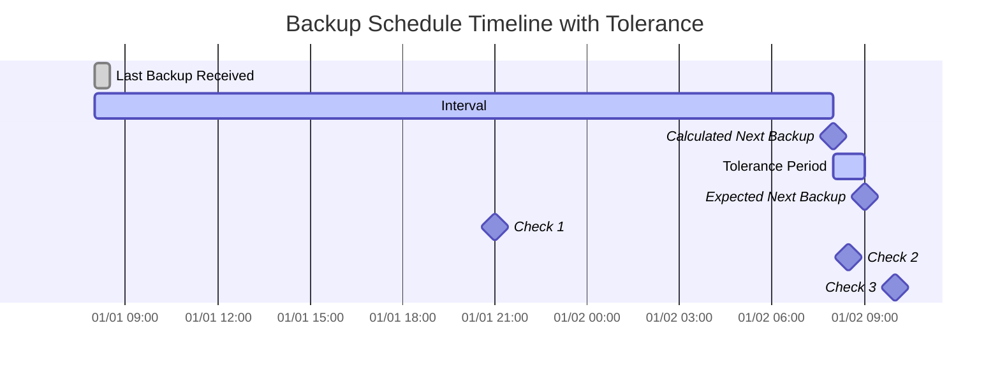

import { ZoomMermaid } from '@site/src/components/ZoomMermaid';

# बैकअप निगरानी {/* #backup-monitoring */}

बैकअप निगरानी सुविधा आपको उन बैकअप को ट्रैक करने और अलर्ट प्राप्त करने की अनुमति देती है जो अतिदेय हैं। सूचनाएं NTFY या ईमेल के माध्यम से हो सकती हैं।

उपयोगकर्ता इंटरफ़ेस में, बकाया बैकअप एक चेतावनी आइकन के साथ प्रदर्शित किए जाते हैं। आइकन पर होवर करने पर अतिदेय बैकअप का विवरण प्रदर्शित होता है, जिसमें अंतिम बैकअप का समय, अपेक्षित बैकअप समय, टॉलरेंस अवधि और अगला अपेक्षित बैकअप समय शामिल है।

## अतिदेय जांचें प्रक्रिया {/* #overdue-check-process */}

**यह कैसे काम करता है:**

| **चरण** | **मान**                  | **विवरण**                                   | **उदाहरण**        |
|:--------:|:---------------------------|:--------------------------------------------------|:-------------------|
|    1     | **अंतिम बैकअप**            | अंतिम सफल बैकअप का टाइमस्टैम्प।      | `2024-01-01 08:00` |
|    2     | **अपेक्षित अंतराल**      | कॉन्फ़िगर की गई बैकअप आवृत्ति।                  | `1 day`            |
|    3     | **परिकलित अगला बैकअप** | `Last Backup` + `Expected Interval`               | `2024-01-02 08:00` |
|    4     | **टॉलरेंस**              | कॉन्फ़िगर की गई ग्रेस अवधि (अनुमत अतिरिक्त समय)। | `1 hour`           |
|    5     | **अपेक्षित अगला बैकअप**   | `Calculated Next Backup` + `Tolerance`            | `2024-01-02 09:00` |

यदि वर्तमान समय `Expected Next Backup` समय के बाद का है, तो बैकअप को **अतिदेय** माना जाता है।

<ZoomMermaid>

</ZoomMermaid>

**उपरोक्त समयरेखा पर आधारित उदाहरण:**

- `2024-01-01 21:00` (🔹जांचें 1) पर, बैकअप **समय पर** है।
- `2024-01-02 08:30` (🔹जांचें 2) पर, बैकअप **समय पर** है, क्योंकि यह अभी भी टॉलरेंस अवधि के भीतर है।
- `2024-01-02 10:00` (🔹जांचें 3) पर, बैकअप **अतिदेय** है, क्योंकि यह `Expected Next Backup` समय के बाद है।

## आवधिक जांचें {/* #periodic-checks */}

**duplistatus** कॉन्फ़िगर करने योग्य अंतरालों पर बकाया बैकअप के लिए आवधिक जांचें करता है। डिफ़ॉल्ट अंतराल 20 मिनट है, लेकिन आप इसे [सेटिंग्स → बैकअप निगरानी](settings/backup-monitoring-settings.md) में कॉन्फ़िगर कर सकते हैं।

## स्वचालित कॉन्फ़िगरेशन {/* #automatic-configuration */}

जब आप Duplicati सर्वर से बैकअप लॉग एकत्र करते हैं, तो **duplistatus** स्वचालित रूप से:

- Duplicati कॉन्फ़िगरेशन से बैकअप शेड्यूल निकालता है
- सटीक रूप से मेल खाने के लिए बैकअप निगरानी अंतरालों को अपडेट करता है
- अनुमत सप्ताह के दिन और निर्धारित समय को सिंक्रनाइज़ करता है
- आपकी सूचना प्राथमिकताओं को सुरक्षित रखता है

:::tip
सर्वोत्तम परिणामों के लिए, अपने Duplicati सर्वर में बैकअप जॉब अंतराल बदलने के बाद बैकअप लॉग एकत्र करें। इससे यह सुनिश्चित होता है कि **duplistatus** आपके वर्तमान कॉन्फ़िगरेशन के साथ सिंक्रनाइज़ रहे।
:::

विस्तृत कॉन्फ़िगरेशन विकल्पों के लिए [बैकअप निगरानी सेटिंग्स](settings/backup-monitoring-settings.md) अनुभाग की समीक्षा करें।
