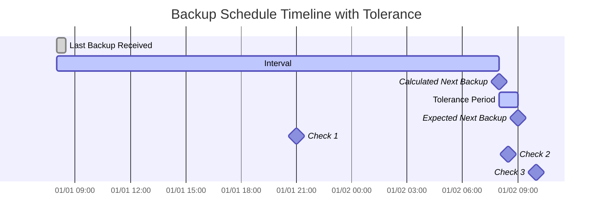

import { ZoomMermaid } from '@site/src/components/ZoomMermaid';

# बैकअप निगरानी {/* #backup-monitoring */}

बैकअप निगरानी सुविधा आपको अतिदेय बैकअप पर नज़र रखने और अलर्ट करने की अनुमति देती है। सूचनाएं NTFY या ईमेल के माध्यम से हो सकती हैं।

उपयोगकर्ता इंटरफ़ेस में, अतिदेय बैकअप को एक चेतावनी आइकन के साथ प्रदर्शित किया जाता है। आइकन पर होवर करने से अतिदेय बैकअप का विवरण प्रदर्शित होता है, जिसमें अंतिम बैकअप समय, अपेक्षित बैकअप समय, सहिष्णुता अवधि और अपेक्षित अगला बैकअप समय शामिल है।

## अतिदेय जांच प्रक्रिया {/* #overdue-check-process */}

**यह कैसे काम करता है:**

| **चरण** | **मान**                     | **विवरण**                                      | **उदाहरण**        |
|:--------:|:----------------------------|:------------------------------------------------|:-------------------|
|    1     | **अंतिम बैकअप**            | अंतिम सफल बैकअप का टाइमस्टैम्प।               | `2024-01-01 08:00` |
|    2     | **अपेक्षित अंतराल**        | कॉन्फ़िगर की गई बैकअप आवृत्ति।                 | `1 day`            |
|    3     | **गणना की गई अगला बैकअप**  | `Last Backup` + `Expected Interval`               | `2024-01-02 08:00` |
|    4     | **सहिष्णुता**               | कॉन्फ़िगर की गई ग्रेस अवधि (अतिरिक्त समय की अनुमति)। | `1 hour`           |
|    5     | **अपेक्षित अगला बैकअप**    | `Calculated Next Backup` + `Tolerance`            | `2024-01-02 09:00` |

एक बैकअप को **अतिदेय** माना जाता है यदि वर्तमान समय `Expected Next Backup` समय से बाद में है।

<ZoomMermaid>

</ZoomMermaid>

**उदाहरण ऊपर दिए गए समयरेखा के आधार पर:**

- `2024-01-01 21:00` (🔹जांच 1) पर, बैकअप **समय पर** है।
- `2024-01-02 08:30` (🔹जांच 2) पर, बैकअप **समय पर** है, क्योंकि यह अभी भी सहिष्णुता अवधि के भीतर है।
- `2024-01-02 10:00` (🔹जांच 3) पर, बैकअप **अतिदेय** है, क्योंकि यह `Expected Next Backup` समय के बाद है।

## आवधिक जांचें {/* #periodic-checks */}

**duplistatus** कॉन्फ़िगर की गई अंतराल पर अतिदेय बैकअप के लिए आवधिक जांच करता है। डिफ़ॉल्ट अंतराल 20 मिनट है, लेकिन आप इसे [सेटिंग्स → बैकअप निगरानी](settings/backup-monitoring-settings.md) में कॉन्फ़िगर कर सकते हैं।

## स्वचालित कॉन्फ़िगरेशन {/* #automatic-configuration */}

जब आप Duplicati सर्वर से बैकअप लॉग एकत्र करते हैं, तो **duplistatus** स्वचालित रूप से:

- Duplicati कॉन्फ़िगरेशन से बैकअप शेड्यूल निकालता है
- बैकअप निगरानी अंतराल को सटीक रूप से मेल करने के लिए अपडेट करता है
- अनुमत सप्ताह के दिनों और निर्धारित समय को समन्वयित करता है
- आपकी सूचनाओं की प्राथमिकताओं को संरक्षित करता है

:::tip
सर्वोत्तम परिणामों के लिए, अपने duplicati सर्वर में बैकअप नौकरी अंतराल बदलने के बाद बैकअप लॉग एकत्र करें। यह सुनिश्चित करता है कि **duplistatus** आपकी वर्तमान कॉन्फ़िगरेशन के साथ सिंक्रनाइज़ रहे।
:::

विस्तृत कॉन्फ़िगरेशन विकल्पों के लिए [बैकअप निगरानी सेटिंग्स](settings/backup-monitoring-settings.md) अनुभाग की समीक्षा करें।
