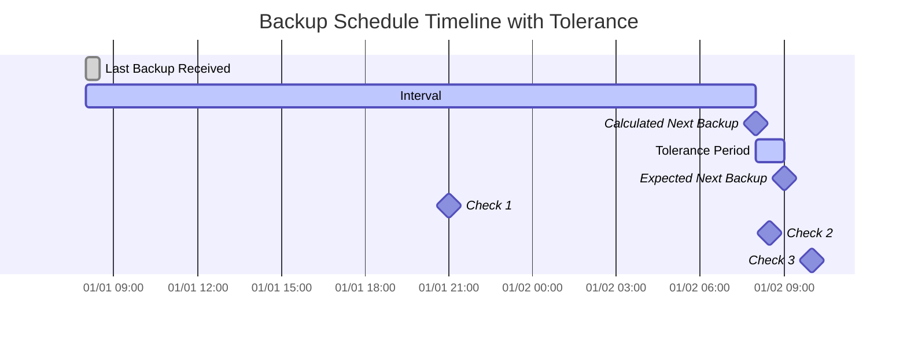

import { ZoomMermaid } from '@site/src/components/ZoomMermaid';

# Backup Monitoring {#backup-monitoring}

Backup monitoring feature se aap overdue backups ko track kar sakte hain aur unpar alert kar sakte hain. Suchnaayein NTFY ya Email ke through ho sakti hain.

Upyogkarta interface mein, overdue backups ko warning icon ke saath dikhaya jata hai. Icon par mouse lekar jane se overdue backup ke vivaran dikhaye jate hain, jismein antim backup samay, apekshit backup samay, tolerance period aur aage aane wala backup samay shamil hai.

## Overdue Check Process {#overdue-check-process}

**Kaise kaam karta hai:**

| **Step** | **Value**                  | **Description**                                   | **Example**        |
|:--------:|:---------------------------|:--------------------------------------------------|:-------------------|
|    1     | **Antim Backup**            | Antim siddh backup ka samay chinh.      | `2024-01-01 08:00` |
|    2     | **Apekshit antaraal**      | Configure kia gaya backup frequency.                  | `1 day`            |
|    3     | **Calculated Next Backup** | `Last Backup` + `Expected Interval`               | `2024-01-02 08:00` |
|    4     | **Tolerance**              | Configure kia gaya grace period (extra time allowed). | `1 hour`           |
|    5     | **Expected Next Backup**   | `Calculated Next Backup` + `Tolerance`            | `2024-01-02 09:00` |

Backup ko **vilambit** mana jata hai jabki vartaman samay `Expected Next Backup` samay se baad ho.

<ZoomMermaid>

</ZoomMermaid>

**Upar dikhaye gaye timeline ke anusar examples:**

- At `2024-01-01 21:00` (🔹Check 1), the backup is **on time**.
- At `2024-01-02 08:30` (🔹Check 2), the backup is **on time**, as it is still within the tolerance period.
- At `2024-01-02 10:00` (🔹Check 3), the backup is **overdue**, as this is after the `Expected Next Backup` time.

## Periodic Checks {#periodic-checks}

**duplistatus** configurable intervals par overdue backups ke liye periodic checks karta hai. Default interval hai 20 minute, par aap isko [Settings → Backup Monitoring](settings/backup-monitoring-settings.md) mein configure kar sakte hain.

## Automatic Configuration {#automatic-configuration}

Jab aap Duplicati server se backup logs collect karte hain, **duplistatus** automatically:

- Duplicati configuration se backup schedule extract karta hai
- Backup monitoring intervals ko exactly match karne ke liye update karta hai
- Anumati prapt saptaah ke din aur scheduled times ko synchronise karta hai
- Apke notification preferences ko preserve karta hai

:::tip
सर्वोत्तम परिणामों के लिए, अपने डुप्लिकेटी सर्वर में बैकअप जॉब अंतराल बदलने के बाद बैकअप लॉग इकट्ठा करें। यह सुनिश्चित करता है कि **duplistatus** आपके वर्तमान कॉन्फ़िगरेशन के साथ सिंक्रनाइज़्ड रहता है।
:::

[Backup Monitoring Settings](settings/backup-monitoring-settings.md) अनुभाग में विस्तृत कॉन्फ़िगरेशन विकल्पों की समीक्षा करें।
