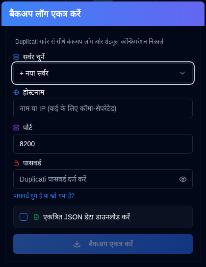
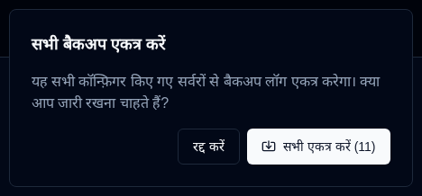

# Backup Logs Ikattha Karein {#collect-backup-logs}

**duplistatus** can retrieve backup logs directly from Duplicati servers to populate the database or restore missing log data. The application automatically skips any duplicate logs that already exist in the database.

## Backup Logs Ikattha Karein ke liye Kadam {#steps-to-collect-backup-logs}

### Manual Collection {#manual-collection}

1.  Click the <IconButton icon="lucide:download" /> **Backup Logs Ikattha Karein** icon on the [Application Toolbar](overview.md#application-toolbar).

2.  Select Server

If you have server addresses configured in [Settings → Server Settings](settings/server-settings.md), select one from the dropdown list for instant collection. If you don't have any servers configured, you can enter the Duplicati server details manually.

3.  Enter the Duplicati server details:
    - **Hostname**: The hostname or IP address of the Duplicati server. You can enter multiple hostnames separated by commas, for example `192.168.1.23,someserver.local,192.168.1.89`
    - **Port**: The port number used by the Duplicati server (default: `8200`).
    - **Password**: Enter the authentication password if required.
    - **Download collected JSON data**: Enable this option to download the data collected by duplistatus.
4.  Click **Backups Ikattha Karein**.

***Notes:***
- If you enter multiple hostnames, the collection will be performed using the same port and password for all servers.
- **duplistatus** will automatically detect the best connection protocol (HTTPS or HTTP). It tries HTTPS first (with proper SSL validation), then HTTPS with self-signed certificates, and finally HTTP as a fallback.

:::tip
<IconButton icon="lucide:download" /> buttons are available in [Settings → Backup Monitoring](settings/backup-monitoring-settings.md) and [Settings → Server Settings](settings/server-settings.md) for single-server collection.
:::

 

### Bulk Collection {#bulk-collection}

_Right-click_ the <IconButton icon="lucide:download" /> **Backup Logs Ikattha Karein** button in the application toolbar to collect from all configured servers.

:::tip
You can also use the <IconButton icon="lucide:import" label="Sab Kuch Ikattha Karein"/> button in the [Settings → Backup Monitoring](settings/backup-monitoring-settings.md) and [Settings → Server Settings](settings/server-settings.md) pages to collect from all configured servers.
:::

## Collection Process Kaise Kaam Karta Hai {#how-the-collection-process-works}

- **duplistatus** स्वचालित रूप से सर्वोत्तम कनेक्शन प्रोटोकॉल का पता लगाता है और निर्दिष्ट Duplicati सर्वर से कनेक्ट होता है।
- यह बैकअप इतिहास, लॉग जानकारी, और बैकअप सम्मान (बैकअप मॉनिटरिंग के लिए) प्राप्त करता है।
- **duplistatus** डेटाबेस में पहले से मौजूद किसी भी लॉग को छोड़ देता है।
- नया डेटा संसाधित और स्थानीय डेटाबेस में संग्रहीत किया जाता है, जिसमें प्रत्येक बैकअप लॉग में रिपोर्ट की गई Duplicati संस्करण शामिल है। [डैशबोर्ड संस्करण](dashboard.md#duplicati-server-version) नवीनतम संग्रहीत लॉग से लिया जाता है — **duplistatus** सर्वर पर वर्तमान में चल रहे संस्करण को नहीं पढ़ता। Duplicati अपग्रेड के बाद, डैशबोर्ड नए संस्करण दिखाने के लिए एक नया बैकअप संग्रहित करें या प्रतीक्षा करें।
- उपयोग किया गया URL (पता लगाए गए प्रोटोकॉल के साथ) स्थानीय डेटाबेस में संग्रहीत या अपडेट किया जाएगा।
- यदि डाउनलोड विकल्प चुना गया है, तो यह डुप्लिकेटी सर्वर से किसी भी डेटा प्राप्त होने पर JSON डेटा डाउनलोड करेगा — भले ही लॉग्स वैधता विफल हों या डेटाबेस में आयात नहीं हो सकें। फ़ाइल का नाम इस प्रारूप में होगा: `[serverName]_collected_[Timestamp].json`। टाइमस्टैम्प आईएसओ 8601 तिथि प्रारूप का उपयोग करता है (YYYY-MM-DDTHH:MM:SS)।
- डैशबोर्ड नए जानकारी को दर्शाने के लिए अपडेट होता है।

:::note Seeing duplicated servers after collecting?
If the same server appears more than once after collecting backup logs (or after a Duplicati reinstall/upgrade), it is usually caused by a changed `machine_id` or by a Duplicati API bug that mixes the `identity` id and the `machine_id`. The fix is to align the ids on the Duplicati server (edit `identity.txt`/`machineid.txt` or set **Duplicati → Settings → Advanced Options → Machine-id**), restart Duplicati, then merge the entries in **duplistatus** via [Settings → Database Maintenance → Duplicate servers merge karein](settings/database-maintenance.md#merge-duplicate-servers). See [Duplicate Servers on the Dashboard](troubleshooting.md#duplicate-servers-on-the-dashboard) for full steps.
:::

## Collection Issues ke liye Troubleshooting {#troubleshooting-collection-issues}

Backup log collection requires the Duplicati server to be accessible from the **duplistatus** installation. If you encounter issues, please verify the following:

- पुष्टि करें कि होस्टनेम (या आईपी पता) और पोर्ट संख्या सही है। आप इसे ब्राउज़र में डुप्लिकेटी सर्वर यूआई को एक्सेस करके परीक्षण कर सकते हैं (उदाहरण के लिए, `http://hostname:port`)।
- जांचें कि **duplistatus** डुप्लिकेटी सर्वर से कनेक्ट कर सकता है। एक सामान्य समस्या DNS नाम रिज़ॉल्यूशन है (प्रणाली होस्टनेम द्वारा सर्वर को नहीं ढूंढ पाती है)। अधिक जानकारी के लिए [ट्रबलशूटिंग अनुभाग](troubleshooting.md#collect-backup-logs-not-working) देखें।
- सुनिश्चित करें कि आपने प्रदान किया गया पासवर्ड सही है।
- डुप्लिकेटी 2.4+ में, संग्रह प्रणाली की डिफ़ॉल्ट खाली होने पर डुप्लिकेटी सर्वर सेटिंग्स से मशीन-आईडी पढ़ता है।
