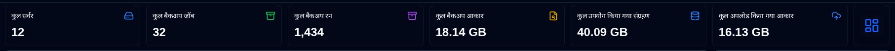
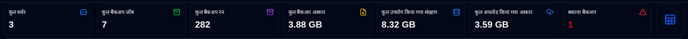
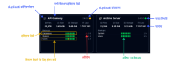
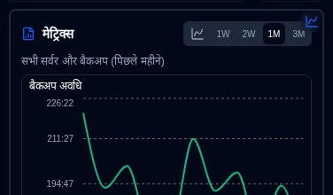
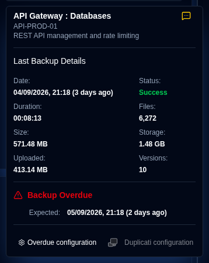

# डैशबोर्ड {#dashboard}

## डैशबोर्ड सारांश {#dashboard-summary}

इस अनुभाग में सभी बैकअप के लिए एकत्रित आँकड़े प्रदर्शित किए जाते हैं।

- **कुल सर्वर**: मॉनिटर किए जाने वाले सर्वर की संख्या।
- **कुल बैकअप जॉब्स**: सभी सर्वरों के लिए कॉन्फ़िगर किए गए बैकअप जॉब्स (प्रकार) की कुल संख्या।
- **कुल बैकअप रन**: सभी सर्वरों के लिए प्राप्त या एकत्रित बैकअप लॉग्स की कुल संख्या।
- **कुल बैकअप साइज़**: नवीनतम प्राप्त बैकअप लॉग्स के आधार पर सभी स्रोत डेटा का संयुक्त साइज़।
- **कुल स्टोरेज उपयोग**: बैकअप डेस्टिनेशन (जैसे क्लाउड स्टोरेज, FTP सर्वर, लोकल ड्राइव) पर बैकअप द्वारा उपयोग की गई कुल स्टोरेज स्पेस, नवीनतम प्राप्त बैकअप लॉग्स के आधार पर।
- **कुल अपलोड साइज़**: डुप्लिकेट सर्वर से डेस्टिनेशन (जैसे लोकल स्टोरेज, FTP, क्लाउड प्रदाता) तक अपलोड किए गए कुल डेटा की मात्रा।
- **विलंबित बैकअप** (तालिका): विलंबित बैकअप की संख्या। देखें [बैकअप सूचनाएं सेटिंग्स](settings/backup-notifications-settings.md)
- **लेआउट टॉगल**: कार्ड्स लेआउट (डिफ़ॉल्ट) और तालिका लेआउट के बीच स्विच करता है।

:::tip डुप्लिकेट सर्वर देख रहे हैं?
यदि डैशबोर्ड पर एक ही सर्वर एक से अधिक बार दिखाई देता है, तो उन्हें एकत्रित करने के लिए [सेटिंग्स → डेटाबेस मेनटेनेंस → डुप्लिकेट सर्वर मर्ज करें](settings/database-maintenance.md#merge-duplicate-servers) का उपयोग करें। डुप्लिकेट तब हो सकते हैं जब आप डुप्लिकेट को पुनः इंस्टॉल या अपग्रेड करते हैं, क्योंकि सर्वर का `machine_id` बदल सकता है और **duplistatus** इसे एक नए सर्वर के रूप में देखता है।
:::

## सर्वर फ़िल्टरिंग {#server-filtering}

आप एप्लिकेशन टूलबार में सर्च फ़ील्ड का उपयोग करके डैशबोर्ड पर प्रदर्शित सर्वर और बैकअप को फ़िल्टर कर सकते हैं। सर्च फ़ील्ड को प्रकट करने के लिए फ़िल्टर आइकन <IconButton icon="lucide:search" /> पर क्लिक करें।

**फ़िल्टर मैच:**
- सर्वर आईडी
- सर्वर URL
- बैकअप जॉब नाम

**स्कोप:**
- डैशबोर्ड पर कार्ड और तालिका व्यू दोनों को फ़िल्टर करता है
- सेशन स्टेट डैशबोर्ड सर्वर फ़िल्टर प्रदाता द्वारा बनाए रखा जाता है
- जब आप डैशबोर्ड छोड़ते हैं या रीफ्रेश करते हैं तो यह साफ़ हो जाता है

यह कई मॉनिटर किए जाने वाले सिस्टम के बीच विशिष्ट सर्वर या बैकअप को जल्दी से स्थानांतरित करने में मदद करता है।

## कार्ड्स लेआउट {#cards-layout}

कार्ड्स लेआउट प्रत्येक बैकअप के लिए प्राप्त नवीनतम बैकअप लॉग की स्थिति को दिखाता है।

- **Server Naam**: Duplicati server ka naam (ya Upnaam)
  - **Server Naam** पर होवर करने से server naam aur note dikhayi dega
- **Overall Stithi**: Server ki stithi. Vilambit backups **Warning** stithi ke roop mein dikhayi denge
- **Sanskaran**: Sabse antim backup log se Duplicati sanskaran, jo stithi indicator ke bayin or dikhaya jata hai. [Duplicati Server Version](#duplicati-server-version) dekhein.
- **Summary jankari**: Is server ke sabhi backups ke liye ekathrit File sankhya, aakar aur upyog kiya gaya sanchayan. Yah sabse haliya prapt backup ka beeta hua samay bhi dikhata hai (samay chinh dekhne ke liye hover karein)
- **Backups list**: Is server ke liye configured sabhi backups ke saath ek table, 3 columns ke saath:
  - **Backup Naam**: Duplicati server mein backup ka naam
  - **Stithi itihas**: Prapt antim 10 backups ki stithi.
  - **Antim backup prapt**: Antim prapt log ke vartaman samay se beeta hua samay. Yadi backup overdue hai to yah warning icon dikhayega.
    - Samay sankshipt format mein dikhaya jata hai: `m` minutes ke liye, `h` hours ke liye, `d` days ke liye, `w` weeks ke liye, `mo` months ke liye, `y` years ke liye.

कार्ड सॉर्ट ऑर्डर और अन्य कॉन्फ़िगरेशन [डिस्प्ले सेटिंग्स](settings/display-settings.md) में सेट किए जा सकते हैं।

पैनल व्यू दो सूचनात्मक डिस्प्ले प्रदान करता है, जो साइड पैनल के ऊपरी दाएँ बटन पर क्लिक करके पहुंचा जा सकता है:

- स्थिति: स्थिति के अनुसार बैकअप जॉब्स की आँकड़े दिखाता है, विलंबित बैकअप और चेतावनी/त्रुटि स्थिति वाले बैकअप जॉब्स की सूची के साथ।

- Manak: Aggregated ya selected server ke liye samay se samay ke liye avadhi, file aakar aur sanchayan aakar ke charts dikhate hain.

### बैकअप विवरण {#backup-details}

List mein kisi backup par hover karne se, last backup log ke details aur kisi bhi vilambit jankari dikhati hai.

- **Server Naam : Backup**: Duplicati server aur backup ka naam ya upnaam, server naam aur note bhi dikhayega.
  - Upnaam aur note ko [Settings → Server Settings](settings/server-settings.md) par configure kiya ja sakta hai.
- **Suchnaayein**: Naye backup logs ke liye [configured notification](#notifications-icons) setting ko dikhane wala icon.
- **Taareekh**: Backup ka samay chinh aur last screen refresh se lekar elapsed samay.
- **Stithi**: Last received backup ki stithi (Safalta, Warning, Truti, Gambhir).
- **Avadhi, File Ginti, File Aakar, Sanchayan Aakar, Upload Kiya Gaya Aakar**: Duplicati server ke dwara report kiye gaye values.
- **Upalabdh Versions**: Backup destination par stored backup versions ki sankhya, backup ke samay.

Agar ye backup vilambit hai, tooltip bhi dikhayega:

- **Expected Backup**: Backup ka expected samay, including the configured grace period (extra time allowed before marking as overdue).

Aap bhi bottom par buttons click karke [Settings → Backup Notifications](settings/backup-notifications-settings.md) khol sakte hain monitoring settings configure karne ke liye ya Duplicati server's web interface kholne ke liye.

## Table Layout {#table-layout}

Table layout lists the most recent backup logs received for all servers and backups.

- **Server Naam**: Duplicati server ka naam (ya Upnaam)
  - Naam ke neeche server note hai
- **Backup Naam**: Duplicati server mein backup ka naam.
- **Sanskaran**: Us backup job ke liye sabse antim backup log se Duplicati sanskaran. [Duplicati Server Version](#duplicati-server-version) dekhein.
- **Upalabdh Versions**: Backup destination par store kiye gaye backup versions ki sankhya. Yadi icon greyed out hai, to log mein vistrit vivaran prapt nahi hua tha. Vivaran ke liye [Duplicati Configuration instructions](../installation/duplicati-server-configuration.md) dekhein.
- **Backup Ginti**: Duplicati server dwara report ki gayi backups ki sankhya.
- **Antim Backup Tithi**: Prapt antim backup log ka samay chinh aur antim screen refresh se beeta hua samay.
- **Antim Backup Stithi**: Prapt antim backup ki stithi (Safalta, Warning, Truti, Gambhir).
- **Avadhi**: HH:MM:SS mein backup ki avadhi.
- **चेतावनियाँ/त्रुटियाँ**: Backup log mein report ki gayi chetavaniyon aur trutiyon ki sankhya, `warnings/errors` ke roop mein dikhayi jati hai (udaharan ke liye `0/0`).
- **Sammaan**:
  - **Notification**: Naye backup logs ke liye configured notification setting dikhane wala ek icon.
  - **Duplicati configuration**: Duplicati server ke web interface ko kholne ke liye ek button

Aap [Display Settings](settings/display-settings.md) use kar sakte hain table size aur other configurations configure karne ke liye.

### Suchnaayein Icons {#notifications-icons}

| Icon                                                                                                                               | Notification Option | Description                                                                                         |
|------------------------------------------------------------------------------------------------------------------------------------|---------------------|-----------------------------------------------------------------------------------------------------|
| <IconButton icon="lucide:message-square-off" style={{border: 'none', padding: 0, color: '#9ca3af', background: 'transparent'}} />  | Band                 | Naye backup log received hone par koi notifications nahi bheje jayenge                                     |
| <IconButton icon="lucide:message-square-more" style={{border: 'none', padding: 0, color: '#60a5fa', background: 'transparent'}} /> | Sabhi                 | Har naye backup log ke liye notifications bheje jayenge, regardless of its status.                      |
| <IconButton icon="lucide:message-square-more" style={{border: 'none', padding: 0, color: '#fbbf24', background: 'transparent'}} /> | Chetaavaniyaan            | Suchnaayein sirf Warning, Anjaan, Truti, aur Gambhir stithi ke backup logs ke liye bheje jaayenge. |
| <IconButton icon="lucide:message-square-more" style={{border: 'none', padding: 0, color: '#f87171', background: 'transparent'}} /> | Trutiyon              | Suchnaayein sirf Truti aur Gambhir stithi ke backup logs ke liye bheje jaayenge.                    |

:::note
Yah suchnaayein samaan sirf tab lagta hai jab **duplistatus** ek naya backup log Duplicati server se praapt karta hai. Vilambit suchnaayein alag se samaan ki gayi hain aur is samaan ke bina bheje jaayenge.
:::

### Vilambit Vistrit {#overdue-details}

Vilambit chetaavani icon par mouse rakhne se vilambit backup ke baare mein vishesh vivaran dikhaye jaate hain.

- **Janch karein**: Kab aakhiri vilambit janch ki gayi thi. [Backup Suchnaayein Sammaan](settings/backup-notifications-settings.md) mein samay ka samaan karein.
- **Antim Backup**: Kab aakhiri backup log praapt kiya gaya tha.
- **Anumati Backup**: Backup ka anumati samay, vilambit ke roop mein mark kiye jaane se pehle anumati samay (extra samay) shamil kiya gaya tha.
- **Antim Suchnaayein**: Kab aakhiri vilambit suchnaayein bheji gayi thi.

## Duplicati Server Version {#duplicati-server-version}

Dashboard har server (card view) ya backup job (Table view) ke liye sabse antim backup log mein report kiye gaye Duplicati sanskaran ko dikhata hai.

- **यह कहाँ दिखाई देता है**: कार्ड्स पर स्थिति संकेतक (status indicator) के बाईं ओर, और टेबल में **Sanskaran** कॉलम में (**Overdue / Agla chalan** के बाद)। आप [Display settings](settings/display-settings.md) या [डुप्लिकेटी संस्करण](settings/duplicati-versions.md) से कार्ड बैज को छिपा सकते हैं। टेबल कॉलम हमेशा दिखाई देता रहता है।
- **रंग**: म्यूटेड टेक्स्ट का अर्थ है कि संस्करण उस चैनल के नवीनतम रिलीज़ से मेल खाता है (या तुलना अनुपलब्ध है)। Warning पीला रंग का अर्थ है कि संस्करण उस चैनल के नवीनतम रिलीज़ से पुराना है।
- **टूलटिप**: अपडेट चैनल (`stable`, `beta`, `experimental`, या `canary`), सर्वर संस्करण, और उस चैनल के लिए नवीनतम उपलब्ध संस्करण देखने के लिए संस्करण संख्या पर होवर करें या क्लिक करें।

**duplistatus** बैकअप लॉग से संस्करण को GitHub पर प्रकाशित नवीनतम डुप्लिकेटी रिलीज़ के साथ तुलना करता है। व्यवस्थापक कैश्ड चैनल संस्करण देख सकते हैं और जांच अंतराल और प्रारंभ समय को [Settings → Duplicati Versions](settings/duplicati-versions.md) में कॉन्फ़िगर कर सकते हैं। कैश भी शुरू पर रिफ्रेश होता है जब यह चयनित अंतराल से पुराना होता है। सफल और असफल GitHub अपडेट्स को [Audit log](settings/audit-logs-viewer.md) में `duplicati_version_refresh` के रूप में रिकॉर्ड किया जाता है (`startup`, `cron`, या `manual` द्वारा शुरू किया गया)।

:::important
**duplistatus** vartaman mein chal rahe sanskaran ke liye Duplicati server se query nahi karta hai. Yah prapt kiye gaye ya [Ekathrit](collect-backup-logs.md) antim backup log mein store kiye gaye sanskaran ka upyog karta hai. Duplicati upgrade karne ke baad, dashboard naya backup log aane tak pichla sanskaran dikhata rehta hai.
:::

### Upalabdh Backup Sanskaran {#available-backup-versions}

Neela ghadi icon par click karne se backup ke samay praapt upalabdh backup versions ki ek list khuli jaati hai, jise Duplicati server ne report kiya hai.

- **Backup Vivaran**: Server naam aur upnaam, server note, backup naam, aur kab backup chalaya gaya tha, ye dikhata hai.
- **Sanskaran Vivaran**: Sanskaran sankhya, utpatti taareekh, aur aayu dikhata hai.

:::note
Agar icon kharaab ho jata hai, to iska matlab hai ki message logs mein koi vishesh jankari praapt nahi ki gayi.
Vishesh jankari ke liye [Duplicati Configuration instructions](../installation/duplicati-server-configuration.md) dekhiye.
:::
