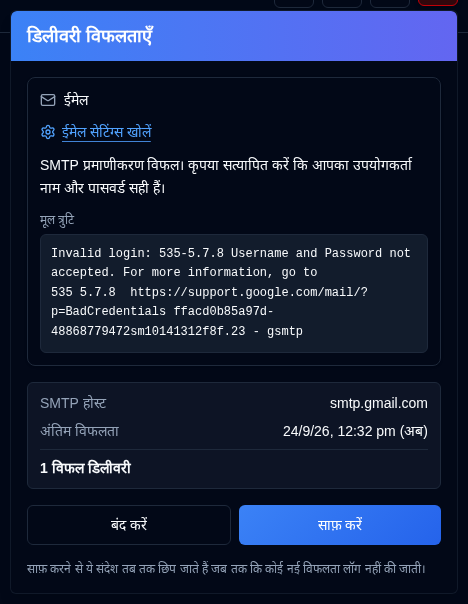

# डिलीवरी विफलताएँ {/* #delivery-failures */}

हल्के लाल रंग का एक <IconButton icon="lucide:siren" tone="alert" /> बटन व्यवस्थापकों के लिए [एप्लिकेशन टूलबार](overview.md#application-toolbar) में दिखाई देता है जब ईमेल या ntfy डिलीवरी विफल हो रही हो। जब दोनों चैनल ठीक होते हैं, तो यह छिपा रहता है, और यह लॉगिन पृष्ठ पर नहीं दिखाया जाता है। सामान्य उपयोगकर्ता इसे नहीं देखते हैं।

प्रत्येक विफल चैनल (ईमेल, NTFY) के लिए एक कार्ड हेतु बटन खोलें, प्रत्येक ऑडिट प्रविष्टि के लिए एक पंक्ति नहीं। प्रत्येक कार्ड दिखाता है:

- त्रुटि, और SMTP उत्तर लॉग किए जाने पर एक मोनोस्पेस **मूल त्रुटि**
- SMTP होस्ट या NTFY टॉपिक
- अंतिम विफलता का समय
- अंतिम सफलता के बाद से, या जब से आपने उस चैनल को अंतिम बार साफ़ किया है, तब से कितनी डिलीवरी विफल हुई हैं

**ईमेल सेटिंग्स खोलें** [सेटिंग्स → ईमेल](settings/email-settings.md) पर ले जाता है। **NTFY सेटिंग्स खोलें** [सेटिंग्स → NTFY](settings/ntfy-settings.md) पर ले जाता है।

**बंद करें** केवल पैनल को खारिज करता है। **साफ़ करें** सूचीबद्ध चैनलों को तब तक छिपाता है जब तक कि कोई नई विफलता लॉग नहीं की जाती, भले ही त्रुटि टेक्स्ट समान हो। बाद की सफल डिलीवरी बटन को छिपाए रखती है। इसमें `email_sent`, `notification_sent`, और उस चैनल के लिए एक सफल [दैनिक सारांश](settings/daily-summary-settings.md) भेजना शामिल है।
