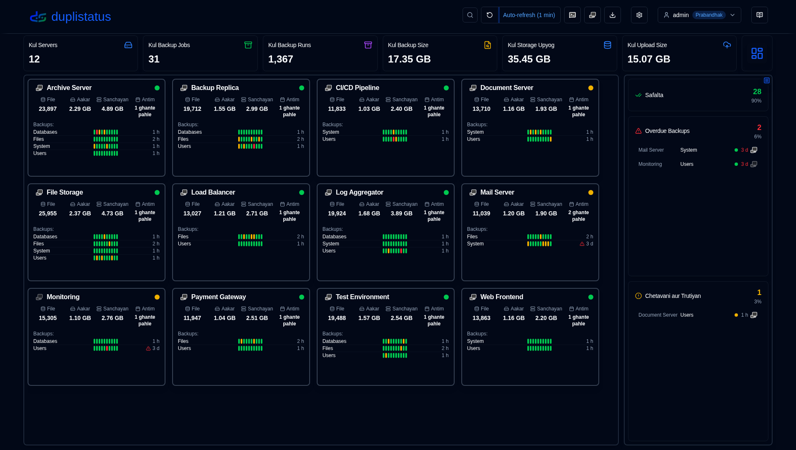
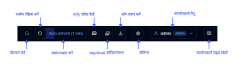
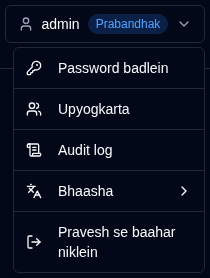
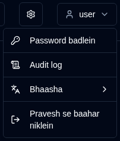

# Overview {#overview}

duplistatus उपयोक्ता मार्गदर्शिका में आपका स्वागत है। यह व्यापक दस्तावेज़ duplistatus का उपयोग करके कई सर्वरों पर अपने डुप्लिकेटी बैकअप ऑपरेशन को निगरानी और प्रबंधित करने के लिए विस्तृत निर्देश प्रदान करता है।

## duplistatus क्या है? {#what-is-duplistatus}

duplistatus एक शक्तिशाली निगरानी डैशबोर्ड है जो विशेष रूप से डुप्लिकेटी बैकअप प्रणालियों के लिए डिज़ाइन किया गया है। यह प्रदान करता है:

- एक सेंट्रलाइज़्ड निगरानी प्रणाली जो एक ही इंटरफ़ेस से कई डुप्लिकेटी सर्वरों को निगरानी करती है
- सभी बैकअप ऑपरेशन की रियल-टाइम स्थिति ट्रैकिंग
- कॉन्फ़िगर करने योग्य चेतावनियों के साथ स्वचालित विलंबित बैकअप का पता लगाने
- बैकअप प्रदर्शन का व्यापक मेट्रिक्स और विज़ुअलाइज़ेशन
- NTFY और ईमेल के माध्यम से फ्लेक्सिबल नोटिफिकेशन सिस्टम
- बहुभाषा समर्थन (अंग्रेज़ी, फ्रेंच, जर्मन, स्पैनिश, ब्राज़ीलियन पुर्तगाली, हिंदी (रोमन) और सरलीकृत चीनी)।

## स्थापना {#installation}

पहले से आवश्यकताओं और विस्तृत स्थापना निर्देशों के लिए, कृपया [स्थापना मार्गदर्शिका](../installation/installation.md) देखें।

## डैशबोर्ड तक पहुंच {#accessing-the-dashboard}

सफल स्थापना के बाद, निम्नलिखित चरणों का पालन करके duplistatus वेब इंटरफ़ेस तक पहुंचें:

1. अपनी पसंदीदा वेब ब्राउज़र खोलें
2. `http://your-server-ip:9666` पर नेविगेट करें
   - `your-server-ip` को वास्तविक आईपी पते या duplistatus सर्वर के होस्टनेम से बदलें
   - डिफ़ॉल्ट पोर्ट है `9666`
3. आपको एक लॉगिन पृष्ठ दिखाई देगा।

पहली बार उपयोग के लिए या (0.9.x से पहले के संस्करण से अपग्रेड के बाद):
    - उपयोगकर्ता नाम: `admin`
    - पासवर्ड: `Duplistatus09`

लॉगिन के बाद, दाईं ओर <IconButton icon="lucide:languages" label="भाषा" /> में या <IconButton icon="lucide:user" label="उपयोगकर्ता नाम" /> में उपयोगकर्ता इंटरफ़ेस भाषा का चयन करें (नीचे देखें)।

4. लॉगिन के बाद, मुख्य डैशबोर्ड स्वचालित रूप से प्रदर्शित होगा (पहली बार उपयोग पर कोई डेटा नहीं)

## उपयोगकर्ता इंटरफ़ेस अवलोकन {#user-interface-overview}

duplistatus आपके पूरे इन्फ्रास्ट्रक्चर में डुप्लिकेटी बैकअप ऑपरेशन की निगरानी करने के लिए एक सहज डैशबोर्ड प्रदान करता है।

उपयोगकर्ता इंटरफ़ेस को एक स्पष्ट और व्यापक निगरानी अनुभव प्रदान करने के लिए कई प्रमुख अनुभागों में संगठित किया गया है:

1. [एप्लिकेशन टूलबार](#application-toolbar): आवश्यक कार्य और कॉन्फ़िगरेशन तक त्वरित पहुंच
2. [डैशबोर्ड सारांश](dashboard.md#dashboard-summary): सभी मॉनिटर किए गए सर्वरों के लिए अवलोकन आँकड़े
3. सर्वर अवलोकन: [कार्ड लेआउट](dashboard.md#cards-layout) या [टेबल लेआउट](dashboard.md#table-layout) जो सभी बैकअप की नवीनतम स्थिति दिखाता है
4. [विलंबित विवरण](dashboard.md#overdue-details): विलंबित बैकअप के लिए विज़ुअल चेतावनियाँ, हॉवर पर विस्तृत जानकारी के साथ
5. [उपलब्ध बैकअप संस्करण](dashboard.md#available-backup-versions): डिस्टिनेशन पर उपलब्ध बैकअप संस्करण देखने के लिए नीले आइकन पर क्लिक करें
6. [बैकअप मेट्रिक्स](backup-metrics.md): बैकअप प्रदर्शन को समय के साथ इंटरैक्टिव चार्ट्स प्रदर्शित करता है
7. [सर्वर विवरण](server-details.md): विशिष्ट सर्वरों के लिए रिकॉर्ड किए गए बैकअप की व्यापक सूची, विस्तृत आँकड़ों सहित
8. [बैकअप विवरण](server-details.md#backup-details): व्यक्तिगत बैकअप के लिए गहन जानकारी, निष्पादन लॉग, चेतावनियाँ और त्रुटियाँ सहित

## एप्लिकेशन टूलबार {#application-toolbar}

एप्लिकेशन टूलबार मुख्य कार्यक्षमता और सेटिंग्स तक सुविधाजनक पहुंच प्रदान करता है, जो कुशल कार्यप्रवाह के लिए व्यवस्थित किया गया है।

| बटन                                                                                                                                           | विवरण                                                                                                                                                                                |
|--------------------------------------------------------------------------------------------------------------------------------------------------|--------------------------------------------------------------------------------------------------------------------------------------------------------------------------------------------|
| <IconButton icon="lucide:search" /> &nbsp; फ़िल्टर                                                                                            | आईडी, URL, या बैकअप जॉब नाम के द्वारा सर्वर खोजें और फ़िल्टर करें।                                                      |
| <IconButton icon="lucide:rotate-ccw" /> &nbsp; स्क्रीन रीफ्रेश करें                                                                                    | सभी डेटा के लिए तत्काल मैनुअल स्क्रीन रीफ्रेश करें                                                                                                                                     |
| <IconButton label="ऑटो-रीफ्रेश" />                                                                                                              | स्वचालित रीफ्रेश कार्यक्षमता को सक्षम या अक्षम करें। [डिस्प्ले सेटिंग्स](settings/display-settings.md)   में कॉन्फ़िगर करें _राइट-क्लिक_ डिस्प्ले सेटिंग्स पृष्ठ खोलने के लिए                         |
| <SvgButton svgFilename="ntfy.svg" /> &nbsp; NTFY खोलें                                                                                            | अपने कॉन्फ़िगर किए गए सूचना विषय के लिए ntfy.sh वेबसाइट तक पहुंचें।   _राइट-क्लिक_ duplistatus से सूचनाएं प्राप्त करने के लिए अपने डिवाइस को कॉन्फ़िगर करने के लिए एक क्यूआर कोड दिखाने के लिए।               |
| <SvgButton svgFilename="duplicati_logo.svg" href="duplicati-configuration" /> &nbsp; [डुप्लिकेटी कॉन्फ़िगरेशन](duplicati-configuration.md)       | चयनित डुप्लिकेटी सर्वर के वेब इंटरफ़ेस खोलें   _राइट-क्लिक_ नए टैब में डुप्लिकेटी लेगसी UI (`/ngax`) खोलने के लिए                                                              |
| <IconButton icon="lucide:download" href="collect-backup-logs" /> &nbsp; [लॉग संग्रहित करें](collect-backup-logs.md)                                   | डुप्लिकेटी सर्वरों से कनेक्ट करें और बैकअप लॉग प्राप्त करें   _राइट-क्लिक_ सभी कॉन्फ़िगर किए गए सर्वरों के लिए लॉग संग्रहित करने के लिए                                                                       |
| <IconButton icon="lucide:settings" href="settings/backup-notifications-settings" /> &nbsp; [सेटिंग्स](settings/backup-notifications-settings.md) | सूचनाएं, मॉनिटरिंग, एसएमटीपी सर्वर, और सूचना टेम्पलेट्स कॉन्फ़िगर करें                                                                                                               |
| <IconButton icon="lucide:user" label="उपयोगकर्ता नाम" />                                                                                               | कनेक्टेड उपयोगकर्ता, उपयोगकर्ता प्रकार (`Admin`, `User`) दिखाएं, उपयोगकर्ता मेनू के लिए क्लिक करें (भाषा चयन सहित)। [उपयोगकर्ता प्रबंधन](settings/user-management-settings.md) में अधिक देखें               |
| <IconButton icon="lucide:book-open-text" href="overview" /> &nbsp; उपयोगकर्ता गाइड                                                                    | आप वर्तमान में देख रहे पृष्ठ से संबंधित अनुभाग को खोलने के लिए [उपयोगकर्ता गाइड](overview.md) खोलें। टूलटिप "[पृष्ठ का नाम] के लिए सहायता" दिखाता है, जो बताता है कि कौन सा दस्तावेज़ खुला जाएगा। |

### उपयोगकर्ता मेनू {#user-menu}

उपयोगकर्ता बटन पर क्लिक करने से उपयोगकर्ता-विशिष्ट विकल्पों वाला एक ड्रॉपडाउन मेनू खुलता है। मेनू विकल्प इस पर निर्भर करते हैं कि आप प्रशासक के रूप में या सामान्य उपयोगकर्ता के रूप में लॉग इन कर रहे हैं। दोनों भूमिकाएँ **भाषा** सब-मेनू के माध्यम से इंटरफ़ेस भाषा बदल सकते हैं। समर्थित भाषाएँ: अंग्रेजी, फ्रेंच, जर्मन, स्पेनिश, ब्राज़ीलियन पुर्तगाली, हिंदी (रोमन) और सरलीकृत चीनी।

<table>
  <tr>
    <th>प्रबंधक</th>
    <th>सामान्य उपयोगकर्ता</th>
  </tr>
  <tr>
    <td style={{verticalAlign: 'top'}}></td>
    <td style={{verticalAlign: 'top'}}></td>
  </tr>
</table>

## Anivarya Sammaan {#essential-configuration}

1. [Duplicati servers](../installation/duplicati-server-configuration.md) को backup log sandesh duplistatus पर भेजने के लिए configure करें (anivarya).
2. प्रारंभिक backup logs संग्रहित करें – [Backup Logs Ikattha Karein](collect-backup-logs.md) सुविधा का उपयोग करें ताकि डेटाबेस को आपकी सभी Duplicati servers से ऐतिहासिक backup डेटा से भर सकें। यह backup monitoring intervals को प्रत्येक server के configuration के आधार पर स्वचालित रूप से अपडेट भी करता है।
3. server settings configure करें – [Settings → Server](settings/server-settings.md) में server aliases और notes सेट करें ताकि आपका dashboard अधिक सूचनात्मक हो।
4. NTFY settings configure करें – [Settings → NTFY](settings/ntfy-settings.md) में NTFY के माध्यम से notifications सेट करें।
5. email settings configure करें – [Settings → Email](settings/email-settings.md) में email notifications सेट करें।
6. backup notifications configure करें – [Settings → Backup Notifications](settings/backup-notifications-settings.md) में per-backup या per-server notifications सेट करें।

 

:::info[महत्वपूर्ण]
Duplicati servers को backup logs duplistatus पर भेजने के लिए configure करना याद रखें, जैसा कि [Duplicati Configuration](../installation/duplicati-server-configuration.md) अनुभाग में बताया गया है।
:::

 

:::note
 सभी उत्पाद नाम, लोगो और ट्रेडमार्क उनके संबंधित मालिकों का संपत्ति है। आइकन और नाम पहचान के लिए उपयोग किए जाते हैं और समर्थन का इम्प्लाई नहीं करते हैं।
:::
