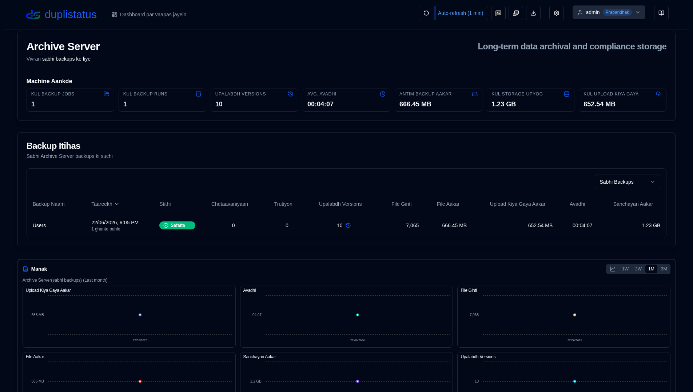
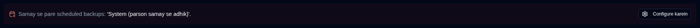
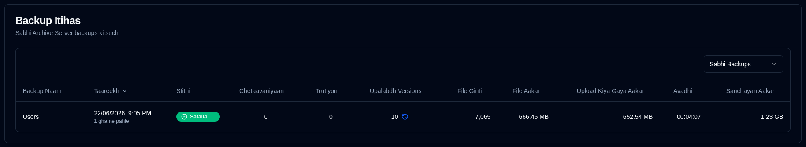

# Server Details {#server-details}

Dashboard se kisi server par click karne se us server ke liye backup ki ek list ke saath ek page khulega. Aap sabhi backups dekh sakte hain ya agar server par adhikatar backups configured hain to ek specific backup select kar sakte hain.

## Server/Backup Statistics {#serverbackup-statistics}

Yah section ya to server par sabhi backups ke liye ya ek selected backup ke liye statistics dikhata hai.

- **KUL BACKUP JOBS**: Yah server par configured backup jobs ki sankhya.
- **KUL BACKUP RUNS**: Execute hue backup runs ki sankhya (Duplicati server se reported).
- **UPLABDH VERSIONS**: Uplabdh versions ki sankhya (Duplicati server se reported).
- **AVG DURATION**: **duplistatus** database mein recorded backups ki average (mean) avadhi.
- **ANTIM BACKUP SIZE**: Antim backup log received mein source files ka size.
- **KUL STORAGE UPYOG**: Backup destination par storage upyog (Antim backup log mein reported).
- **KUL UPLOAD KIYA GAYA**: **duplistatus** database mein recorded sari upload ki gayi data ka sum.

Agar yah backup ya server par kisi bhi backup (jab **Sabhi Backups** selected hain) overdue hai, to ek message summary ke niche dikhayi jayegi.

Click the <IconButton icon="lucide:settings" href="settings/backup-monitoring-settings" label="Configure"/> to go to [Settings → Backup Monitoring](settings/backup-monitoring-settings.md). Or click the <SvgButton SvgButton svgFilename="duplicati_logo.svg" href="duplicati-configuration" /> on the toolbar to open the Duplicati server's web interface and check the logs.

 

## Backup History {#backup-history}

Yah table selected server ke liye backup logs list karta hai.

- **Backup Name**: Duplicati server mein backup ka naam.
- **Date**: Backup ka timestamp aur last screen refresh se elapsed time.
- **Status**: Backup ki status (Success, Warning, Error, Fatal).
- **Warnings/Errors**: Backup log mein reported warnings/errors ki sankhya.
- **Available Versions**: Backup destination par uplabdh backup versions ki sankhya. Agar icon greyed out hai, to detailed information nahi received kiya gaya.
- **File Count, File Size, Uploaded Size, Duration, Storage Size**: Duplicati server se reported values.

:::tip Tips
• **Backup History** section mein dropdown menu use karein **All Backups** ya yah server ke liye ek specific backup select karne ke liye.

• Aap kisi bhi column ko sort kar sakte hain uske header par click karke, sort order reverse karne ke liye dobara click karein.
 
• [Backup Details](#backup-details) dekhne ke liye kisi bhi row par click karein.

:::

:::note
Jab **Sabhi Backups** selected hain, to list newest se oldest tak ordered dikhayi jati hai.
:::

 

## Backup Details {#backup-details}

Dashboard (table view) mein kisi status badge par click karne se ya backup history table mein kisi bhi row par click karne se detailed backup information dikhayi jayegi.

- **Server Vivaran**: server naam, upnaam aur note.
- **Backup Jaankaaree**: backup ka samay chinh aur uska ID.
- **Backup Aankade**: reported counters, sizes, aur avadhi ka sankshipt.
- **Log Sankshipt**: reported sandesh ka sankhya.
- **Upalabdh Versions**: upalabdh versions ka list (sirf tab dikhaya jata hai jab jaankaaree logs mein praapt hota hai).
- **Sandesh/Chetaavaniyaan/Trutiyon**: pura execution logs. Subtitle batata hai ki log kya Duplicati server ne truncate kiya hai.

 

:::note
Duplicati server ko complete execution logs bhejne aur truncation se bachne ke liye [Duplicati Configuration instructions](../installation/duplicati-server-configuration.md) par jaake padhein.
:::
