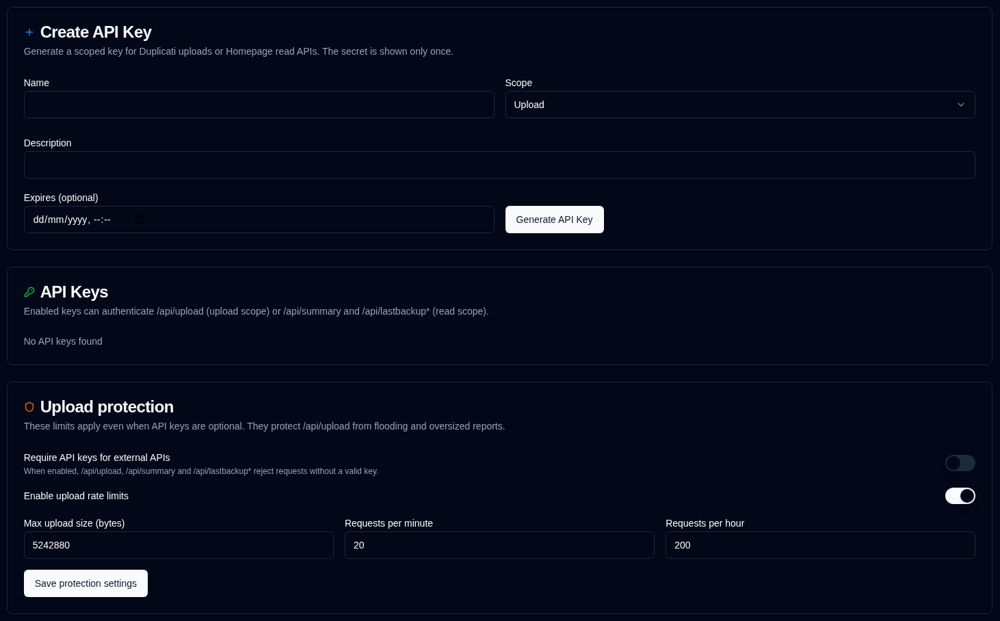

# एपीआई कुंजियाँ {#api-keys}

प्रशासक बाहरी HTTP एपीआई के लिए स्कोप्ड एपीआई कुंजियाँ बना सकते हैं जो डुप्लिकेटी और होमपेज उपयोग करते हैं। कुंजियाँ डिफ़ॉल्ट रूप से वैकल्पिक हैं इसलिए मौजूदा डुप्लिकेटी जॉब्स काम करना जारी रखते हैं।



## स्कोप्स {#scopes}

| स्कोप | एंडपॉइंट्स |
|-------|-----------|
| अपलोड करें | `POST /api/upload` |
| पढ़ें | `GET /api/summary`, `GET /api/lastbackup/:id`, `GET /api/lastbackups/:id` |

एक अपलोड कुंजी रीड एपीआई को कॉल नहीं कर सकती है, और एक रीड कुंजी रिपोर्ट्स अपलोड नहीं कर सकती है।

## कुंजी बनाने {#creating-a-key}

1. **Sammaan → एपीआई कुंजियाँ** खोलें।
2. एपीआई कुंजियाँ कार्ड के नीचे **एपीआई कुंजी बनाएँ** पर क्लिक करें।
3. एक नाम दर्ज करें, एक स्कोप चुनें, और वैकल्पिक रूप से एक समाप्ति तिथि सेट करें (`YYYY-MM-DD`).
4. कुंजी उत्पन्न करें और सीक्रेट तुरंत कॉपी करें। यह डायलॉग में केवल एक बार दिखाया जाता है।
5. बाद में सूची में एक फिंगरप्रिंट जैसे `Qk7v…3xTa` (पहले और अंतिम चार अक्षर), समाप्ति तिथि, और स्थिति दिखाई देती है। वही फिंगरप्रिंट ऑडिट लॉग में भी दिखाई देता है।

### {#disable-or-delete} को अक्षम या हटाएँ

कुंजी को हटाने के बिना **Kriyaen** कॉलम में चेकबॉक्स का उपयोग करें। Nishkriya कुंजियाँ प्रमाणीकरण नहीं कर सकतीं। कुंजी को फिर से सक्षम करने के लिए फिर से चेकबॉक्स पर टिक करें। समाप्त कुंजियाँ सक्षम नहीं की जा सकतीं; इसके बजाय एक नई कुंजी बनाएँ। Delete कुंजी को स्थायी रूप से हटाता है।

### समाप्ति {#expiry}

एक वैकल्पिक समाप्ति तिथि वह अंतिम कैलेंडर दिन है जब तक कुंजी मान्य रहती है। यह उस दिन ब्राउज़र के स्थानीय समय क्षेत्र में **23:59:59** पर समाप्त हो जाती है, दिन के शुरुआत में मध्यरात्रि पर नहीं।

`2026-12-01` चुनने से `2026-12-01T23:59:59` स्थानीय रूप से बनाया जाता है, फिर उस क्षण को यूटीसी के रूप में संग्रहीत किया जाता है। यूटीसी+1 के लिए एक ब्राउज़र के लिए यह `2026-12-01T22:59:59.000Z` है। कुंजी 1 दिसंबर तक मान्य रहती है और स्थानीय समय के 23:59:59 के बाद से समाप्त मानी जाती है (`expires_at <= now`). एपीआई कुंजियाँ तालिका में समाप्ति तिथि दिखाई देती है (या **Kabhi Nahi** अगर कोई सेट नहीं किया गया था)। उस क्षण के बाद स्थिति बैज **समाप्त** (ग्रे) में बदल जाता है; समाप्त कुंजियाँ प्रमाणीकरण नहीं कर सकती हैं, भले ही वे सक्षम छोड़ दिए गए हों।

## कुंजी का उपयोग {#using-a-key}

डुप्लिकेटी कस्टम हेडर्स सेट नहीं कर सकता है। कुंजी को रिपोर्ट यूआरएल में डालें:

```bash
--send-http-json-urls=https://your-host/api/upload?api_key=YOUR_KEY
```

होमपेज विजेट्स उसी क्वेरी पैरामीटर का उपयोग कर सकते हैं:

```yaml
url: http://your-host/api/summary?api_key=YOUR_READ_KEY
```

हेडर्स भेजने वाले क्लाइंटों `X-Api-Key` या `Authorization: Bearer` का उपयोग कर सकते हैं। क्वेरी-स्ट्रिंग कुंजियाँ रिवर्स-प्रॉक्सी एक्सेस लॉग्स में दिखाई देती हैं।

## कुंजियाँ आवश्यक करें {#require-keys}

**बाहरी एपीआई के लिए एपीआई कुंजियाँ आवश्यक हैं** स्विच डिफ़ॉल्ट रूप से बंद है। जब आप इसे चालू करते हैं, तो चार बाहरी डेटा एपीआई एक मान्य कुंजी के बिना `401` लौटाते हैं। पहले कम से कम एक अपलोड कुंजी और एक पढ़ें कुंजी सक्षम करें, अन्यथा डुप्लिकेटी अपलोड और होमपेज विजेट्स रोक देंगे।

## बाहरी एपीआई सुरक्षा {#external-api-protection}

उसी पृष्ठ पर बाहरी डेटा एपीआई के लिए एपीआई कुंजियाँ आवश्यक हो सकती हैं, और एक अधिकतम बॉडी आकार (डिफ़ॉल्ट 5 एमबी) और `/api/upload` के लिए प्रति-आईपी दर सीमाएं कॉन्फ़िगर कर सकती है। आकार और दर सीमाएं कुंजियाँ वैकल्पिक होने पर भी लागू होती हैं और फ्लडिंग से रोकने के मुख्य रक्षा हैं।

बाहरी एपीआई तक पहुंचने के लिए कुंजियों का उपयोग किए बिना, किसे अनुमति दे सकते हैं, इसके लिए [आईपी अनुमति सूची](ip-allowlist-settings.md) देखें।
