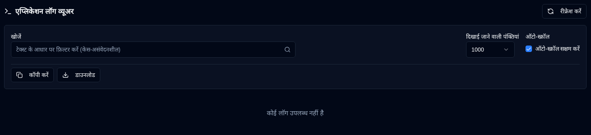

# एप्लिकेशन लॉग {/* #application-logs */}

एप्लिकेशन लॉग व्यूअर व्यवस्थापकों को वेब इंटरफ़ेस से सीधे फ़िल्टरिंग, निर्यात और रीयल-टाइम अपडेट के साथ सभी एप्लिकेशन लॉग की एक ही स्थान पर निगरानी करने की सुविधा देता है।

 

## उपलब्ध कार्रवाइयाँ {/* #available-actions */}

| बटन                                                                 | विवरण                                                                                               |
|:--------------------------------------------------------------------|:----------------------------------------------------------------------------------------------------|
| <IconButton icon="lucide:refresh-cw" label="रीफ़्रेश करें" />            | चयनित फ़ाइल से लॉग को मैन्युअल रूप से पुनः लोड करें। रीफ़्रेश करते समय लोडिंग स्पिनर दिखाता है और नई पंक्ति की पहचान के लिए ट्रैकिंग को रीसेट करता है। |
| <IconButton icon="lucide:copy" label="क्लिपबोर्ड पर कॉपी करें" />         | सभी फ़िल्टर की गई लॉग पंक्तियों को अपने क्लिपबोर्ड पर कॉपी करें। वर्तमान खोज फ़िल्टर का पालन करता है। त्वरित साझाकरण या अन्य टूल में पेस्ट करने के लिए उपयोगी है। |
| <IconButton icon="lucide:download" label="निर्यात करें" />               | लॉग को टेक्स्ट फ़ाइल के रूप में डाउनलोड करें। वर्तमान में चयनित फ़ाइल संस्करण से निर्यात करता है और वर्तमान खोज फ़िल्टर (यदि कोई हो) लागू करता है। फ़ाइल नाम प्रारूप: `duplistatus-logs-YYYY-MM-DD.txt` (ISO प्रारूप में तिथि)। |
| <IconButton icon="lucide:arrow-down-from-line" />                   | प्रदर्शित लॉग की शुरुआत पर तुरंत जाएं। तब उपयोगी होता है जब ऑटो-स्क्रॉल अक्षम हो या लंबी लॉग फ़ाइलों में नेविगेट कर रहे हों। |
| <IconButton icon="lucide:arrow-down-to-line" />                    | प्रदर्शित लॉग के अंत में तुरंत जाएं। तब उपयोगी होता है जब ऑटो-स्क्रॉल अक्षम हो या लंबी लॉग फ़ाइलों में नेविगेट कर रहे हों। |

 

## नियंत्रण और फ़िल्टर {/* #controls-and-filters */}

| नियंत्रण | विवरण |
|:--------|:-----------|
| **फ़ाइल संस्करण** | चुनें कि कौन सी लॉग फ़ाइल देखनी है: **वर्तमान** (सक्रिय फ़ाइल) या रोटेट की गई फ़ाइलें (`.1`, `.2`, आदि, जहाँ उच्च संख्याएँ पुरानी हैं)। |
| **दिखाई जाने वाली पंक्तियां** | चयनित फ़ाइल से नवीनतम **100**, **500**, **1000** (डिफ़ॉल्ट), **5000**, या **10000** पंक्तियाँ प्रदर्शित करें। |
| **ऑटो-स्क्रॉल** | सक्षम होने पर (वर्तमान फ़ाइल के लिए डिफ़ॉल्ट), स्वचालित रूप से नई लॉग प्रविष्टियों पर स्क्रॉल करता है और प्रत्येक 2 सेकंड में रीफ़्रेश करता है। केवल **वर्तमान** फ़ाइल संस्करण के लिए काम करता है। |
| **खोजें** | टेक्स्ट के अनुसार लॉग पंक्तियों को फ़िल्टर करें (केस-असंवेदनशील)। फ़िल्टर वर्तमान में प्रदर्शित पंक्तियों पर लागू होते हैं। |

 

लॉग डिस्प्ले हेडर फ़िल्टर की गई पंक्तियों की संख्या, कुल पंक्तियाँ, फ़ाइल आकार, और अंतिम संशोधित टाइमस्टैम्प दिखाता है।

 
