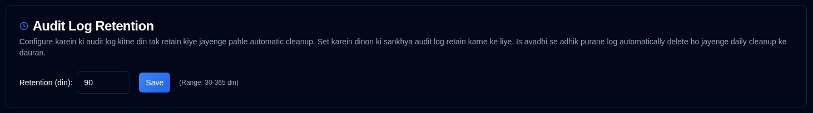

# Audit Log Retention {#audit-log-retention}

Configure karein kitna samay tak audit logs rakhe jaate hain, phir automatic cleanup hota hai.

| Sammaan | Vivaaran | Default Value |
|:-------|:-----------|:-------------|
| **Retention (din)** | Sankhya ka din jitna samay tak audit logs rakhe jaate hain, phir automatic deletion hota hai | **90 din** |

## Retention Settings {#retention-settings}

- **Range**: 30 se 365 din
- **Automatic Cleanup**: Daily 02:00 UTC par chalta hai (configurable nahi hai)
- **Manual Cleanup**: API ke through available hai, administrators ke liye (see [Cleanup Audit Logs](../../api-reference/administration-apis.md#cleanup-audit-logs---apiaudit-logcleanup))
