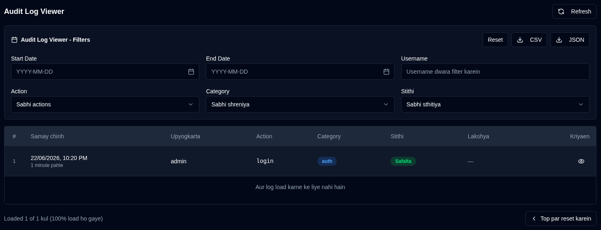

# Audit Logs {#audit-logs}

Audit log **duplistatus** में सभी pranali badlavon aur upyogkarta Action ka ek vistrit record pradan karta hai. Yah suraksha aur troubleshooting uddeshyon ke liye configuration badlav, upyogkarta gatividhiyon, aur pranali karyon ko track karne mein madad karta hai.

## Audit Log Viewer {#audit-log-viewer}

Audit log viewer nimnalikhit jankari ke saath sabhi logged events ki ek kalakramanusar soochi dikhata hai:

- **Samay chinh**: Kab event hua
- **Upyogkarta**: Jis Username ne Action kiya (ya automated actions ke liye "Pranali")
- **Action**: Woh vishisht Action jo kiya gaya
- **Category**: Action ki Category (Authentication, Upyogkarta prabandhan, Configuration, Backup Operations, Server Management, Pranali Operations)
- **Stithi**: Kya Action safal hua ya Asafal
- **Lakshya**: Woh object jis par prabhav pada (yadi lagu ho)
- **Vivaran**: Action ke bare mein atirikt jankari

### Viewing Log Details {#viewing-log-details}

Vistrit jankari dekhne ke liye kisi bhi log entry ke bagal mein <IconButton icon="lucide:eye" /> aankh ke icon par click karein, jismein shaamil hai:
- Pura samay chinh
- Upyogkarta jankari
- Poore action ke Vivaran (udaharan ke liye: badle gaye fields, Aankde, ityadi)
- IP pata aur Upyogkarta agent
- Truti Sandesh (yadi Action Asafal raha)

### Exporting Audit Logs {#exporting-audit-logs}

Aap filtered audit logs ko do formats mein export kar sakte hain:

| Button | Vivaran |
|:------|:-----------|
| <IconButton icon="lucide:download" label="CSV"/> | Spreadsheet analysis ke liye logs ko CSV file ke roop mein export karein |
| <IconButton icon="lucide:download" label="JSON"/> | Programmatic analysis ke liye logs ko JSON file ke roop mein export karein |

:::note
Exports mein keval wahi logs shaamil honge jo aapke active filters ke aadhar par vartaman mein dikhayi de rahe hain. Sabhi logs export karne ke liye, pehle Sabhi saaf karein.
:::
