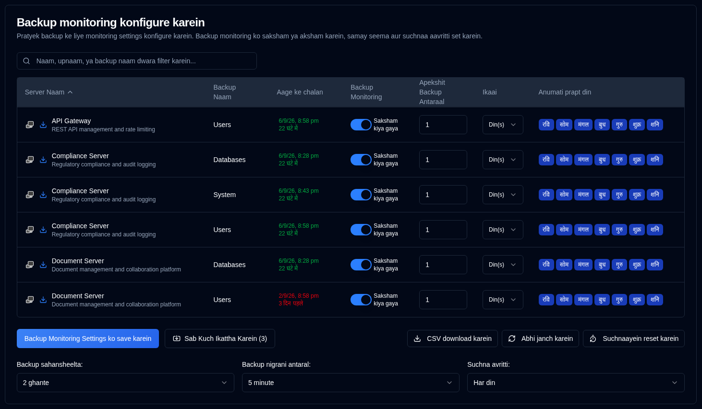

# Backup Monitoring {#backup-monitoring}

## सर्वर फ़िल्टरिंग {#server-filtering}

Ye prushth par server list ko filter field ka upayog karke filter kiya ja sakta hai.

Jab **दैनिक सारांश** Saksham kiya gaya hai, to Vilambit nirdesh chalta rehta hai, lekin individual Vilambit Suchnaayein roka jaate hain. [दैनिक सारांश](daily-summary-settings.md) dekhiye.

**फ़िल्टर मैच:**
- सर्वर आईडी
- सर्वर URL
- बैकअप जॉब नाम

Isse aapko bahut saare systems ko manage karte hue specific servers ya backups ko quickly locate karna asaan ho jata hai.

## Configure Per-Backup Monitoring Settings {#configure-per-backup-monitoring-settings}

-  **Server Name**: Server ka naam jo overdue backups ke liye monitor kiya ja raha hai. 
   - Duplicati server ke web interface kholne ke liye <SvgIcon svgFilename="duplicati_logo.svg" height="18"/> par click karein
   - Is server se backup logs collect karne ke liye <IIcon2 icon="lucide:download" height="18"/> par click karein.
- **Backup Name**: Backup ka naam jo overdue backups ke liye monitor kiya ja raha hai.
- **Next Run**: Aage ke chalan ka samay jo agar aage ke liye scheduled hai toh sabz me dikhata hai, ya agar overdue hai toh laal me dikhata hai. "Next Run" value par hover karne se ek tooltip dikhata hai jo database se last backup timestamp ko dikhata hai, full date/time aur relative time ke saath format kiya gaya hai.
- **Backup Monitoring**: Is backup ke liye backup monitoring enable ya disable karein.
- **Expected Backup Interval**: Apekshit backup antaraal.
- **Unit**: Apekshit antaraal ka unit.
- **Allowed Days**: Backup ke liye anumati prapt saptaah ke din.

Agar server name ke paas ke icons greyed out hai, toh server [Settings → Server Settings](/user-guide/settings/server-settings) me configure nahin kiya gaya hai.

:::note
Jab aap Duplicati server se backup logs collect karte hain, **duplistatus** automatically backup monitoring intervals aur configurations ko update karta hai.
:::

:::tip
Best results ke liye, aap apne Duplicati server me backup job intervals configuration badalne ke baad backup logs collect karein. Isse **duplistatus** apne current configuration ke saath synchronised rehta hai.
:::

## Global Configurations {#global-configurations}

Ye sammaan sabhi backups ke liye lagte hain:

| Sammaan                         | Vivaaran                                                                                                                                                                                                                                                                                                                             |
|:--------------------------------|:----------------------------------------------------------------------------------------------------------------------------------------------------------------------------------------------------------------------------------------------------------------------------------------------------------------------------------------|
| **Backup Tolerance**            | Overdue ke liye mark karne se pehle apekshit backup time ke liye grace period (extra time allowed) jod diya gaya hai. Default **1 ghanta** hai.                                                                                                                                                                                                             |
| **Backup Monitoring Interval** | System overdue backups ke liye kitni baar check karta hai. Default **5 minute** hai.                                                                                                                                                                                                                                                            |
| **Notification Frequency**      | Overdue notifications bhejne ka samay:   **Ek baar`: Send **just one** notification when the backup becomes overdue.   `Har din`: Send **daily** notifications while overdue (default).   `Har saptaah`: Send **weekly** notifications while overdue.   `Har mahine**: Overdue rahe hue **monthly** notifications bhejein. |

## Available Actions {#available-actions}

| Button                                                              | Vivaaran                                                                                                                           |
|:--------------------------------------------------------------------|:--------------------------------------------------------------------------------------------------------------------------------------|
| <IconButton label="Backup Monitoring Settings Save karein" />              | Settings save karta hai, disabled backups ke liye timers clear karta hai, aur overdue check chalta hai.                                                |
| <IconButton icon="lucide:import" label="Sab Kuch Ikattha Karein (#)"/>          | Sabhi configured servers se backup logs sankalan karein, brackets mein sankhya server sankalan karne ke liye.                                   |
| <IconButton icon="lucide:download" label="CSV Download"/>           | Sabhi backup monitoring sammaan aur "Antim Backup Samay chinh (DB)" ko database se lekar ek CSV file download karta hai.               |
| <IconButton icon="lucide:refresh-cw" label="Abhi Janch karein"/>            | Vilambit backup janch ko tathya samay chalao. Isse fayda hota hai jab configurations badalte hain. Yeh "Aage ke chalan" recalculation bhi trigger karta hai. |
| <IconButton icon="lucide:timer-reset" label="Notifications Reset"/> | Sabhi backups ke liye last vilambit notification reset karta hai.                                                                            |
