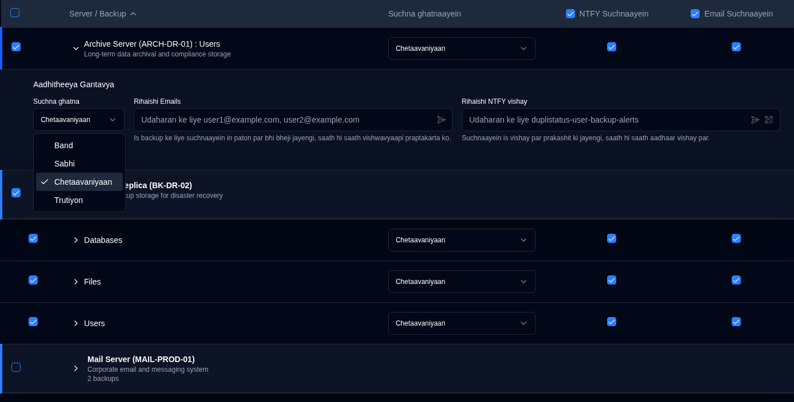

# Backup Suchnaayein {#backup-notifications}

Use this settings to send notifications when a [new backup log is received](../../installation/duplicati-server-configuration.md).

The backup notifications table is organised by server. The display format depends on how many backups a server has:
- **Multiple backups**: Shows a server header row with individual backup rows below it. Click the server header to expand or collapse the backup list.
- **Single backup**: Displays a **merged row** with a blue left border, showing:
  -  **Server Naam : Backup Naam** if no server alias configured,  or
  - **Server Upnaam (Server Naam) : Backup Naam** if it is configured.

This page has an auto-save feature. Any changes you make will be saved automatically.

 

## Filter {#filter}

Use the **Filter by Server Name** field at the top of the page to quickly find specific backups by server name or alias. The table will automatically filter to show only matching entries.

 

## Configure Per-Backup Notification Settings {#configure-per-backup-notification-settings}

| Setting                       | Description                                               | Default Value |
| :---------------------------- | :-------------------------------------------------------- | :------------ |
| **Suchna ghatnaayein**       | Configure when to send notifications for new backup logs. | **Chetaavaniyaan**    |
| **NTFY**                      | Enable or disable NTFY notifications for this backup.     | **Saksham kiya gaya**     |
| **Email**                     | Enable or disable email notifications for this backup.    | **Saksham kiya gaya**    |

**Notification Events Options:**

- **all**: Send notifications for all backup events.
- **warnings**: Send notifications for warnings and errors only (default).
- **errors**: Send notifications for errors only.
- **off**: Disable notifications for new backup logs for this backup.

 

## Aadhitheeya Gantavya {#additional-destinations}

Additional notification destinations allow you to send notifications to specific email addresses or NTFY topics beyond the global settings. The system uses a hierarchical inheritance model where backups can inherit default settings from their server, or override them with backup-specific values.

Additional destination configuration is indicated by contextual icons next to server and backup names:

- **Server icon** <IconButton icon="lucide:settings-2" style={{border: 'none', padding: 0, color: 'inherit', background: 'transparent'}} />: Appears next to server names when default additional destinations are configured at the server level.

- **Backup icon** <IconButton icon="lucide:external-link" style={{border: 'none', padding: 0, color: '#60a5fa', background: 'transparent'}} /> (blue): Appears next to backup names when custom additional destinations are configured (overriding server defaults).

- **Backup icon** <IconButton icon="lucide:external-link" style={{border: 'none', padding: 0, color: '#64748b', background: 'transparent'}} /> (gray): Appears next to backup names when the backup is inheriting additional destinations from server defaults.

If no icon is displayed, the server or backup does not have additional destinations configured.

### Server-Level Defaults {#server-level-defaults}

Aap server level par default aadhaar rihaishi gantavya sanrachit kar sakte hain jo ki us server par sabhi backups ke liye aadhaar sankalit honge.

1. [Settings → Backup Notifications](backup-notifications-settings.md) par jaane ke liye.
2. Table server ke hisaab se group kiya gaya hai, jisme har server ke liye alag-alag server header rows dikhaye jaate hain jo ki server naam, upnaam, aur backup ginti dikhate hain.
   - **Note**: Jisme sirf ek backup hai, uske liye ek merged row dikhaya jata hai, jisme alag-alag server header nahi hota. Server-level defaults ko merged rows se aadhaar sanrachit nahi kiya ja sakta. Agar aapko sirf ek backup server ke liye server defaults sanrachit karna hai, to aap us server par doosri backup temporarily add karke ya backup ke Additional Destinations ko aadhaar existing server defaults se sankalit kar sakte hain.
3. **Default Additional Destinations for this server** section expand karne ke liye server row ke kisi bhi jagah par click karein.
4. Niche diye gaye default settings sanrachit karein:
   - **Notification event**: Choose which events trigger notifications to the additional destinations (**all**, **warnings**, **errors**, or **off**).
   - **Additional Emails**: Enter one or more email addresses (comma-separated) that will receive notifications for all backups on this server. Click the <IconButton icon="lucide:send-horizontal" style={{border: 'none', padding: 0, color: 'inherit', background: 'transparent'}} /> icon button to send a test email to the addresses in the field.
   - **Additional NTFY Topic**: Enter a custom NTFY topic name where notifications will be published for all backups on this server. Click the <IconButton icon="lucide:send-horizontal" style={{border: 'none', padding: 0, color: 'inherit', background: 'transparent'}} /> icon button to send a test notification to the topic, or click the <IconButton icon="lucide:qr-code" style={{border: 'none', padding: 0, color: 'inherit', background: 'transparent'}} /> icon button to display a QR code for the topic to configure your device to receive notifications.

**Server Default Management:**

- **Sync to All**: Clears all backup overrides, making all backups inherit from the server defaults.
- **Clear All**: Clears all additional destinations from both server defaults and all backups while maintaining the inheritance structure.

### Per-Backup Configuration {#per-backup-configuration}

Individual backups automatically inherit the server defaults, but you can override them for specific backup jobs.

1. Click the anywhere in a backup row to expand its **Additional Destinations** section.
2. Configure the following settings:
   - **Notification event**: Choose which events trigger notifications to the additional destinations (**all**, **warnings**, **errors**, or **off**).
   - **Additional Emails**: Enter one or more email addresses (comma-separated) that will receive notifications in addition to the global recipient. Click the <IconButton icon="lucide:send-horizontal" style={{border: 'none', padding: 0, color: 'inherit', background: 'transparent'}} /> icon button to send a test email to the addresses in the field.
   - **Additional NTFY Topic**: Enter a custom NTFY topic name where notifications will be published in addition to the default topic. Click the <IconButton icon="lucide:send-horizontal" style={{border: 'none', padding: 0, color: 'inherit', background: 'transparent'}} /> icon button to send a test notification to the topic, or click the <IconButton icon="lucide:qr-code" style={{border: 'none', padding: 0, color: 'inherit', background: 'transparent'}} /> icon button to display a QR code for the topic to configure your device to receive notifications.

**Inheritance Indicators:**

- **Link icon** <IconButton icon="lucide:link" style={{border: 'none', padding: 0, color: '#3b82f6', background: 'transparent'}} /> in blue: Indicates the value is inherited from server defaults. Clicking the field will create an override for editing.
- **Broken link icon** <IconButton icon="lucide:link-2-off" style={{border: 'none', padding: 0, color: '#3b82f6', background: 'transparent'}} /> in blue: Indicates the value has been overridden. Click the icon to revert to inheritance.

**Additional Destinations Behavior:**

- Notifications are sent to both the global settings and the additional destinations when configured.
- The notification event setting for additional destinations is independent of the main notification event setting.
- If additional destinations are set to **off**, no notifications will be sent to those destinations, but the main notifications will still work according to the primary settings.
- When a backup inherits from server defaults, any changes to the server defaults will automatically apply to that backup (unless it has been overridden).

 

## Bulk Edit {#bulk-edit}

You can edit additional destination settings for multiple backups at once using the bulk edit feature. This is particularly useful when you need to apply the same additional destinations to many backup jobs.

1. [Settings → Backup suchnaayein](backup-notifications-settings.md) पर जाएं।
2. पहले कॉलम में चेकबॉक्स का उपयोग करके उन बैकअप या सर्वरों का चयन करें जिन्हें आप संपादित करना चाहते हैं।
   - दृश्यमान सभी बैकअप का चयन या अचयन करने के लिए हेडर रो में चेकबॉक्स का उपयोग करें।
   - आप चयन करने से पहले सूची को संकुचित करने के लिए फ़िल्टर का उपयोग कर सकते हैं।
3. बैकअप चयनित होने के बाद, एक बुल्क एक्शन बार दिखाई देगा जिसमें चयनित बैकअप की संख्या दिखाई देगी।
4. संपादन संवाद खोलने के लिए **Bulk संपादन** पर क्लिक करें।
5. अतिरिक्त गंतव्य सेटिंग्स को कॉन्फ़िगर करें:
   - **Suchna ghatna**: सभी चयनित बैकअप के लिए सूचना घटना सेट करें।
   - **Rihaishi Emails**: सभी चयनित बैकअप के लिए लागू करने के लिए ईमेल पते दर्ज करें (अल्पविराम से अलग किए गए)।
   - **Rihaishi NTFY vishay**: सभी चयनित बैकअप के लिए लागू करने के लिए एक NTFY विषय नाम दर्ज करें।
   - बुल्क संपादन संवाद में ईमेल पते और NTFY विषयों को सत्यापित करने के लिए परीक्षण बटन उपलब्ध हैं, इससे पहले कि वे कई बैकअप पर लागू किए जाएं।
6. सभी चयनित बैकअप पर सेटिंग्स लागू करने के लिए **Save** पर क्लिक करें।

**Bulk Saaf karein:**

चयनित बैकअप से सभी अतिरिक्त गंतव्य सेटिंग्स को हटाने के लिए:

1. उन बैकअप का चयन करें जिन्हें आप साफ़ करना चाहते हैं।
2. बुल्क एक्शन बार में **Bulk Saaf karein** पर क्लिक करें।
3. संवाद बॉक्स में क्रिया की पुष्टि करें।

यह चयनित बैकअप के लिए सभी अतिरिक्त ईमेल पते, NTFY विषयों, और सूचना घटना को हटा देगा। साफ़ करने के बाद, बैकअप सर्वर के डिफ़ॉल्ट से विरासत में मिलने के लिए वापस आएंगे (यदि कोई कॉन्फ़िगर किया गया है)।

 
