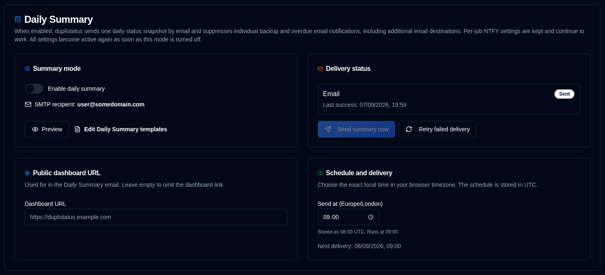

# दैनिक सारांश {/* #daily-summary */}

दैनिक सारांश एक वैकल्पिक सूचना मोड है जो एक सटीक स्थानीय समय पर प्रत्येक ज्ञात बैकअप जॉब का **एक** स्थानीयकृत स्नैपशॉट भेजता है। जब यह सक्षम होता है, तो डिफ़ॉल्ट ईमेल प्राप्तकर्ता (सेटिंग्स → ईमेल → प्राप्तकर्ता ईमेल) को बैकअप और अतिदेय ईमेल रोक दिए जाते हैं। [बैकअप सूचनाएं](backup-notifications-settings.md) में कॉन्फ़िगर किए गए अतिरिक्त ईमेल गंतव्य मेल खाने वाले ईवेंट प्राप्त करना जारी रखते हैं। प्रति-जॉब NTFY सूचनाएं जारी रहती हैं। वे सेटिंग्स संग्रहीत रहती हैं और दैनिक सारांश बंद होते ही फिर से सक्रिय हो जाती हैं।

स्नैपशॉट भेजने के समय की **वर्तमान** स्थिति होती है (प्रत्येक जॉब के लिए नवीनतम परिणाम)। यह पिछले दिन के रन का इतिहास नहीं है।

## आवश्यकताएं {/* #requirements */}

- SMTP कॉन्फ़िगर होना चाहिए। ईमेल एक बार भेजा जाता है, यदि कोई **SMTP प्राप्तकर्ता ओवरराइड करें** सहेजा गया है तो उसे, अन्यथा [ईमेल सेटिंग्स](/user-guide/settings/email-settings) से SMTP प्राप्तकर्ता को।
- दैनिक सारांश पर निर्भर होने से पहले अपने SMTP कॉन्फ़िगरेशन की जांच करें और सुनिश्चित करें कि यह काम कर रहा है।
- शेड्यूल किए गए वितरण के लिए cron सेवा की आवश्यकता होती है। डिस्पैचर संग्रहीत UTC भेजने के समय पर प्रतिदिन एक बार सक्रिय होता है।

## क्या शामिल है {/* #what-is-included */}

ज्ञात जॉब प्रत्येक सर्वर और बैकअप नाम के लिए **नवीनतम देखा गया बैकअप** हैं — वही सेट जो डैशबोर्ड और सेटिंग्स → बैकअप निगरानी में है।

स्थिति श्रेणियां (Success, Warning, Error, Fatal, Unknown) परस्पर अनन्य हैं और जॉब संख्या के बराबर जुड़ती हैं। **अतिदेय** की गणना अलग से की जाती है: एक अतिदेय सफल जॉब अभी भी Success रहता है और अतिदेय भी होता है।

## शेड्यूल {/* #schedule */}

अपने **ब्राउज़र समय क्षेत्र** में एक सटीक `HH:mm` समय चुनें। duplistatus शेड्यूल को UTC के रूप में संग्रहीत करता है और पृष्ठ पर दोनों मान दिखाता है (**Duplicati संस्करण** के समान पैटर्न)। इस पृष्ठ पर किए गए परिवर्तन स्वचालित रूप से सहेजे जाते हैं। नए इंस्टॉलेशन के लिए डिफ़ॉल्ट भेजने का समय **01:00 UTC** है।

- शेड्यूल को सक्षम करने या बदलने से यह **अगली भविष्य** की घटना से शुरू होता है, कभी भी तत्काल अप्रत्याशित रूप से नहीं भेजा जाता।
- cron जॉब सक्रिय होने पर शेड्यूल किया गया घड़ी का समय हमेशा भेजता है। **अभी सारांश भेजें**, एक पुनः प्रयास, या उसी दिन पहले भेजा गया सारांश इसे छोड़ता नहीं है।

## सार्वजनिक डैशबोर्ड URL {/* #public-dashboard-url */}

इस पृष्ठ पर वैकल्पिक **सार्वजनिक डैशबोर्ड URL** दैनिक सारांश ईमेल में `{duplistatus_link}` प्लेसहोल्डर को फ़ीड करता है। बिना किसी अंतिम स्लैश के `http://` या `https://` URL का उपयोग करें। लिंक को छोड़ने के लिए इसे खाली छोड़ दें।

जब परिवेश में `DUPLISTATUS_PUBLIC_URL` सेट होता है, तो यह सहेजी गई सेटिंग को ओवरराइड करता है ([पर्यावरण चर](/installation/environment-variables) देखें)।

## SMTP प्राप्तकर्ता ओवरराइड करें {/* #override-smtp-recipient */}

वैकल्पिक **SMTP प्राप्तकर्ता ओवरराइड करें** दैनिक सारांश को ईमेल सेटिंग्स में प्राप्तकर्ता से भिन्न पते पर भेजता है। उस डिफ़ॉल्ट का उपयोग जारी रखने के लिए इसे खाली छोड़ दें। मान `daily_summary` कॉन्फ़िगरेशन कुंजी (`smtpRecipient`) में संग्रहीत होता है और शेड्यूल किए गए भेजने, **अभी सारांश भेजें**, और पुनः प्रयासों के लिए उपयोग किया जाता है। सेंड API अभी भी अनुरोध में प्राप्तकर्ता को स्वीकार नहीं करते हैं।

## प्रतिस्थापन व्यवहार {/* #replacement-behaviour */}

जब दैनिक सारांश चालू होता है:

- डिफ़ॉल्ट ईमेल प्राप्तकर्ता को अपलोड और अतिदेय ईमेल नहीं भेजे जाते हैं
- बैकअप सूचनाएं में अतिरिक्त ईमेल गंतव्य अभी भी मेल खाने वाले ईवेंट प्राप्त करते हैं (उस फ़िल्टर के लिए अतिदेय को एक चेतावनी माना जाता है)
- प्रति-जॉब NTFY सूचनाएं जारी रहती हैं
- जब कुछ भी नहीं भेजा गया हो तो अतिदेय टाइमस्टैम्प आगे नहीं बढ़ाए जाते हैं, इसलिए मोड बंद होने पर अतिदेय अलर्ट तुरंत फिर से शुरू हो सकते हैं
- टेम्पलेट पूर्वावलोकन, ट्रांसपोर्ट परीक्षण, और **अभी सारांश भेजें** अब भी काम करते हैं

**अभी सारांश भेजें** एक अतिरिक्त डिलीवरी है। यह अगली निर्धारित आवृत्ति का उपयोग नहीं करती है।

निर्धारित, **अभी सारांश भेजें**, और पुनः प्रयास डिलीवरी [ऑडिट लॉग](audit-logs-viewer.md) में `daily_summary_sent` (सिस्टम संचालन) के रूप में रिकॉर्ड की जाती हैं। सेटिंग्स सहेजना `daily_summary_updated` (कॉन्फ़िगरेशन) है।

## टेम्पलेट {/* #templates */}

[सेटिंग्स → टेम्पलेट](/user-guide/settings/notification-templates) के अंतर्गत डेली समरी ईमेल टेम्पलेट (Markdown) को संपादित करें। डिफ़ॉल्ट विषय में `{summary_date}` के साथ-साथ Success, चेतावनी, अतिदेय, त्रुटि, और Fatal संख्याएँ शामिल हैं ताकि इनबॉक्स लाइन स्नैपशॉट का सारांश प्रस्तुत करे। अतिदेय स्थिति की संख्याओं को ओवरलैप कर सकता है। Success, चेतावनी/त्रुटि, अतिदेय, और दैनिक सारांश के लिए ईमेल बॉडी सभी Markdown का उपयोग करते हैं। इस पृष्ठ पर या `DUPLISTATUS_PUBLIC_URL` के माध्यम से सार्वजनिक डैशबोर्ड URL कॉन्फ़िगर होने पर डिफ़ॉल्ट टेम्पलेट के अंत में `{duplistatus_link}` शामिल होता है।

इस पृष्ठ पर **Generate preview** [सेटिंग्स → टेम्पलेट](/user-guide/settings/notification-templates) जैसा ही पूर्वावलोकन संवाद खोलता है: ईमेल विषय के साथ-साथ ईमेल HTML और सादा पाठ। ईमेल HTML वर्तमान लाइट या डार्क थीम का पालन करता है।
