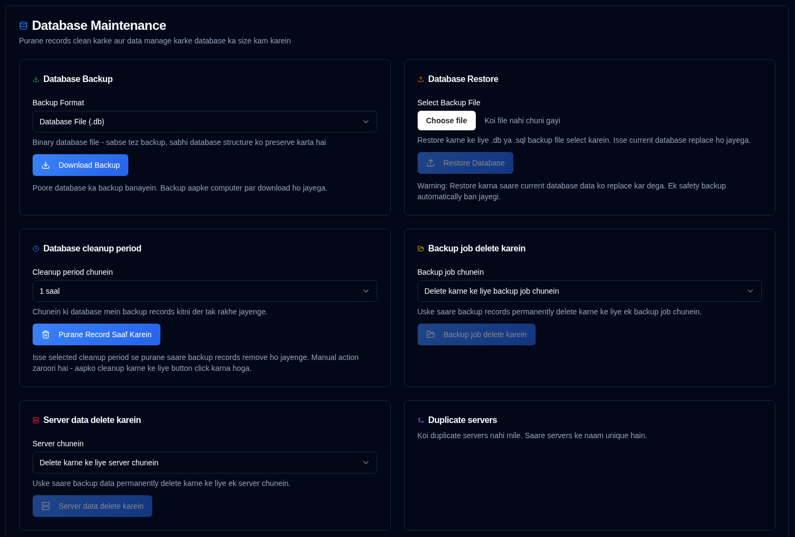

# Database Maintenance {#database-maintenance}

अपने बैकअप डेटा और डेटाबेस रखरखाव ऑपरेशन के माध्यम से प्रदर्शन को अनुकूलित करें।

 

## Database Backup {#database-backup}

सुरक्षा या माइग्रेशन उद्देश्यों के लिए अपने पूरे डेटाबेस का बैकअप बनाएं।

1.  [Settings → Database Maintenance](database-maintenance.md) पर जाएं।
2.  **Database Backup** अनुभाग में, एक बैकअप प्रारूप चुनें:
    - **Database File (.db)**: बाइनरी प्रारूप - सबसे तेज़ बैकअप, सभी डेटाबेस संरचना को बिल्कुल संरक्षित करता है
    - **SQL Dump (.sql)**: पाठ प्रारूप - मानव-पठनीय SQL स्टेटमेंट, पुनर्स्थापना से पहले संपादित किया जा सकता है
3.  <IconButton icon="lucide:download" label="Download Backup" /> पर क्लिक करें।
4.  बैकअप फ़ाइल आपके कंप्यूटर पर टाइमस्टैम्प के साथ नामित हो कर डाउनलोड की जाएगी।

**Backup Formats:**

- **.db प्रारूप**: नियमित बैकअप के लिए अनुशंसित। SQLite के बैकअप API का उपयोग करके डेटाबेस फ़ाइल का एक सटीक कॉपी बनाता है, जिससे डेटाबेस उपयोग के दौरान भी सुसंगतता सुनिश्चित होती है।
- **.sql प्रारूप**: माइग्रेशन, निरीक्षण, या जब आपको पुनर्स्थापना से पहले डेटा को संपादित करने की आवश्यकता होती है, तो उपयोगी होता है। डेटाबेस को पुनर्निर्माण करने के लिए सभी SQL स्टेटमेंट्स को शामिल करता है।

**Best Practices:**

- प्रमुख ऑपरेशन (सफाई, विलय, आदि) से पहले नियमित बैकअप बनाएं
- बैकअप को एप्लिकेशन से अलग एक सुरक्षित स्थान पर संग्रहीत करें
- बैकअप की वैधता सुनिश्चित करने के लिए नियमित रूप से पुनर्स्थापना प्रक्रियाओं का परीक्षण करें

 

## Database Restore {#database-restore}

पहले से बनाए गए बैकअप फ़ाइल से अपने डेटाबेस को पुनर्स्थापित करें।

1.  [Settings → Database Maintenance](database-maintenance.md) पर जाएं।
2.  **Database Restore** अनुभाग में, फ़ाइल इनपुट पर क्लिक करें और एक बैकअप फ़ाइल चुनें:
    - समर्थित प्रारूप: `.db`, `.sql`, `.sqlite`, `.sqlite3`
    - अधिकतम फ़ाइल आकार: 100MB
3.  <IconButton icon="lucide:upload" label="Restore Database" /> पर क्लिक करें।
4.  डायलॉग बॉक्स में क्रिया की पुष्टि करें।

**Restore Process:**

- पुनर्स्थापना से पहले वर्तमान डेटाबेस का एक सुरक्षित बैकअप स्वचालित रूप से बनाया जाता है
- वर्तमान डेटाबेस को बैकअप फ़ाइल से बदल दिया जाता है
- सुरक्षा के लिए सभी सत्र साफ़ कर दिए जाते हैं (उपयोगकर्ताओं को फिर से लॉग इन करना होगा)
- पुनर्स्थापना के बाद डेटाबेस की एकता की पुष्टि की जाती है
- सभी कैशेस साफ़ कर दिए जाते हैं ताकि ताजा डेटा सुनिश्चित हो

**Restore Formats:**

- **.db फ़ाइलें**: डेटाबेस फ़ाइल को सीधे बदल दिया जाता है। सबसे तेज़ पुनर्स्थापना विधि।
- **.sql फ़ाइलें**: डेटाबेस को पुनर्निर्माण करने के लिए SQL स्टेटमेंट्स को निष्पादित किया जाता है। यदि आवश्यक हो तो चयनात्मक पुनर्स्थापना की अनुमति देता है।

:::warning
डेटाबेस पुनर्स्थापित करने से **सभी वर्तमान डेटा को बदल दिया जाएगा।** यह क्रिया पूर्ववत नहीं की जा सकती।  
एक सुरक्षित बैकअप स्वचालित रूप से बनाया जाता है, लेकिन पुनर्स्थापना से पहले अपना बैकअप बनाना अनुशंसित है।
 
**Important:** पुनर्स्थापना के बाद, सुरक्षा के लिए सभी उपयोगकर्ता सत्र साफ़ कर दिए जाते हैं। आपको फिर से लॉग इन करना होगा।
:::

**Troubleshooting:**

- Agar restore fail ho jata hai, toh original database automatically safety backup se restore ho jata hai
- Ensure the backup file is not corrupted and matches the expected format
- For large databases, the restore process may take several minutes

 

---

 

:::note
Yeh sabhi maintenance functions ke liye lagta hai: dashboard par sabhi statistics, detail pages, aur charts **duplistatus** database se data ka use karke calculate kiya jata hai. Purane information ko delete karne se ye calculations par impact padega.
 
Agar aapne by mistake data delete kiya hai, toh aap [Collect Backup Logs](../collect-backup-logs.md) feature ka use karke usko restore kar sakte hain.
:::

 

## Data Cleanup Period {#data-cleanup-period}

Outdated backup records ko remove karke storage space free karo aur system performance improve karo.

1.  Navigate to [Settings → Database Maintenance](database-maintenance.md).
2.  Choose a retention period:
    - **6 mahine**: Retain records from the last 6 mahine.
    - **1 saal**: Retain records from the last saal.
    - **2 saal**: Retain records from the last 2 saal (default).
    - **Delete all data**: Remove all backup records and servers. 
3.  Click <IconButton icon="lucide:trash-2" label="Clear Old Records" />.
4.  Confirm the action in the dialogue box.

**Cleanup Effects:**

- Deletes backup records older than the selected period
- Updates all related statistics and metrics

:::warning

"Delete all data" option select karne se **sabhi backup records aur configuration settings system se permanently remove ho jayenge**.

Yeh strongly recommended hai ki aap is action se pehle database backup create karein.

:::

 

## Delete Backup Job Data {#delete-backup-job-data}

Remove a specific Backup Job (type) data.

1.  Navigate to [Settings → Database Maintenance](database-maintenance.md).
2.  Select a Backup Job from the dropdown list.
    - The backups will be ordered by server alias or name, then the backup name.
3.  Click <IconButton icon="lucide:folder-open" label="Delete Backup Job" />.
4.  Confirm the action in the dialogue box.

**Deletion Effects:**

- Permanently deletes all data associated with this Backup Job / Server.
- Cleans up associated configuration settings.
- Updates dashboard statistics accordingly.

 

## Delete Server Data {#delete-server-data}

Remove a specific server and all its associated backup data.

1.  Navigate to [Settings → Database Maintenance](database-maintenance.md).
2.  Select a server from the dropdown list.
3.  Click <IconButton icon="lucide:server" label="Delete Server Data" />.
4.  Confirm the action in the dialogue box.

**Deletion Effects:**

- Permanently deletes the selected server and all its backup records
- Cleans up associated configuration settings
- Updates dashboard statistics accordingly

 

## Merge Duplicate Servers {#merge-duplicate-servers}

Detect and merge duplicate servers that have the same name but different IDs. se this feature to consolidate them into a single server entry.

इसका कारण हो सकता है जब डुप्लिकेटी का `machine-id` अपग्रेड या पुनः स्थापना के बाद बदल जाता है। डुप्लिकेट सर्वर केवल तब दिखाए जाते हैं जब वे मौजूद हों। अगर कोई डुप्लिकेट नहीं मिला, तो अनुभाग एक संदेश दिखाएगा कि सभी सर्वर का नाम अद्वितीय है।

1.  [सम्मान → डेटाबेस रखरखाव](database-maintenance.md) पर जाएं।
2.  अगर डुप्लिकेट सर्वर मिल गए हैं, तो एक **डुप्लिकेट सर्वर मिलाएं** अनुभाग दिखाई देगा।
3.  डुप्लिकेट सर्वर समूहों की सूची की समीक्षा करें:
    - प्रत्येक समूह में वही नाम वाले सर्वर दिखाए जाते हैं लेकिन अलग-अलग आईडी
    - **लक्ष्य सर्वर** (नवीनतम निर्माण तिथि के अनुसार) हाइलाइट किया गया है
    - **पुराने सर्वर आईडी** जो मिलाए जाएंगे वे अलग से सूचीबद्ध हैं
4.  प्रत्येक समूह के पास चेकबॉक्स चुनकर उन सर्वर समूहों का चयन करें जिन्हें आप मिलाना चाहते हैं।
5.  <IconButton icon="lucide:git-merge" label="चयनित सर्वर मिलाएं" /> पर क्लिक करें।
6.  डायलॉग बॉक्स में क्रिया की पुष्टि करें।

**मिलाने की प्रक्रिया:**

- सभी पुराने सर्वर आईडी लक्ष्य सर्वर (नवीनतम निर्माण तिथि के अनुसार) में मिला दी जाती हैं
- सभी बैकअप रिकॉर्ड और कॉन्फ़िगरेशन लक्ष्य सर्वर पर स्थानांतरित कर दिए जाते हैं
- उसी बैकअप नाम के लिए डुप्लिकेट `backup_id` मान एक आईडी में संयोजित कर दिए जाते हैं (नवीनतम बैकअप पंक्ति जीतती है)
- पुराने सर्वर प्रविष्टियाँ हटा दी जाती हैं
- डैशबोर्ड आँकड़े स्वचालित रूप से अपडेट किए जाते हैं

:::info[महत्वपूर्ण]
यह क्रिया पूर्ववत नहीं की जा सकती। पुष्टि करने से पहले डेटाबेस बैकअप की अनुशंसा की जाती है।
:::

 
