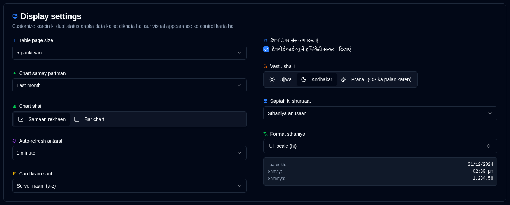

# Display {#display}

Upyogkarta interface aur display preferences configure karein.

 

| Setting                   | Description                                         | Default Value      |
|:--------------------------|:----------------------------------------------------|:-------------------|
| **Table Size**            | Server details page par prushth par sankhya of rows. | 5 rows             |
| **डैशबोर्ड पर संस्करण दिखाएं** | डैशबोर्ड कार्ड पर डुप्लिकेटी संस्करण दिखाएं या छुपाएं। डैशबोर्ड तालिका हमेशा संस्करण कॉलम दिखाती है। [डुप्लिकेटी संस्करण](duplicati-versions.md) में भी उपलब्ध है। | चालू |
| **Theme**                 | Light, dark, yaad rakhein apane operating system appearance (prefers light/dark mode). | Follow OS when unset |
| **Chart Time Range**      | Charts mein dikhane wala samay antaral. Available options: **1W** (last 7 days), **2W** (last 14 days), **1M** (last 30 days), **3M** (last 90 days). You can also toggle time range directly from chart headers. | 1 month            |
| **Chart Style**           | Smooth line charts yaad bar chart visualization. Both modes use time-bucket aggregation for optimal display. You can also toggle directly from chart headers. | Smooth lines       |
| **Format sthaniya**         | एक फॉर्मेटिंग स्थानीयता चुनें जो आपकी UI भाषा के स्वतंत्र है (416 स्थानीयताएँ समर्थित हैं)। यह तारीखों, समयों और संख्याओं को कैसे प्रदर्शित किया जाता है, उस पर प्रभाव डालता है। सापेक्ष-टाइम फ़्रेज़ (जैसे "2 घंटे में") फॉर्मेट स्थानीयता के अनुसार होते हैं जब तक कि **UI भाषा में सापेक्ष समय रखें** सक्षम नहीं किया गया है। एक लाइव पूर्वावलोकन तारीख, समय, संख्या और एक सापेक्ष-टाइम नमूना शामिल करता है। उदाहरण: UI भाषा = जर्मन, फॉर्मेट स्थानीयता = अंग्रेज़ी (यूके) → जर्मन UI के साथ यूके तारीख प्रारूप। | UI भाषा के आधार पर |
| **UI भाषा में सापेक्ष समय रखें** | जब सक्षम किया जाता है, तो फ़्रेज़ जैसे "2 घंटे में" **उपयोगकर्ता → भाषा** के अनुसार होते हैं बजाय फॉर्मेट स्थानीयता। तारीखें, समय और संख्याएँ अभी भी फॉर्मेट स्थानीयता का उपयोग करती हैं। डिफ़ॉल्ट रूप से बंद है। | बंद |
| **Auto-refresh Interval** | Prushthon ka refresh hone ka samay antaral.              | 1 minute           |
| **Cards Sort Order**      | Dashboard par cards ka kram suchi.              | Server name (a-z)  |
| **Start of Week**         | Saptah ki shuruaat configure karein.                     | Based on locale    |

 

:::tip
**Quick Access**: You can quickly access this page by right-clicking on the auto-refresh button in the application toolbar.
:::
