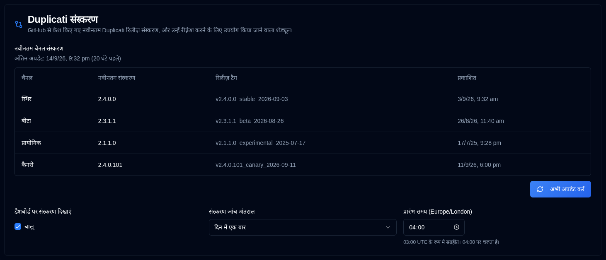

# डुप्लिकेटी संस्करण {#duplicati-versions}

यह पृष्ठ **duplistatus** कैश में संग्रहीत नवीनतम डुप्लिकेटी रिलीज़ संस्करण दिखाता है और व्यवस्थापकों को कॉन्फ़िगर करने की अनुमति देता है कि वे GitHub से कितनी बार वे संस्करण ताज़ा किए जाते हैं।

कैश [dashboard](../dashboard.md#duplicati-server-version) और [Servers](server-settings.md) पृष्ठ द्वारा उपयोग किया जाता है ताकि प्रत्येक सर्वर संस्करण को रंग दिया जा सके और दिखाया जा सके कि यह वर्तमान है या पुराना।

## नवीनतम चैनल संस्करण {#latest-channel-versions}

तालिका प्रत्येक डुप्लिकेटी चैनल के लिए नवीनतम कैश संस्करण सूचीबद्ध करती है:

| चैनल        | विवरण                                      |
|:---------------|:-------------------------------------------------|
| **स्थिर**     | नवीनतम स्थिर रिलीज़                            |
| **बेटा**       | नवीनतम बेटा रिलीज़                              |
| **प्रायोगिक** | नवीनतम प्रायोगिक रिलीज़                    |
| **कैनरी**     | नवीनतम कैनरी रिलीज़                            |

तालिका के ऊपर नवीनतम सफल GitHub अपडेट समय दिखाया जाता है। यदि एक चैनल अभी तक नहीं मिला है, या कैश कभी अपडेट नहीं किया गया है, तो पृष्ठ दिखाता है कि संस्करण अनुपलब्ध है।

व्यवस्थापक **अब अपडेट करें** पर क्लिक कर सकते हैं ताकि नवीनतम रिलीज़ तुरंत प्राप्त की जा सके। इससे क्रॉन सेवा चलाने की आवश्यकता नहीं होती है। यदि GitHub तक पहुंच नहीं हो पाती है, तो **duplistatus** पिछले कैश को बनाए रखता है।

## संस्करण जाँच अनुसूची {#version-check-schedule}

**डैशबोर्ड पर संस्करण दिखाएं** [dashboard](../dashboard.md#duplicati-server-version) कार्ड दृश्य में संस्करण बैज को चालू या बंद करता है। डैशबोर्ड तालिका हमेशा **संस्करण** कॉलम दिखाती है। यह डिफ़ॉल्ट रूप से चालू है और [Display Settings](display-settings.md) में भी उपलब्ध है। यह एक प्रति-उपयोगकर्ता प्रदर्शन प्राथमिकता है।

व्यवस्थापक चुन सकते हैं कि **duplistatus** कितनी बार GitHub पर नवीनतम डुप्लिकेटी रिलीज़ के लिए जाँच करता है:

| अंतराल           | चलाता है                                                         |
|:-------------------|:-------------------------------------------------------------|
| **एक दिन में एक बार**     | कॉन्फ़िगर किए गए प्रारंभ समय पर एक बार                            |
| **हर 12 घंटे में** | प्रारंभ समय पर और 12 घंटे बाद                         |
| **हर 6 घंटे में**  | प्रारंभ समय पर और उसके बाद हर 6 घंटे में               |

शुरुआत का समय आपके ब्राउज़र के टाइमज़ोन में दैनिक सारांश के समान संक्षिप्त समय नियंत्रण का उपयोग करके चुना जाता है। कोई भी `HH:mm` समय चुनें। **duplistatus** उस मान को UTC में संग्रहीत करता है और क्रॉन सेवा UTC में जांच चलाती है।

उदाहरण:

- दैनिक 06:00 के प्रारंभ समय के साथ 06:00 पर चलता है।
- दैनिक 06:30 के प्रारंभ समय के साथ 06:30 पर चलता है।
- हर 12 घंटे में 08:15 के प्रारंभ समय के साथ 08:15 और 20:15 पर चलता है।
- हर 6 घंटे में 02:45 के प्रारंभ समय के साथ 02:45, 08:45, 14:45, और 20:45 पर चलता है।

स्टार्टअप पर, **duplistatus** कैश को ताज़ा करता है अगर यह चयनित अंतराल (24 घंटे, 12 घंटे, या 6 घंटे) से पुराना है। असफल ताज़ा करने के प्रयास अंतिम कैश्ड संस्करणों को रखते हैं।

सामान्य उपयोगकर्ता कैश्ड संस्करणों और अनुसूची को देख सकते हैं, और **डैशबोर्ड पर संस्करण दिखाएं** को चालू या बंद कर सकते हैं। केवल व्यवस्थापक ही अंतराल, प्रारंभ समय बदल सकते हैं, या एक ताज़ा अपडेट कर सकते हैं।

:::note
अनुसूची बदलने पर, `duplicati_version_check_updated` प्रविष्टि [ऑडिट लॉग](audit-logs-viewer.md) में लिखी जाती है। सफल और असफल GitHub अपडेट `duplicati_version_refresh` के रूप में रिकॉर्ड किए जाते हैं, ट्रिगर के रूप में `startup`, `cron`, या `manual`।
:::
