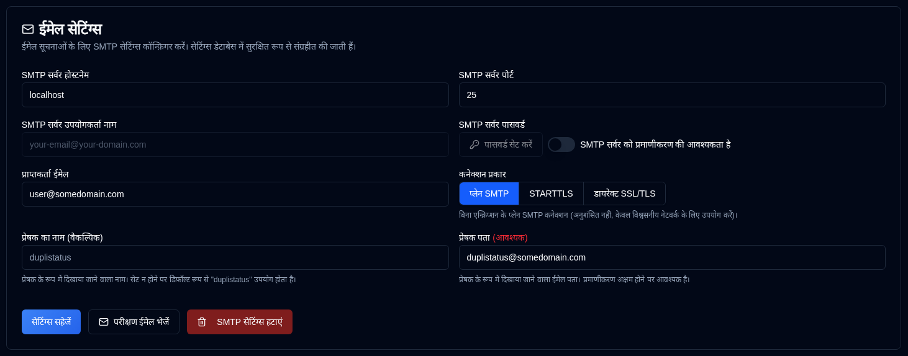

# Email {#email}

**duplistatus** SMTP के माध्यम से ईमेल सूचनाएं भेजने का समर्थन करता है, NTFY सूचनाओं के लिए एक विकल्प या पूरक के रूप में। ईमेल कॉन्फ़िगरेशन अब डेटाबेस में एन्क्रिप्टेड स्टोरेज के साथ वेब इंटरफ़ेस के माध्यम से प्रबंधित किया जाता है, जो सुरक्षा को बढ़ाने के लिए है।

| सेटिंग्स                | विवरण                                                           |
|:------------------------|:-----------------------------------------------------------------|
| **SMTP सर्वर होस्ट**    | आपकी ईमेल प्रदाता का SMTP सर्वर (जैसे, `smtp.gmail.com`).      |
| **SMTP सर्वर पोर्ट**    | पोर्ट नंबर (सामान्यत: `25` प्लेन SMTP के लिए, `587` STARTTLS के लिए, या `465` डायरेक्ट SSL/TLS के लिए). |
| **कनेक्शन प्रकार**     | प्लेन SMTP, STARTTLS, या डायरेक्ट SSL/TLS के बीच चुनें। नए कॉन्फ़िगरेशन के लिए डिफ़ॉल्ट डायरेक्ट SSL/TLS होता है। |
| **SMTP प्रमाणीकरण** | SMTP प्रमाणीकरण सक्षम या अक्षम करने के लिए टॉगल करें। जब अक्षम किया जाता है, तो उपयोगकर्ता नाम और पासवर्ड फ़ील्ड आवश्यक नहीं होते हैं। |
| **SMTP उपयोगकर्ता नाम**       | आपका ईमेल पता या उपयोगकर्ता नाम (जब प्रमाणीकरण सक्षम हो तो आवश्यक होता है)। |
| **SMTP पासवर्ड**       | आपका ईमेल पासवर्ड या ऐप-स्पेसिफ़िक पासवर्ड (जब प्रमाणीकरण सक्षम हो तो आवश्यक होता है)। |
| **प्रेषक का नाम**         | ईमेल सूचनाओं में प्रेषक के रूप में दिखाने वाला नाम (वैकल्पिक, डिफ़ॉल्ट "duplistatus")। |
| **से पता**        | प्रेषक के रूप में दिखाने वाला ईमेल पता। प्लेन SMTP कनेक्शन के लिए या जब प्रमाणीकरण अक्षम हो तो आवश्यक होता है। जब प्रमाणीकरण सक्षम हो तो डिफ़ॉल्ट SMTP उपयोगकर्ता नाम होता है। ध्यान दें कि कुछ ईमेल प्रदाता `From Address` को `SMTP Server Username` से ओवरराइड कर सकते हैं। |
| **प्राप्तक ईमेल**     | सूचनाएं प्राप्त करने के लिए ईमेल पता। एक वैध ईमेल फॉर्मेट होना चाहिए। |

साइडबार में **ईमेल** के पास एक <IIcon2 icon="lucide:mail" color="green"/> हरा आइकन आपके सेटिंग्स वैलिड होने का संकेत करता है। अगर आइकन <IIcon2 icon="lucide:mail" color="yellow"/> पीला है, तो आपके सेटिंग्स वैलिड नहीं हैं या कॉन्फ़िगर नहीं किए गए हैं।

आइकन हरे रंग में दिखता है जब सभी आवश्यक फ़ील्ड सेट होते हैं: SMTP सर्वर होस्ट, SMTP सर्वर पोर्ट, प्राप्तक ईमेल, और या तो (SMTP उपयोगकर्ता नाम + पासवर्ड जब प्रमाणीकरण आवश्यक हो) या (से पता जब प्रमाणीकरण अक्षम हो)।

जब कॉन्फ़िगरेशन पूरी तरह से कॉन्फ़िगर नहीं किया जाता है, तो एक पीला अलर्ट बॉक्स प्रदर्शित किया जाता है जो आपको सूचित करता है कि ईमेल सेटिंग्स सही ढंग से भरे जाने तक कोई ईमेल नहीं भेजी जाएगी। [Backup Notifications](backup-notifications-settings.md) टैब में ईमेल चेकबॉक्स भी ग्रे आउट हो जाएंगे और "(निष्क्रिय)" लेबल दिखाएंगे।

 

## Available Actions {#available-actions}

| बटन                                                           | विवरण                                              |
|:-----------------------------------------------------------------|:---------------------------------------------------------|
| <IconButton label="सेटिंग्स सहेजें" />                             | NTFY सेटिंग्स में किए गए परिवर्तनों को सहेजें।              |
| <IconButton icon="lucide:mail" label="टेस्ट ईमेल भेजें"/>         | SMTP कॉन्फ़िगरेशन का उपयोग करके एक टेस्ट ईमेल संदेश भेजता है। टेस्ट ईमेल SMTP सर्वर होस्टनेम, पोर्ट, कनेक्शन प्रकार, प्रमाणीकरण स्थिति, उपयोगकर्ता नाम (यदि लागू हो), प्राप्तक ईमेल, से पता, प्रेषक का नाम, और टेस्ट टाइमस्टैम्प प्रदर्शित करता है। |
| <IconButton icon="lucide:trash-2" label="SMTP सेटिंग्स हटाएँ"/> | SMTP विन्यास को हटाएँ / Clear करें। [दैनिक सारांश](daily-summary-settings.md) सक्रिय होने पर निष्क्रिय, क्योंकि उस मोड को ईमेल की आवश्यकता होती है। |

 

:::info[महत्वपूर्ण]
  आपको <IconButton icon="lucide:mail" label="टेस्ट ईमेल भेजें"/> बटन का उपयोग करके अपने ईमेल सेटअप का परीक्षण करना चाहिए, इससे पहले कि आप सूचनाओं के लिए इसका उपयोग करने के लिए निर्भर करें।

 यहां तक कि जब आप एक हरा <IIcon2 icon="lucide:mail" color="green"/> आइकन देखते हैं और सब कुछ कॉन्फ़िगर किया गया लगता है, तो भी ईमेल भेजी नहीं जा सकती हैं।
 
 **duplistatus** केवल जाँचता है कि आपकी SMTP सेटिंग्स भरी गई हैं, नहीं कि ईमेल वास्तव में डिलीवर की जा सकती हैं।
:::

 

## सामान्य SMTP प्रदाता {#common-smtp-providers}

**Gmail:**

- Host: `smtp.gmail.com`
- Port: `587` (STARTTLS) aur `465` (Direct SSL/TLS)
- Connection Type: STARTTLS for port 587, Direct SSL/TLS for port 465
- Username: Your Gmail address
- Password: Use an App Password (not your regular password). Generate one at https://myaccount.google.com/apppasswords
- Authentication: Required

**Outlook/Hotmail:**

- Host: `smtp-mail.outlook.com`
- Port: `587`
- Connection Type: STARTTLS
- Username: Your Outlook email address
- Password: Your account password
- Authentication: Required

**Yahoo Mail:**

- Host: `smtp.mail.yahoo.com`
- Port: `587`
- Connection Type: STARTTLS
- Username: Your Yahoo email address
- Password: Use an App Password
- Authentication: Required

### Security Best Practices {#security-best-practices}

- Consider using a dedicated email account for notifications
 - Test your configuration using the "Test Email Bhejein" button
 - Settings are encrypted and stored securely in the database
 - **Use encrypted connections** - STARTTLS and Direct SSL/TLS are recommended for production use
 - Plain SMTP connections (port 25) are available for trusted local networks but are not recommended for production use over untrusted networks
