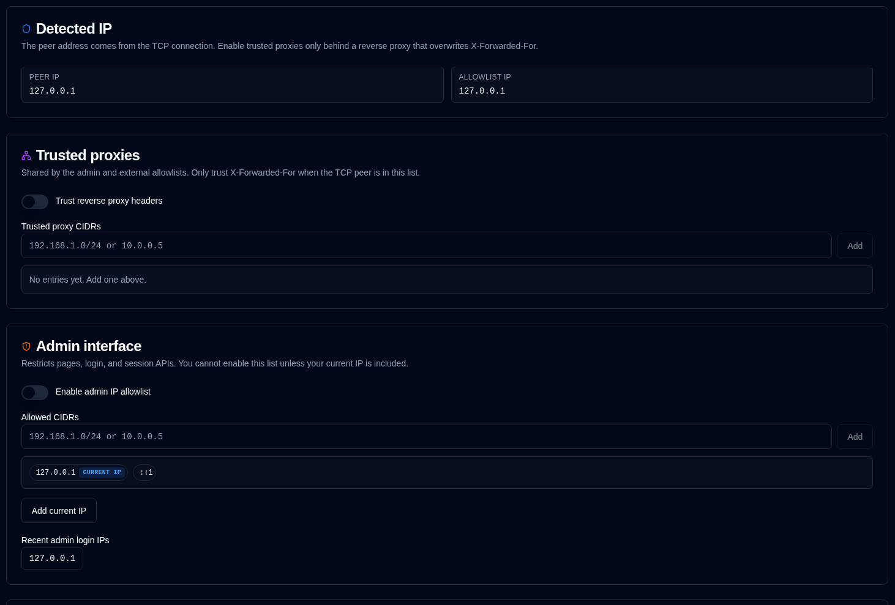

# IP अनुमति सूची {/* #ip-allowlist */}

प्रशासक निर्धारित कर सकते हैं कि कौन एडमिन इंटरफ़ेस और बाहरी डेटा API तक पहुंच सकता है। दोनों सूचियाँ स्वतंत्र हैं। डिफ़ॉल्ट रूप से दोनों बंद हैं।



एप्लिकेशन `scripts/peer-ip.cjs` द्वारा सेट किए गए आंतरिक हेडर से TCP पीयर एड्रेस पढ़ता है। कोई क्लाइंट उस हेडर को झूठा नहीं बना सकता। **पहचाना गया IP** TCP **पीयर IP** और पहुंच निर्णय के लिए उपयोग किए गए **अनुमति सूची IP** दिखाता है (वे मिलान करते हैं जब तक कि विश्वसनीय-प्रॉक्सी हेडर लागू न हों)।

अस्वीकृत अनुरोध HTTP 403 लौटाते हैं (API पथ पर `IP_NOT_ALLOWED`)। उन्हें ऑडिट लॉग में नहीं लिखा जाता है। एक दर-सीमित `console.warn` लाइन एप्लिकेशन stdout में उत्सर्जित की जाती है (उदाहरण के लिए `docker logs`) — प्रति क्लाइंट IP और सतह (एडमिन, बाहरी, या प्रोब) प्रति मिनट अधिकतम एक लॉग, और प्रति घंटा दस — ताकि स्कैनर लॉग को बाढ़ न दे सकें।

## विश्वसनीय प्रॉक्सी {/* #trusted-proxies */}

**रिवर्स प्रॉक्सी हेडर पर भरोसा करें** केवल तभी सक्षम करें जब duplistatus पर पहुंच केवल उसी रिवर्स प्रॉक्सी के माध्यम से हो सके जो `X-Forwarded-For` / `X-Real-IP` को **अधिलेखित** करता है (जोड़ना नहीं)। प्रत्येक प्रॉक्सी CIDR को **जोड़ें** के साथ जोड़ें (या अल्पविराम या नई लाइन से अलग की गई सूची पेस्ट करें)। प्रविष्टियाँ हटाने योग्य चिप्स के रूप में दिखाई देती हैं। जब TCP पीयर उस सूचि में नहीं होता है, तो अग्रेषित हेडर को अनदेखा कर दिया जाता है।

## एडमिन इंटरफ़ेस {/* #admin-interface */}

जब सक्षम हो, तो पृष्ठ, लॉगिन, CSRF, और सत्र API केवल सूचीबद्ध CIDR को स्वीकार करते हैं। **जोड़ें** के साथ प्रविष्टियाँ जोड़ें; जब आपका वर्तमान **अनुमति सूची IP** सूची में होता है तो उसे **वर्तमान IP** के रूप में टैग किया जाता है। **127.0.0.1** और **::1** डिफ़ॉल्ट रूप से शामिल किए जाते हैं और हटाए नहीं जा सकते। **वर्तमान IP जोड़ें** और ऑडिट लॉग से **हाल के एडमिन लॉगिन IP** त्वरित सुझाव प्रस्तुत करते हैं। आप इस सूचि को तब तक सक्षम नहीं कर सकते जब तक कि आपका वर्तमान IP पहले से शामिल न हो (या आप लूपबैक से कनेक्ट न हो रहे हों)। लॉकआउट को इसके साथ पुनर्प्राप्त किया जा सकता है:

```bash
ADMIN_IP_ALLOWLIST_ENABLED=false
```

या आपके CIDR को `ADMIN_IP_ALLOWLIST` में जोड़कर। पूर्ण पुनर्प्राप्ति चरण (डॉकर पुनर्निर्माण, फिर सेटिंग्स ठीक करें और ओवरराइड हटाएं) [IP अनुमति सूची द्वारा लॉक आउट](../troubleshooting.md#locked-out-by-ip-allowlist) में हैं।

## बाहरी API {/* #external-apis */}

जब सक्षम हो, तो `/api/upload`, `/api/summary`, और `/api/lastbackup*` केवल सूचीबद्ध CIDR को स्वीकार करते हैं।

`/api/health` और `/api/ping` अकेले बाहरी सूची पर नहीं हैं (डैशबोर्ड पिंग एडमिन UI IP से आता है)। जब **कोई भी** अनुमति सूची सक्षम होती है, तो वे प्रोब लूपबैक (`127.0.0.1`, `::1`) और **एडमिन या बाहरी** सूची से CIDR को स्वीकार करते हैं। असूचीबद्ध IP को HTTP 403 प्राप्त होता है। जब दोनों सूचियाँ बंद होती हैं, तो प्रोब सार्वजनिक रहते हैं।

गैर-लूपबैक प्रोब अनुरोध भी दर-सीमित होते हैं (HTTP 429, `PROBE_RATE_LIMITED`): `/api/ping` 60/मिनट और 600/घंटा; `/api/health` 30/मिनट और 120/घंटा। कंटेनर के भीतर डॉकर जांच लोकलहोस्ट पर होती है और कभी थ्रॉटल नहीं की जाती। ऐप-स्तर की सीमाएँ एक आयामी कनेक्शन बाढ़ को नहीं रोकतीं; उसे रिवर्स प्रॉक्सी पर रखें।

यह सूची सुरक्षा है जिसका उपयोग तब किया जाना चाहिए जब API कुंजियों की आवश्यकता न हो। एडमिन सूचि की तरह CIDR को चिप्स के रूप में जोड़ें। **127.0.0.1** और **::1** डिफ़ॉल्ट रूप से शामिल किए जाते हैं और हटाए नहीं जा सकते। ऑडिट लॉग से **हाल के अपलोड स्रोत IP** को त्वरित-जोड़ सुझाव के रूप में प्रस्तुत किया जाता है।

यदि इस अनुमति सूची और API कुंजियों दोनों की आवश्यकता हो, तो अनुरोध को **दोनों** को पार करना चाहिए।

## पर्यावरण ओवरराइड {/* #environment-overrides */}

| चर | उद्देश्य |
|----------|---------|
| `IP_TRUSTED_PROXIES` | अल्पविराम से अलग की गई विश्वसनीय प्रॉक्सी CIDR (ट्रस्ट-प्रॉक्सी का संकेत भी करता है) |
| `ADMIN_IP_ALLOWLIST_ENABLED` | `true` / `false` |
| `ADMIN_IP_ALLOWLIST` | अल्पविराम से अलग की गई CIDR |
| `EXTERNAL_API_IP_ALLOWLIST_ENABLED` | `true` / `false` |
| `EXTERNAL_API_IP_ALLOWLIST` | अल्पविराम से अलग किए गए सीआईडीआर |

पर्यावरण मान डेटाबेस को ओवरराइड करते हैं ताकि लॉकआउट को यूआई के बिना ही पुनर्प्राप्त किया जा सके।
