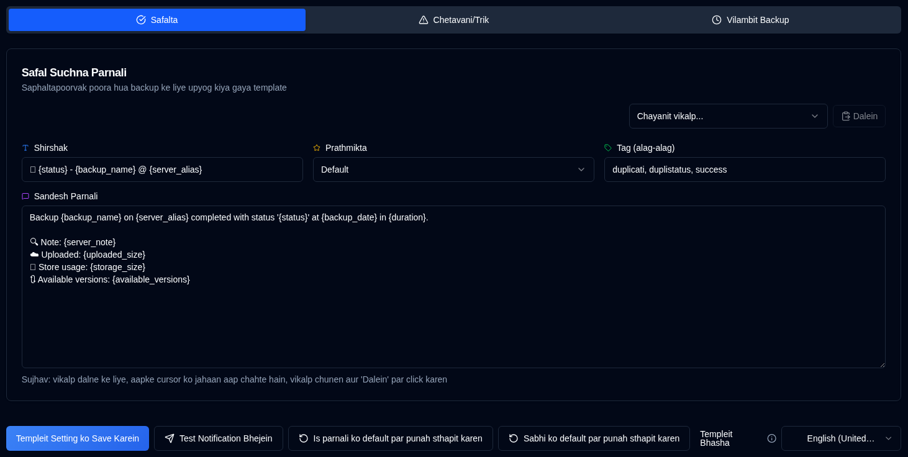

# Templates {#templates}

**duplistatus** uses three templates for notification messages. These templates are used for both NTFY and Email notifications.

The page includes a **Template Language** selector that sets the locale for default templates. Changing the language updates the locale for new defaults, but it does **not** change the text of existing templates. To apply a new language to your templates, either edit them manually or use **Reset this template to default** (for the current tab) or **Reset all to default** (for all three templates).

| Template           | Description                                         |
| :----------------- | :-------------------------------------------------- |
| **Success**        | Used when backups complete successfully.            |
| **Warning/Error**  | Used when backups complete with warnings or errors. |
| **Overdue Backup** | Used when backups are overdue.                      |

 

## Template Language {#template-language}

A **Template Language** selector at the top of the page lets you choose the language for default templates (English, German, French, Spanish, Portuguese, Hindi (Roman), and Simplified Chinese). Changing the language updates the locale for defaults, but existing customized templates keep their current text until you update them or use one of the reset buttons.

 

## Available Actions {#available-actions}

| Button                                                              | Description                                                                                         |
|:--------------------------------------------------------------------|:----------------------------------------------------------------------------------------------------|
| <IconButton label="Save Template Settings" />                      | Saves the settings when changing the template. The button saves the template being displayed (Success, Warning/Error or Overdue Backup). |
| <IconButton icon="lucide:send" label="Send Test Notification"/>     | Checks the template after updating it. The variables will be replaced with their names for the test. For email notifications, the template title becomes the email subject line. |
| <IconButton icon="lucide:rotate-ccw" label="Reset this template to default"/> | Restores the default template for the **selected template** (the current tab). Remember to save after resetting. |
| <IconButton icon="lucide:rotate-ccw" label="Reset all to default"/> | Restores all three templates (Success, Warning/Error, Overdue Backup) to the defaults for the selected Template Language. Remember to save after resetting. |

 

## Variables {#variables}

All templates support variables that will be replaced with actual values. The following table shows the available variables:

| Variable               | Description                                     | Available In     |
|:-----------------------|:------------------------------------------------|:-----------------|
| `{server_name}`        | Name of the server.                             | All templates    |
| `{server_alias}`       | Alias of the server.                            | All templates    |
| `{server_note}`        | Note for the server.                            | All templates    |
| `{server_url}`         | URL of the Duplicati Server web configuration   | All templates    |
| `{backup_name}`        | Name of the backup.                             | All templates    |
| `{status}`             | Backup की स्थिति (Safalta, Chetavaniya, Truti, Gambhir). | Safalta, Chetavaniya |
| `{backup_date}`        | Backup की तारीख और समय.                    | Safalta, Chetavaniya |
| `{duration}`           | Backup की अवधि.                         | Safalta, Chetavaniya |
| `{uploaded_size}`      | अपलोड किए गए डेटा की मात्रा.                        | Safalta, Chetavaniya |
| `{storage_size}`       | संचयन उपयोग जानकारी.                      | Safalta, Chetavaniya |
| `{available_versions}` | उपलब्ध backup संस्करणों की संख्या.            | Safalta, Chetavaniya |
| `{file_count}`         | प्रबंधित fileों की संख्या.                      | Safalta, Chetavaniya |
| `{file_size}`          | backup की गई fileों का कुल आकार.                  | Safalta, Chetavaniya |
| `{messages_count}`     | संदेशों की संख्या.                             | Safalta, Chetavaniya |
| `{warnings_count}`     | चेतावनियों की संख्या.                             | Safalta, Chetavaniya |
| `{errors_count}`       | त्रुटियों की संख्या.                               | Safalta, Chetavaniya |
| `{log_text}`           | लॉग संदेश (चेतावनियाँ और त्रुटियाँ)              | Safalta, Chetavaniya |
| `{last_backup_date}`   | अंतिम backup की तारीख.                        | Vilambit          |
| `{last_elapsed}`       | अंतिम backup से बीते समय.             | Vilambit          |
| `{expected_date}`      | अपेक्षित backup तारीख.                           | Vilambit          |
| `{expected_elapsed}`   | अपेक्षित तारीख से बीते समय.           | Vilambit          |
| `{backup_interval}`    | अंतराल स्ट्रिंग (उदाहरण, "1D", "2W", "1M").       | Vilambit          |
| `{overdue_tolerance}`  | विलंब सहनशीलता सेटिंग.                      | Vilambit          |
