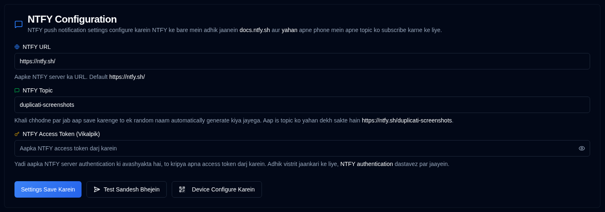

# NTFY {#ntfy}

[NTFY](https://github.com/binwiederhier/ntfy) ek aasaan suchnaa sewaa hai jo aapake phone ya desktop par push notifications bhejne ke liye use kiya ja sakta hai. Is section mein, aap apake notification server connection aur authentication ko sanrachit kar sakte hain.

| Sammaan               | Vivaaran                                                                                                                                   |
|:----------------------|:----------------------------------------------------------------------------------------------------------------------------------------------|
| **NTFY URL**          | Aapake NTFY server ka URL (default public `https://ntfy.sh/` hai).                                                                      |
| **NTFY Topic**        | Aapake notifications ke liye ek ekakshar (unique) identifier. Pranali khali chhodne par ek random topic automatically generate hogi, ya aap apana apna specify kar sakte hain. |
| **NTFY Access Token** | Authenticated NTFY servers ke liye ek optional access token. Agar aapake server ko authentication ki zaroorat nahi hai toh is field ko khali chhod dijiye.               |

 

A <IIcon2 icon="lucide:message-square" color="green"/> green icon next to **NTFY** in the sidebar means your settings are valid. If the icon is <IIcon2 icon="lucide:message-square" color="yellow"/> yellow, your settings are not valid.
When the configuration is not valid, the NTFY checkboxes in the [`Backup Notifications`](backup-notifications-settings.md) tab will also be greyed out.

## Available Actions {#available-actions}

| Button                                                                | Vivaaran                                                                                                  |
|:----------------------------------------------------------------------|:-------------------------------------------------------------------------------------------------------------|
| <IconButton label="Sammaan ko Save karein" />                                  | NTFY sammaan mein kiye gaye sabhi changes ko save karein.                                                                  |
| <IconButton icon="lucide:send-horizontal" label="Test Message Bhejein"/> | Aapake NTFY server par ek test message bhejein apake configuration ko check karne ke liye.                                         |
| <IconButton icon="lucide:qr-code" label="Device Sanrachit karein"/>          | Ek QR code dikhaye jo aapake mobile device ya desktop ko NTFY notifications ke liye quickly configure karne mein madad karega. |

## Device Sanrachit karein {#device-configuration}

Aapake device par NTFY application install karne ke baad, usko configure karne se pehle ([see here](https://ntfy.sh/)). <IconButton icon="lucide:qr-code" label="Device Sanrachit karein"/> button par click karne par, ya application toolbar mein <SvgButton svgFilename="ntfy.svg" /> icon par right-click karne par, ek QR code dikhayi jayegi. Is QR code ko scan karne se aapake device ko notifications ke liye sahi NTFY topic ke saath automatically configure ho jayega.

 

 

:::caution
Agar aap access token ke bina public **ntfy.sh** server use karte hain, toh aapake topic name se koi bhi aapake
notifications dekh sakte hain. 
 
Ek baar privacy ka ek degree provide karne ke liye, ek random 12-character topic generate kiya jata hai, jo over
3 sextillion (3,000,000,000,000,000,000,000) possible combinations deta hai, jo guess karne ko asaasya banata hai.

Improved security ke liye, [access token authentication](https://docs.ntfy.sh/config/#access-tokens) aur [access control lists](https://docs.ntfy.sh/config/#access-control-list-acl) use karke aapake topics ko protect karne ke liye, ya [self-host NTFY](https://docs.ntfy.sh/install/#docker) total control ke liye consider karein.

⚠️ **Aapake NTFY topics ko secure karne ka jimaadari aapake paas hai. Kripaya is service ko apane apne riske par use karein.**
:::

 
 

:::note
 सभी उत्पाद नाम, लोगो और ट्रेडमार्क उनके संबंधित मालिकों का संपत्ति है। आइकन और नाम पहचान के लिए उपयोग किए जाते हैं और समर्थन का इम्प्लाई नहीं करते हैं।
:::
