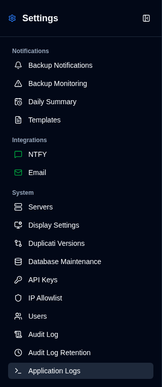
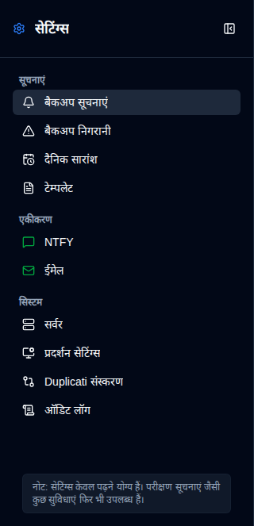

# Overview {#overview}

Sammaan prushth ek ekikrit sannidhi samayik interface hai **duplistatus** ke sabhi aspek ko configure karne ke liye. Aap is par click karke is par pahunchein <IconButton icon="lucide:settings" /> **Sammaan** button par [Application Toolbar](../overview.md#application-toolbar) mein. Yadi samajhne ke liye ki regular users ko ek sadharan menu dikhata hai jisme kam option hote hain administrator ke mukaab mein.

## Administrator View {#administrator-view}

Administrators sabhi available settings dekhte hain.

<table>
  <tr>
    <td>
      
    </td>
    <td>
      <ul>
        <li>
          <strong>Suchnaayein</strong>
          <ul>
            <li><a href="backup-notifications-settings.md">Backup suchnaayein</a>: Configure per-backup notification settings</li>
            <li><a href="backup-monitoring-settings.md">Backup Monitoring</a>: Configure overdue backup detection and alerts</li>
            <li><a href="notification-templates.md">Templates</a>: Customise notification message templates</li>
          </ul>
        </li> 
        <li>
          <strong>Integrations</strong>
          <ul>
            <li><a href="ntfy-settings.md">NTFY</a>: Configure NTFY push notification service</li>
            <li><a href="email-settings.md">Email</a>: Configure SMTP email notifications</li>
          </ul>
        </li> 
        <li>
          <strong id="system">Pranali</strong>
          <ul>
            <li><a href="server-settings.md">Server</a>: Manage Duplicati server configurations</li>
            <li><a href="display-settings.md">Display settings</a>: Configure theme, chart time range, chart style, format locale, auto-refresh interval, card sort order, and week start</li>
            <li><a href="duplicati-versions.md">डुप्लिकेटी संस्करण</a>: View cached Duplicati release versions and configure the version check schedule</li>
            <li><a href="database-maintenance.md">Database Maintenance</a>: Perform database cleanup (admin only)</li>
            <li><a href="user-management-settings.md">Upyogkarta</a>: Manage user accounts (admin only)</li>
            <li><a href="audit-logs-viewer.md">Audit log</a>: View system audit logs</li>
            <li><a href="audit-logs-retention.md">Audit Log Retention</a>: Configure audit log retention (admin only)</li>
            <li><a href="application-logs-settings.md">Application logs</a>: View and export application logs (admin only)</li>
          </ul>
        </li>
      </ul>
    </td>
  </tr>
</table>

## Non-Administrator View {#non-administrator-view}

Regular users ek limited set of settings dekhte hain.

<table>
  <tr>
    <td>
      
    </td>
    <td>
      <ul>
        <li>
          <strong>Suchnaayein</strong>
          <ul>
            <li><a href="backup-notifications-settings.md">Backup suchnaayein</a>: View per-backup notification settings (read-only)</li>
            <li><a href="backup-monitoring-settings.md">Backup monitoring</a>: View overdue backup settings (read-only)</li>
            <li><a href="notification-templates.md">Templates</a>: View notification templates (read-only)</li>
          </ul>
        </li> 
        <li>
          <strong>Integrations</strong>
          <ul>
            <li><a href="ntfy-settings.md">NTFY</a>: View NTFY settings (read-only)</li>
            <li><a href="email-settings.md">Email</a>: View email settings (read-only)</li>
          </ul>
        </li> 
        <li>
          <strong id="system">Pranali</strong>
          <ul>
            <li><a href="server-settings.md">Server</a>: View server configurations (read-only)</li>
            <li><a href="display-settings.md">Display</a>: Configure theme, chart time range, chart style, format locale, auto-refresh interval, card sort order, and week start</li>
            <li><a href="duplicati-versions.md">डुप्लिकेटी संस्करण</a>: View cached Duplicati release versions (schedule changes are administrator-only)</li>
            <li><a href="audit-logs-viewer.md">Audit log</a>: View system audit logs (read-only)</li>
          </ul>
        </li>
      </ul>
    </td>
  </tr>
</table>

## Status Icons {#status-icons}

साइडबार में **NTFY** और **Email** एकीकरण सम्मानों के पास स्थिति चिह्न प्रदर्शित होते हैं:
- <IIcon2 icon="lucide:message-square" color="green"/> <IIcon2 icon="lucide:mail" color="green"/> **हरा चिह्न**: आपकी सम्मानें मान्य हैं और सही ढंग से कॉन्फ़िगर की गई हैं
- <IIcon2 icon="lucide:message-square" color="yellow"/> <IIcon2 icon="lucide:mail" color="yellow"/> **पीला चिह्न**: आपकी सम्मानें मान्य नहीं हैं या कॉन्फ़िगर नहीं की गई हैं

जब कॉन्फ़िगरेशन अमान्य होता है, तो [Backup Suchnaayein](backup-notifications-settings.md) टैब में संबंधित चेकबॉक्स ग्रे आउट और निष्क्रिय हो जाएंगे। अधिक विवरण के लिए, [NTFY Settings](ntfy-settings.md) और [Email Settings](email-settings.md) पृष्ठ देखें।

 

:::important
हरा चिह्न यह नहीं सुनिश्चित करता कि सूचनाएं सही ढंग से काम कर रही हैं। हमेशा उपलब्ध परीक्षण सुविधाओं का उपयोग करके पुष्टि करें कि आपकी सूचनाएं काम कर रही हैं, इससे पहले कि आप उन पर निर्भर करें।
:::

 
