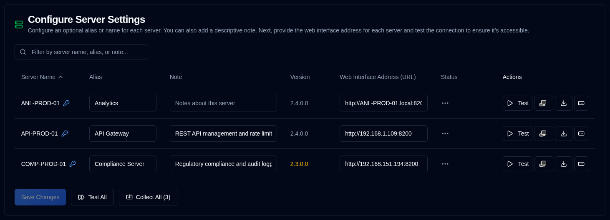

# Server {#server}

आप अपने सर्वरों के लिए एक वैकल्पिक नाम (उपनाम) कॉन्फ़िगर कर सकते हैं, इसके कार्य का वर्णन करने के लिए एक नोट और आपके डुप्लिकेटी सर्वरों के वेब पते यहां कॉन्फ़िगर करें।

| सेटिंग्स                         | विवरण                                                                                                                                                                                  |
|:--------------------------------|:---------------------------------------------------------------------------------------------------------------------------------------------------------------------------------------------|
| **Server Name**                 | डुप्लिकेटी सर्वर में कॉन्फ़िगर किया गया सर्वर नाम। एक <IIcon2 icon="lucide:key-round" color="#42A5F5"/> दिखाई देगा अगर सर्वर के लिए पासवर्ड सेट किया गया है।                                         |
| **Alias**                       | आपके सर्वर का एक उपनाम या मानव-पठनीय नाम। जब आप एक उपनाम पर होवर करते हैं तो यह इसका नाम दिखाएगा; कुछ मामलों में इसे स्पष्ट बनाने के लिए यह उपनाम और नाम को ब्रैकेट के बीच दिखाएगा। |
| **Note**                        | सर्वर कार्यक्षमता, स्थापना स्थान या किसी अन्य जानकारी का वर्णन करने के लिए स्वतंत्र पाठ। जब कॉन्फ़िगर किया जाता है, तो यह सर्वर के नाम या उपनाम के पास प्रदर्शित किया जाएगा।                 |
| **Sanskaran**                     | The Duplicati version from the latest backup log, with the same colour and tooltip as the [dashboard](../dashboard.md#duplicati-server-version). Muted text is Vartaman or अनुपलब्ध; warning yellow is outdated. |
| **Web Interface Address (URL)** | डुप्लिकेटी सर्वर के UI तक पहुंचने के लिए URL कॉन्फ़िगर करें। दोनों `HTTP` और `HTTPS` URLs समर्थित हैं।                                                                                           |
| **Status**                      | परीक्षण या बैकअप लॉग्स परिणाम प्रदर्शित करें                                                                                                                                              |
| **Actions**                     | आप सर्वर के लिए पासवर्ड सेट करने के लिए, लॉग्स इकट्ठा करने और परीक्षण कर सकते हैं, अधिक विवरण के लिए नीचे देखें।                                                                                         |

 

:::note
यदि वेब इंटरफ़ेस एड्रेस (URL) कॉन्फ़िगर नहीं किया गया है, तो <SvgIcon svgFilename="duplicati_logo.svg" /> बटन 
सभी पृष्ठों में निष्क्रिय हो जाएगा और सर्वर [डुप्लिकेटी कॉन्फ़िगरेशन](../duplicati-configuration.md) <SvgButton svgFilename="duplicati_logo.svg" href="../duplicati-configuration"/>  सूची में दिखाई नहीं देगा।
:::

 

## प्रत्येक सर्वर के लिए उपलब्ध क्रियाएँ {#available-actions-for-each-server}

| बटन                                                                                                      | विवरण                                                             |
|:------------------------------------------------------------------------------------------------------------|:------------------------------------------------------------------------|
| <IconButton icon="lucide:play" label="Test"/>                                                               | डुप्लिकेटी सर्वर से कनेक्शन परीक्षण करें।                            |
| <SvgButton svgFilename="duplicati_logo.svg" />                                                              | एक नए ब्राउज़र टैब में डुप्लिकेटी सर्वर का वेब इंटरफ़ेस खोलें।         |
| <IconButton icon="lucide:download" />                                                                       | डुप्लिकेटी सर्वर से बैकअप लॉग इकट्ठा करें।                          |
| <IconButton icon="lucide:rectangle-ellipsis" /> &nbsp; या <IIcon2 icon="lucide:key-round" color="#42A5F5"/> | डुप्लिकेटी सर्वर के लिए पासवर्ड बदलें या सेट करें। |

 

:::info[IMPORTANT]

आपकी सुरक्षा को सुरक्षित रखने के लिए, आप केवल निम्नलिखित क्रियाएँ कर सकते हैं:
- सर्वर के लिए पासवर्ड सेट करें
- पासवर्ड पूरी तरह से हटाएं (डिलीट करें)
 
पासवर्ड डेटाबेस में एन्क्रिप्टेड रूप में संग्रहीत किया जाता है और उपयोगकर्ता इंटरफ़ेस में कभी प्रदर्शित नहीं किया जाता है।
:::

 

## सभी सर्वरों के लिए उपलब्ध क्रियाएँ {#available-actions-for-all-servers}

| बटन                                                     | विवरण                                     |
|:-----------------------------------------------------------|:------------------------------------------------|
| <IconButton label="Save Changes" />                        | सर्वर सेटिंग्स में किए गए परिवर्तनों को सहेजें।   |
| <IconButton icon="lucide:fast-forward" label="Test All"/>  | सभी डुप्लिकेटी सर्वरों से कनेक्शन परीक्षण करें।   |
| <IconButton icon="lucide:import" label="Collect All (#)"/> | सभी डुप्लिकेटी सर्वरों से बैकअप लॉग इकट्ठा करें। |

 
