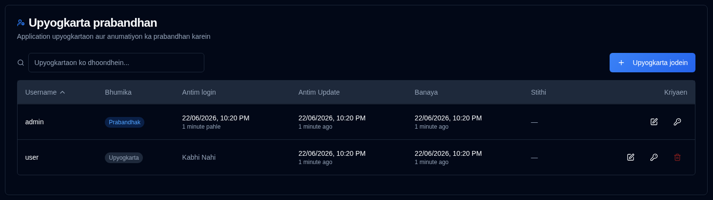

# Upyogkarta {#users}

Manage user accounts, permissions, and access control for **duplistatus**. This section allows administrators to create, modify, and delete user accounts.

>[!TIP] 
>The default `admin` account can be deleted. To do so, first create a new admin user, log in with that account, 
> and then delete the `admin` account.
>
> The default password for the `admin` account is `Duplistatus09`. You will be required to change it upon first login.

## User Management ko pravesh karein {#accessing-user-management}

You can access the User Management section in two ways:

1. **From the User Menu**: Click the <IconButton icon="lucide:user" label="username" />   in the [Application Toolbar](../overview.md#application-toolbar) and select "Admin Users".

2. **From Settings**: Click on <IconButton icon="lucide:settings"/> and **Users** in the settings sidebar

## Naya Upyogkarta banaane ka {#creating-a-new-user}

1. Click the <IconButton icon="lucide:plus" label="Add User"/> button
2. Enter the user details:
   - **Username**: Must be 3-50 characters, unique, case-insensitive
   - **Admin**: Check to grant administrator privileges
   - **Require Password Change**: Check to force password change on first login
   - **Password**: 
     - Option 1: Check "Auto-generate password" to create a secure temporary password
     - Option 2: Uncheck and enter a custom password
3. Click <IconButton icon="lucide:user-plus" label="Create User" />.

## Upyogkarta ko samajhane ka {#editing-a-user}

1. Click the <IconButton icon="lucide:edit" /> edit icon next to the user
2. Modify any of the following:
   - **Username**: Change the username (must be unique)
   - **Admin**: Toggle administrator privileges
   - **Require Password Change**: Toggle password change requirement
3. Click <IconButton icon="lucide:check" label="Save Changes" />.

## Upyogkarta ka Password Reset karein {#resetting-a-user-password}

1. Click the <IconButton icon="lucide:key-round" /> key icon next to the user
2. Confirm the password reset
3. A new temporary password will be generated and displayed
4. Copy the password and provide it to the user securely

## Upyogkarta ko delete karein {#deleting-a-user}

1. Click the <IconButton icon="lucide:trash-2" /> delete icon next to the user
2. Confirm the deletion in the dialog box.  **User deletion is permanent and cannot be undone.**

## Account Lockout {#account-lockout}

Accounts are automatically locked after multiple failed login attempts:
- **Lockout Threshold**: 5 failed attempts
- **Lockout Duration**: 15 minutes
- Locked accounts cannot log in until the lockout period expires

## Prabandhak Access {#recovering-admin-access} ko Punah Prapt Karna

Yadi aap apna prabandhak Password kho chuke hain ya aapke account ko Lock Kiya gaya hai, toh aap admin recovery script ka upyog karke access ko punah prapt kar sakte hain. Docker environments mein administrator access ko punah prapt karne ke vistrit nirdeshon ke liye [Admin Account Recovery](../admin-recovery.md) guide dekhein.
