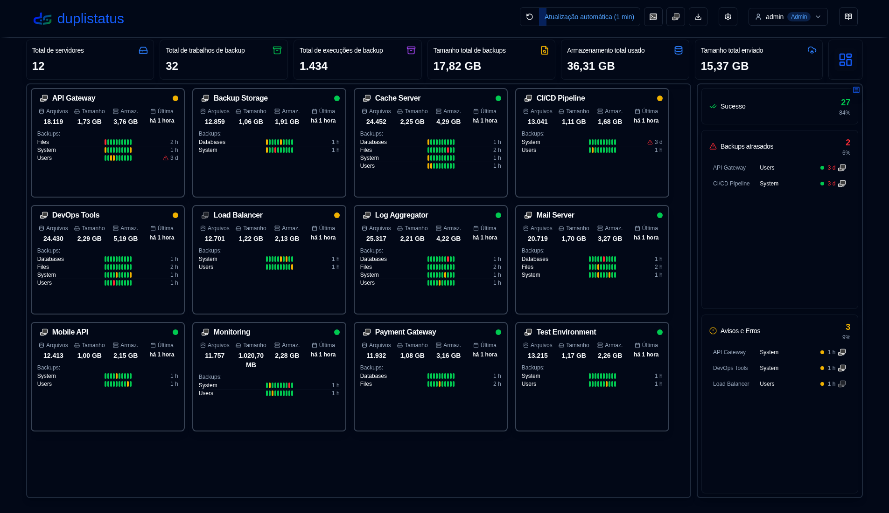
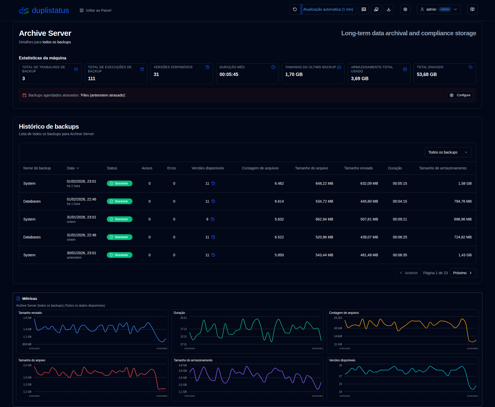
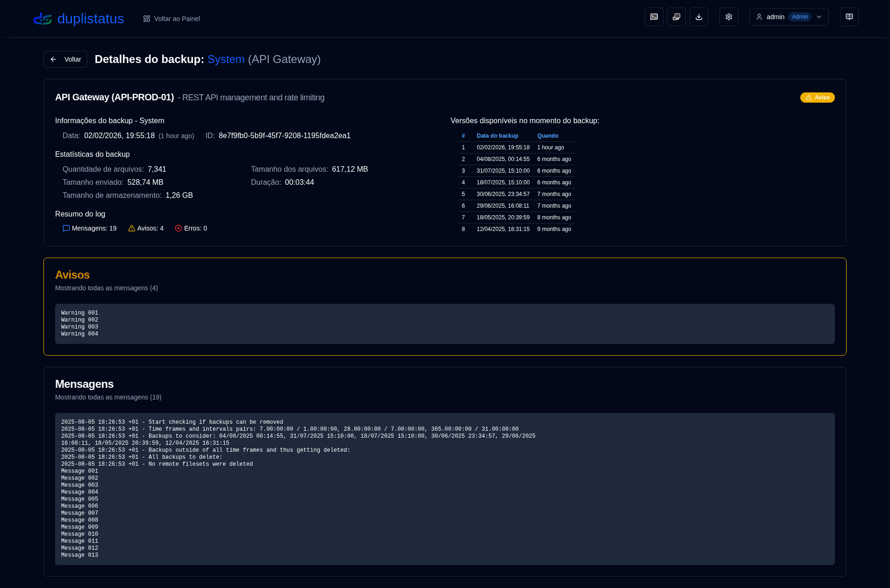
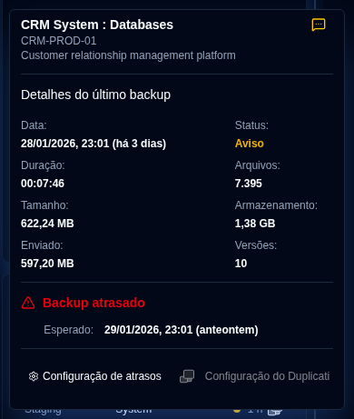

# Bem-vindo ao duplistatus {#welcome-to-duplistatus}

**duplistatus** - Monitore Múltiplos Servidores do [Duplicati](https://github.com/duplicati/duplicati) de um Único Painel

## Recursos {#features}

- **Configuração Rápida**: Implantação simples em contêineres, com imagens disponíveis no Docker Hub e GitHub.
- **Painel Unificado**: Visualize o status, histórico e detalhes de backup de todos os servidores em um só lugar.
- **Monitoramento de backups atrasados**: Verificação automatizada e alertas para backups agendados atrasados.
- **Visualização de Dados e Logs**: Gráficos interativos e coleta automática de logs de servidores Duplicati.
- **Notificações e Alertas**: Suporte integrado NTFY e SMTP/e-mail para alertas de backup, incluindo notificações de backup atrasado.
- **Controle de Acesso do Usuário e Segurança**: Sistema de autenticação seguro com controle de acesso baseado em funções (funções Admin/Usuário), políticas de senha configuráveis, proteção contra bloqueio de conta e gerenciamento abrangente de usuários.
- **Logs de Auditoria**: Trilha de auditoria completa de todas as alterações do sistema e ações do usuário com filtragem avançada, recursos de exportação e períodos de retenção configuráveis.
- **Visualizador de logs do aplicativo**: Interface exclusiva para administradores visualizar, pesquisar e exportar logs do aplicativo diretamente da interface web com recursos de monitoramento em tempo real.
- **Suporte a Múltiplos Idiomas**: Interface e documentação disponíveis em inglês, francês, alemão, espanhol e português do Brasil.

## Instalação {#installation}

O aplicativo pode ser implantado usando Docker, Portainer Stacks ou Podman. 
Ver detalhes no [Guia de Instalação](installation/installation.md).

- Se você está atualizando de uma versão anterior, seu banco de dados será automaticamente
  [migrado](migration/version_upgrade.md) para o novo esquema durante o processo de atualização.

- Ao usar o Podman (seja como um contêiner autônomo ou dentro de um pod), e se você precisar de configurações de DNS personalizadas (como para Tailscale MagicDNS, redes corporativas ou outras configurações de DNS personalizadas), você pode especificar manualmente servidores de DNS e domínios de pesquisa. Consulte o guia de instalação para mais detalhes.

## Configuração de Servidores Duplicati (Obrigatório) {#duplicati-servers-configuration-required}

Uma vez que seu servidor **duplistatus** esteja em funcionamento, você precisa configurar seus servidores **Duplicati** para enviar logs de backup para o **duplistatus**, conforme descrito na seção [Configuração do Duplicati](installation/duplicati-server-configuration.md) do Guia de Instalação. Sem essa configuração, o painel não receberá dados de backup de seus servidores Duplicati.

## Guia do Usuário {#user-guide}

Consulte o [Guia do Usuário](user-guide/overview.md) para instruções detalhadas sobre como configurar e usar o **duplistatus**, incluindo configuração inicial, configuração de recursos e solução de problemas.

## Capturas de tela {#screenshots}

### Painel {#dashboard}

### Histórico de backups {#backup-history}

### Detalhes do backup {#backup-details}

### Backups atrasados {#overdue-backups}

### Notificações atrasadas no seu telefone {#overdue-notifications-on-your-phone}

## Referência da API {#api-reference}

Consulte a [Documentação de Endpoints da API](api-reference/overview.md) para detalhes sobre endpoints disponíveis, formatos de requisição/resposta e exemplos.

## Desenvolvimento {#development}

Para instruções sobre como baixar, alterar ou executar o código, consulte [Configuração de Desenvolvimento](development/setup.md).

Este projeto foi construído principalmente com ajuda de IA. Para aprender como, consulte [Como Eu Construí Esta Aplicação Usando Ferramentas de IA](development/how-i-build-with-ai).

## Créditos {#credits}

- Em primeiro lugar, agradecimentos a Kenneth Skovhede por criar o Duplicati—esta incrível ferramenta de backup. Agradecimentos também a todos os colaboradores.

💙 Se você encontrar [Duplicati](https://www.duplicati.com) útil, considere apoiar o desenvolvedor. Mais detalhes estão disponíveis em seu site ou página do GitHub.

- Ícone SVG do Duplicati de https://dashboardicons.com/icons/duplicati - Ícone SVG do ntfy de https://dashboardicons.com/icons/ntfy - Ícone SVG do GitHub de https://github.com/logos

:::note
 Todos os nomes de produtos, logotipos e marcas registradas são propriedade de seus respectivos proprietários. Ícones e nomes são usados apenas para fins de identificação e não implicam endosso.
 :::

## Licença {#license}

O projeto é licenciado sob a [Apache License 2.0](LICENSE.md).   

**Direitos autorais © 2025 Waldemar Scudeller Jr.**
