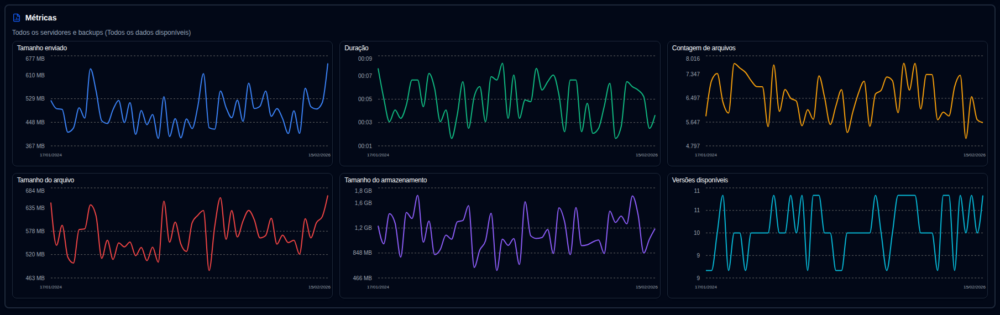

# Métricas de Backup {#backup-metrics}

Um gráfico de métricas de backup ao longo do tempo é mostrado tanto no Painel (visualização de tabela) quanto na página de Detalhes do Servidor.

- **Painel**, o gráfico mostra o número total de backups registrados no banco de dados **duplistatus**. Se você usar o layout de Cards, pode selecionar um servidor para ver suas métricas consolidadas (quando o painel lateral está exibindo métricas).
- **Página de Detalhes do Servidor**, o gráfico mostra métricas para o servidor selecionado (para todos os seus backups) ou para um backup específico individual.

- **Tamanho enviado**: Quantidade total de dados enviados/transmitidos durante backups do servidor Duplicati para o destino (armazenamento local, FTP, provedor de nuvem, ...) por dia.
- **Duração**: A duração total de todos os backups recebidos por dia em HH:MM.
- **Quantidade de arquivos**: A soma do contador de quantidade de arquivos recebido para todos os backups por dia.
- **Tamanho dos arquivos**: A soma do tamanho dos arquivos reportado pelo servidor Duplicati para todos os backups recebidos por dia.
- **Tamanho de armazenamento**: A soma do tamanho de armazenamento usado no destino de backup reportado pelo servidor Duplicati por dia.
- **Versões disponíveis**: A soma de todas as versões disponíveis para todos os backups por dia.

:::note
Você pode usar o controle [Configurações de exibição](settings/display-settings.md) para configurar o intervalo de tempo do gráfico.
:::
